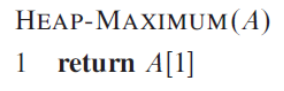

# Data Structures

An *abstract data type* (ADT) is a specification of:

* A set of data.

* A set of operations that can be performed on the data.


ADT is abstract in the sense that it is independent of various concrete implementations.

* Encapsulates data structures and relecant algorithms.
* Provides access interface.

## Stack

> A pile of plates

An object added to the stack goes on the "top" of the stack. (`push`)

An object removed from the stack is taken from the "top" of the stack (`pop`)

**LIFO**: Last in, First out


### Operations

```pseudocode
Push(S, x):
	inserts an element x into the stack S

Pop(S):
	deletes the element on top of the stack S.

Stack-Empty(S):
	returns whether the stack S is empty.
```


## Queue

> A real-life queue

An element added to the queue foes to the "end" of the queue. (`enqueue`)

The element which has been in the queue the longest can be removed from the queue. (`dequeue`)

Elements are removed from a queue in the same order as they were inserted.

**FIFO**: First in, First out.


### Operations

```pseudocode
Enqueue(Q, x):
	inserts an element x into the queue Q
	
Dequeue(Q):
	deletes the head element in the queue Q.
```

<div style="page-break-after: always;"></div>

## Linked List

> A sequence of elements

Each element in the linked list is with:

* One key
* One ore more pointers

There are different types depending on how the elements are linked.

### Singly linked list

**Element:**

* A key
* One pointer: "next", pointing the the successor of the element.
* The last element points to a "NIL".

**Head pointer**:

* Pointer "head": pointing to the first element of the list.


**Note:**

* "next" are for elements (x.next)
* "head" is for whole list (L.head)

#### Alternatively:


<div style="page-break-after: always;"></div>

### Doubly linked list

**Element:**

* A key
* Two pointers: "next" and "prev"

Still has "head".


#### Alternatively


#### Operations

```pseudocode
Search(L, k):
	Find the first element with a key k in the list L
	
Insert(L, x):
	Insert element x into list L
	
Delete(L, x):
	Delete the element x from list L
```

<div style="page-break-after: always;"></div>

## Priority Queue

A priority queue (PQ) is a container for maintaining a set **A** of elements, each with an associated value called *key*.

### Operations

```
Insert(A, x):
	insert element x in set A

Maximum(A):
	returns the element of A with the largest key (i.e. highest priority)

extract-Max(A):
	returns and removes the element of A with  the largest key from A
```

### Heap Implementation

Use a max-heap.




