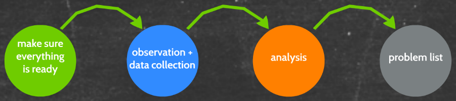

# Evaluation - What is Usability and Usability Testing

**Literature:**

- Benyon - Designing Interactive Systems (chap. 4 section 4.3 + chap. 10)
- Rubin & Chisnell - Handbook of Usability Testing (chap. 3) [(PDF)](./extra/07/Rubin & Chisnell - Handbook of Usability Testing (chap. 3).pdf)
- Rubin & Chisnell - Handbook of Usability Testing (chap. 5)[ (PDF)](./extra/07/Rubin & Chisnell - Handbook of Usability Testing (chap. 5).pdf)
- Nielsen & Molich - Heuristic Evaluation of User Interfaces ([PDF](./extra/07/Nielsen & Molich - Heuristic Evaluation of User Interfaces.pdf))
- Nielsen and Molic's heuristics ([PDF](./extra/07/Nielsen and Molic's heuristics.pdf))

## Usability

### ISO 9241 definition:

"The **effectiveness, efficiency** and **satisfaction** with which specified users achieve specified goals in particular envirionments"

**Effectiveness**:

* The accuracyand completeness with which specified users can achieve specified goals in particular envirionments.

> ​	How well the users can complete their tasks.

**Efficiency**:

* The resource expended in relation to the accuracy and completeness of goals achieved.

> ​	How much eg. time needed to solve their tasks.

**Satisfaction:**

* The comfort and acceptability of the work system to its users and other people affected by its use.

> ​	Subjective measure.

### Jacob Nielsen definition

**Learnability:**

* How easy is it for users to accomplish basic tasks the first time they encounter the design?

**Efficiency**:

* Once users have learned the design, how quickly can they perform the tasks?

**Memorability**:

* When users return to the design after a period of not using it, how easily can they reestablish proficiency?

**Errors:**

* How many errors do users make, how severe are these errors, and how easily can they recover from the errors?

**Satisfaction**:

* How pleasant is it to use the design?

## Usability Testing

**Purpose**

* Identifying usability problems in a system
* Starting point for refinements of design.

**Outcome**

* A ranked list of usability problems
* Knowledge about what works well

How do we evaluate usability?

**Inquiry**

* We try to understand users.

* Also part of doing PACT.

**Testing**

* Users test product designs.

**Inspection**

* Testing of a design by an expert.

### When to test?

### Lab vs. Field Test

#### Lab Test

##### Strengths

* The **least obtrusive** way to collect data
* Allows **communication** "behind the scenes"
* Allows many observers
* High **replicability** and **control**
* Demand characteristics

##### Weaknesses

* Somewhat "**sterile**" environment
* Test participants may feel like "**lab monkeys**"
* **Questionable** **realism** (ecological validity)

## Testing

Representative users **interact** with design.

Task **solving** and/or "**thinking-aloud**".

Produces a **ranked list of usability problems.**

**Pros**

* Identifies problems **very precisely**
* Gives **first-hand** insight into use

**Cons**

* Test situation can be **unnatural**
* **Difficult** and very **time consuming**

### Testing Process (Participant perspective)

### Testing Process (Our Perspective)

 

### Activities

#### Planning

##### Test Participants

Representative for the user group

* Demographics
* Experience

Number of test-subjects

* Generalizability
* Quantitative conclusions
* Statistics

##### Deciding on the Tasks

What are the basic tasks that representative users do with the system?

Is the whole system part of the evaluation?

Can we create a crystal clear task description?

How long does it take to solve the tasks?

**Useful rules:**

1. Make the tasks **realistic**
2. Make the tasks **actionable**
3. Avoid **clues** and **describing** the steps

**Good Tasks**:

* Represent **real use** of the system
* Describe the **end result**
* **Motivate** (why should they be solved?)
* Include **relevant** data (eg. names)
  * Don't force the users to use their own logins for example.
* Group smaller sub-tasks together

**Typical bad tasks:**

* Vague, unclear or general
* Provides too much help
* Contain jargon and unfamiliar terms
* Forces the user into a specified sequence

##### Deciding What to Measure and How

* Are all the components of usability relevant?
* How will we collect data?
* What are we going to measure?
* Think aloud?

#### Usability Metrics

**Objective metrics:**

* Effectiveness
  * How **many** tasks were completed
* Efficiency
  * How **fast** were they completed

**Subjective (perceived) metrics:**

* Interview data
* Questionnaires (for example SUS, USE questionnaires)

 

## Heuristic inspection

Experts inspects a design using a checklist (heuristic)

Scenarios + relevant tasks can structure process.

Produces a ranked list of usability problems.

**Pros**

* Quick and easy to conduct
* No users required
* 3-5 inspections finds 70% of all problems

**Cons**

* High proportion of "cosmetic" problems
* "False" usability problems

