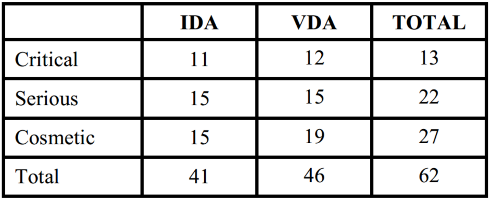
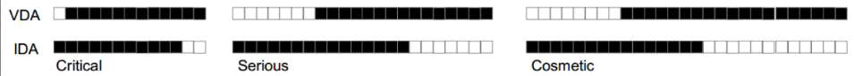

# Alternative Methods for Testing Usability

## Instant Data Analysis

**Main Difference: You do not analyze video data!**

Analysis done **immediately** after the last session

* Brainstorm
* Tasks
* Logger's notes

**Presence during IDA:**

* Test moderator
* Logger
* Facilitator

Test moderator and data logger starts by **brainstorming** all the usability problems that they can remember from the sessions.

The facilitator **notes** this down, and creates an **overview** of the problems. 

So that the **moderator** and **logger** can **focus** only on **remembering** the problems.

### Comparison

From the study (Kjeldskov et al. - Instant Data Analysis [(PDF)](./extra/09/Kjeldskov et al - Instant Data Analysis.pdf))

#### Overlap

**White** box is an **unidentified** problem, **Black** box is an **identified** problem. 

#### Time Spent

IDA:		4 person hours

VBA:	40 person hours

## Remote Usability testing

 

### Remote Asynchronous

* Logging/Analytics
  * You know what users do, but not why.
* Usability Questionnaire

## Usability Problems

**Definition:**

Usability problems are present when the system is:

* **Unuseful:** You cannot find the documents or functions you wneed to solve your tasks.
* **Difficult to learn**: It takes a long time to learn how to use the system.
* **Difficult to remember**: It takes a long time to find elements in the system, which you have used previously.
* **Ineffective to use:** It takes a long time to solve certain tasks with the system.
* **Unsatisfying to use:** The system does not feel comfortable to use, it is not joyful to work with it.

This is basically an inverted edition of Jacob Nielsen's definition from lecture [07](../DEB/07-evaluation.md#jacob-nielsen-definition).

