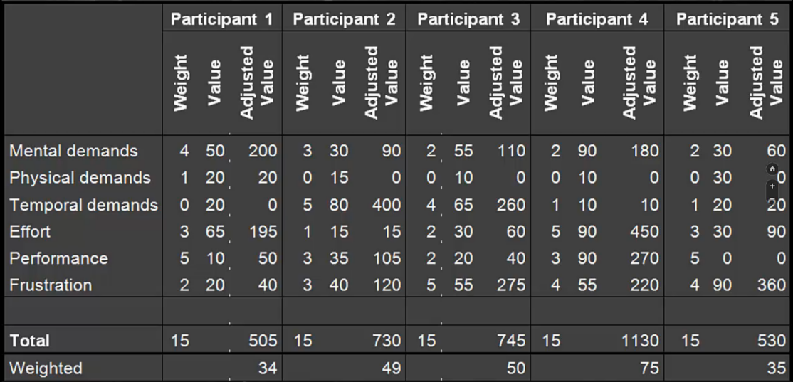

# Memory

## Working memory

Central executive is part of working memory and part of the brain. Consists of two slave systems, and helps humans focus on/remember things they see or hear fairly detailed, but not for a long time

Working memory is persistent for about 30 seconds. Dialog boxes are persistent until users take action, otherwise they might forget.

* Visuo-spatial sketchpad (visualization)
* Articulatory loop (audiotory)
  * Called "loop" because humans will repeat things to remember them
    * For example phone numbers

### Chunking

Division of a thing to remember, into smaller parts, which then helps remember more

* Phone numbers
  * 25687462 => 25 68 74 62
  * Area codes are often separated from the rest of the number

Reduce the memory load by chunking

Sub-items need to be strongly connected to the super category

Another example is in the Word tool bar, that groups different actions together

## Theories about recollection

How many things can a human recall, based on free memory, without any cues to help remember. Helps decide how many menu items to include in a UI.

### Miller (1956)   5 to 9 items

### Cowan (2002) 3 to 5 items

A menu with many items is not necessarily bad design. Humans can't remember that much, needs to be **shown what they need**, rather than let them recall. Can be described as a form of direct manipulation (constant overview of objects, reverse actions and see them).

## Principles

For reducing the memory load

* Recognition rather than recall
* Match between system and the real world
  * An icon with a design from the real world, will let users recognize what it does
  * Linked to recognition rather than recall

# Attention

What we focus upon. Focus can be directed to surroundings while interacting. Concentration of mental effort on sensory (things that are seen or heard) or mental (thoughts) events.

## The Stroop Effect

Shows how bad the human attention span is. 

When asked to say the color of the font, and not the color that is written, it is easier when there is a correspondence. Requires a larger mental effort when missing correspondence. Attention is directed towards reading the word (mental stimuli) but the font color is seen.

## Forms of attention

### Selective attention

Where attention is directed towards one element

* An example is sitting on the phone at a bus stop. It is selective attention, but can quickly become divided if bus arrives. Must realize how environment can affect attention when designing.

### Divided attention

When attention is shifted from one element to another

* An example is driving while being on the phone
* Another example is BT, shows lots of ads and articles, so difficult to be selective with attention

## Stress

Stress will affect attention, and is described as external (noise, light vibration) and mental (anger, fear) stimuli affecting level of arousal.

### Yerkes-Dodson law

As the stress/arousal level increases, so will the performance, until a certain level. More stress can be handled with a simple task than with a complex task, before performance drops.

An optimal level of stress exist, but will vary between users, typically because of skill.

If a system is designed in a stressful environment, the performance level needs to be considered.

#### Examples

* A news website with lots of ads 
* Ambulances
* Other safety critical environments
* Flight cockpits
* Environments with lots of stimuli

## Mental workload

Describes how busy the user is and how difficult their task is.

### NASA Task Load Index

Helps measure mental workload through questionnaire form

Result of a NASA TLX

Helps measure the perceived workload

## Visual search

When having to locate an item in a visual scene. Easy to locate an item when using attention drawing elements, such as the item being larger or another color. Attention is grabbed.

Humans do not use a particular strategy to search for items. They will often look at images however, so images can be "dangerous" to use, as they can stand out too much compared to text.

## Alerts and error messages

If an error occurs or there is a change in the system state, the users attention needs to be grabbed. Can be done in two ways:

* Unobtrusive
  * When an email is received and a small popup appears
  * General Windows popups
  * The message can be seen, but does not interfere with the users current task
* Obtrusive
  * Master alerts in planes (will happen if an engine goes out, blinks and beeps). Grabs attention from flying, but is more important.
  * Can't have too many obtrusive alerts as it will slow and/or hinder their work

More detailed guidelines for error messages:

* Careful wording (direct, but not rude)
* Avoid threatening words (catastrophe etc)
* Do not use no double negation
* Be specific (e.g. "enter your name")
* No uppercase letters (Don't SHOUT at the user. Humans reads through shapes)
* Use attention-grabbing techniques with caution