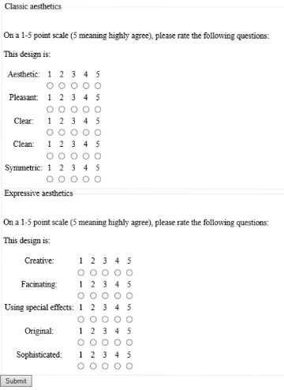

# User Experience

**Literature:**

- Bargas-Avila and Hornbæk - Old wine in new bottles or novel challenges? [(PDF)](./extra/09/Bargas-Avila and Hornbæk - Old wine in new bottles or novel challenges.pdf)
- Kjeldskov et al. - Instant Data Analysis [(PDF)](./extra/09/Kjeldskov et al - Instant Data Analysis.pdf)

---

Recall the definition of Usability in Lecture 07.

**User Experience:**

From ISO 9241-210

> A person's **perceptions** and **responses** that result from the use or anticipated use of a product, system or service...

This is a broader term than usability.

**Emotion is a key aspect!**

## How is UX data collected?

### AttrakDiff2

From Marc Hassenzahl et al.

### Lavie and Tractinsky

Purely aesthetics.

### Pitfalls?

What does the participant remember most from the interaction?

If he had a bad interaction in the end, is this what is reflected in the questionnaire?

Or is it the mean of the whole interaction? 

## Emotions

**What are emotions?**

James-Lange (1884):

* "... the result of physical changes in autonomic and motor functions"
* Sensory input creates bodily responses
* Awareness of bodily changes constitutes an emotion.

Scherer (2005):

* Mobilization and synchronization of organismic subsystems
* A response to a cognitive evaluation of stimulus events
* Events are "of major concerns for the organism"

**Moods/Attitudes vs. Emotions (Scherer, 2005)**

* Emotions are intense and short-lived (connected to specific events)
* Moods are of low intensity and may last for days

**6 Basic Emotions**

**Emotion Graph**

### How can we measure emotions?

#### **Self-Assessment-Manikin (SAM)**

Studies show that when we evaluate emotions in retrospect, the major movements in emotions will dominate.

- If one really cool thing makes us happy, this will dominate the evaluation

#### **Galvanic Skin Response (GSR)**

Used during the interactions

#### Electromyography (EMG)

#### Facereader Software

#### Cued Recall Debrief

* Use the graph data to pick points of interests.
* Show the user video clips of the POI's
* Ask them to reflect on what happens

