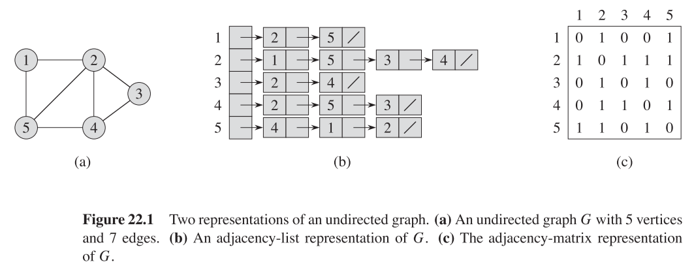

# Graph Theory

**Directed graph**, $G$, is a pair $(V,E)$, where $V$ is a finite set and $E$ is a binary relation on $V$.

The figure shows the directed graph $G=(V,E)$, where $V= \{1,2,3,4,5,6\}$  and $E=\{(1,2), (2,2), (2,4), (2,5),(4,1),(4,5),(5,4),(6,3)\}$. 

The edge (2,2) is a **self-loop**.

A "point" is called a **vertex**, (plural: **vertices**). A "connection" is called an **edges**/**edges**. (E is the **edge set**).

An **undirected graph** is a graph where the edge set of E is unordered.

This figure shows the undirected graph $G=(V,E)$, where $V=\{1,2,3,4,5,6\}$ and $E=\{(1,2),(1,5),(2,5),(3,6)\}$ 

In undirected graphs, self-loops are forbidden. (u,v) and (v,u) are considered the same edge.

In a directed graph we say that (u,v) is **incident from** or **leaves** u, and is **incident to** or **enters** v. If the graph is undirected, (u,v) is **incident on** u and v.

 				Incident from 6. Incident to 3. Leaves 6 and enters 6. 

If (*u,v*) is an edge in a graph, *v* is **adjacent** to *u*

The **degree** of a vertex in an undirected graph is the number of edges incident on it.

A vertex with a degree of 0 is **isolated** like vertex 4 in the undirected graph example.

In a directed graph the **out-degree** of a vertex is the number of edges leaving it. The **in-degree** is the number of edges entering it. The **degree** is out-degree plus in-degree.

A **path** of **length** k from *u* to *u'* is a sequence from *u* to *u'* going through k vertices.

Mathematically: 

​	$\langle v_0, v_1,...,v_k\rangle$ where $u=v_0,  u'=v_k$ and $(v_{i-1},v_i)\in E$ for $i=1,2,...,k$

The path **contains** the vertices $v_0, v_1,...,v_k$ and the edges $(v_0,v_1),(v_1,v_2),...,(v_{k-1},v_k)$

A graph is **sparse** if $|E|$ is much less than $|V|^2$ 

​	while it is **dense** if $|E|$ is close to $|V|^2$

## Representation of graphs

There are two standard ways to represent a graph:

* **A collection of adjacency lists**
* **An adjacency matrix**

If a graph is **sparse** the **adjacency-list** representation is of choice.

 If a graph is **dense**, **adjacency-matrix** may be of choice.

 