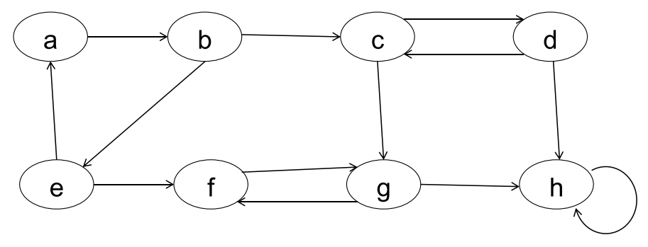

# Strongly Connected Components

A strongly connected component of a directed graph G=(V, E) is a maximal set of vertices $C\subseteq V$, such that for every pair of vertices *u* and *v* in C, they are reachable from each other.



Strongly connected components are:
$$
\{a,b,e\},\{c,d\},\{f,g\},\{h\}
$$

<div style="page-break-after: always;"></div>

## DFS and Transpose of a graph

DFS often works as a subroutine in another algorithm

* Classifying edges
* Topological sort
* <u>Strongly Connected Components</u>


**Transpose of a graph**:

Given a graph G = (V, E)

* Its transpose graph is 

$$
G^T=(V,E^T),where\\
E^T=\{(u,v):(v,u)\in E\}
$$


* Transpose graph $G^T$ has the same vertex set as G, 
  but has a different edge set from G, where directions of the edges are reversed. 


G and $G^T$ has exactly the same strongly connected components.

* Vertices u and v are reachable from each other in G
  if and only if they are reachable from each other in $G^T$


## Algorithm

```
Strongly-Connected-Components(G)
01	call DFS(G) to compute finishing times u.f for each vertex u
02	compute G^T
03	call DFS(G^T), but in the main loop of DFS, consider the vertices
		in order of decreasing u.f (as computed in line 1)
04	output the vertices of each tree in the depth-first forest formed in line 3 as a 
		seperate strongly connected component
```

<div style="page-break-after: always;"></div>

### Running Example


