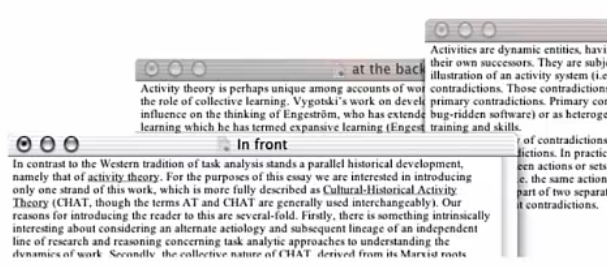
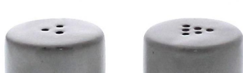

# Perception and Navigation

## Perception

**Perceptual set:**
Our previous experiences that makes us experience depth and patterns in a particular way.

### Depth perception

Critical in the design of 3D applications

How we understand depth:

**Primary cues**

* Retinal disparity (two separate images)
* Stereopsis (image combining process)
* Accommodation (muscular process to create image focus)
* Convergence (muscular process for image focus on short distances)

**Secondary cues** (2D plane, monocular)

* Light and shade

* Linear perspective

* Height in horizontal plane

* Motion parallax

* Overlap

  

  
Also makes use of light and shade

* Relative size

* Texture gradient

### Pattern recognition

Based on our perceptual set

**Gestalt laws of perception**

Psychology terms 

* Proximity

  * "Elements that are positioned close together are belonging together"

    

    
Two separate groups of stars

* Continuity

	

* Similarity

Round vs diamond shapes -> These have different properties

* Closure
  * "Images that are not complete that nevertheless provides a complete image"

### Affordance

> "The affordance of the environment are what it offers animals, what it provides or furnishes, for good or ill" - Gibson

So, an affordance is a resource that the environment offers an animal and...

...the animal must possess the capabilities to perceive and use the resource.

> "It is perceived affordances that tell the user what actions can be performed on an object and, to some extent how to do them" - Norman

#### Examples

Salt and pepper shaker. We know through our perceptual set, that we use more salt than pepper in European countries, so the one with more holes is for salt.

There being only plates but no door handles provides the affordance, that we need to push the door. Through our perceptual set.

This is a juice presser. But that is not clear from the leftmost picture. The affordance of this product is unclear.

## Navigation

Object identification

* Identifying categories and clusters of objects

Wayfinding

* Working out how to reach a destination

Exploration

* Understanding what exists in an environment

* How objects are related

Three types of signs:

* Informational signs (object identification)
* Directional signs (wayfinding)
* Warning and reassurance signs (exploration)

### Informational signs

Orienting oneself (Passini 1994)

Providing information on objects

Aid in object identification and classification of objects

### Directional signs

Choosing the correct route (Passini, 1994)

Providing information on routes and route hierarchies

Apple Guidelines:

* Provide one path for one destination
* Make the path logical

We need to provide a clear visual hierarchy

### Warning and reassurance signs

Monitoring chosen route (Passini, 1994)

Recognizing when the destination is reached (Passini, 1994)

Providing feedback on actual location

Providing information on possible actions within the environment

Apple Guidelines:

* Provide markers of where you are
* Traceability

