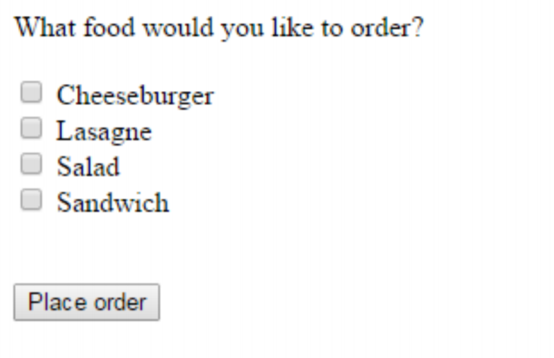
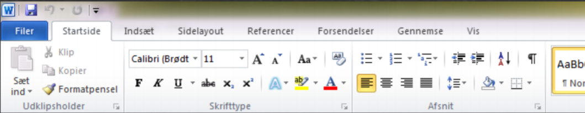

# Physical Design

**Literature:**

- Benyon, D. (3rd edition): Chapter 4, section 4.5 + Chapter 9, sections 9.5 and 9.6 + Chapter 12, sections 12.1-12.3.
- Nielsen (1994): Enhancing the Explanatory Power of Usability Heuristics ([PDF](./extra/04/Nielsen (1994) - Enhancing the Explanatory Power of Usability Heuristics.pdf))
- Petrie (2012): What do users really care about?: a comparison of usability problems found by users and experts on highly interactive websites ([PDF](./extra/04/Petrie (2012) - What do users really care about - a comparison of usability problems found by users and experts on highly interactive websites.pdf))

---

Abstract vs. concrete design.

**Abstract (Conceptual design):**

Determining the following:

* Logic
* Functions
* Structure
* Content

**Concrete design:**

Physical realization of the same (logic, functions, ...)

---

The UI: *"Everything in the system that people come in contact with"*

Difference user interfaces: Command prompt and GUI (Graphical User Interface).

## Command Prompt

Some things can be done fast by expert users.

## Graphical User Interface

**Direct Manipulation**

Example: Windows File Manager

* Continuous representation of the object of interest
* Physical actions or labeled button presses instead of complex syntax
* Rapid incremental reversible operations whose impact on the object of interest is immediately visible

User friendly for novice user.

**WIMP**

* Windows
* Icons
* Menus
* Pointers

### Icons

Holton's icon checklist

* Understandable
* Familiar
* Unambiguous
* Memorable
* Informative
* Few
* Distinct
* Attractive
* Legible (Easily readable)
* Compact
* Coherent
* Extensible

### Menus

Different types of menus:

* Cascading
* Pop-up
* Contextual

#### Cascading Menu

It cascades/unfolds.

Compacting the information visible to the user.

#### Popup Menu

#### Contextual Menu

Typically right click on folder/file you want to access.

Adapts based on the context.

### Widget Guidelines

#### Radio Buttons

You can only select one item.

Mutual exclusiveness.

#### Checkboxes

You can select more than one.

#### Toolbars

#### More examples:

* Textbox
* Dropdowns
* Date
* Textarea
* Password
* Tel
* URL
* And many more

### Nielsen's Heuristics

1. Visibility of systems status
2. Match between system and real world
3. User control and freedom
4. Consistency and standards 
5. Error prevention
6. Recognition rather than recall
7. Flexibility and efficiency of use

### Petrie and Powers' heuristics

Physical presentation:

1. Make text and interactive elements large and clear enough
2. Make page layout clear
3. Avoid short time-outs and display timeouts
4. Make key content and elements and changes to them salient[^salient]

Content:

5. Provide relevant and appropriate content
6. Provide sufficient but not excessive content
7. Provide clear terms, abbreviations, avoid jargon

Information Architecture:

8. Provide clear, well-organized information structures

Interactivity:

9. How and why? 
10. Clear labels and instructions
11. Avoid duplication/excessive effort by users
12. Make input formats clear and easy
13. Provide feedback on user actions and system progress
14. Make the sequence of interaction logical
15. Provide a logical and complete set of options
16. Follow conventions for interaction
17. Provide the interactive functionality users will need and expect
18. Indicate if links go to an external site or to another webpage
19. Interactive and non-interactive elements should be clearly distinguished
20. Group interactive elements clearly and logically
21. Provide informative error messages and error recovery

[^salient]: most noticeable or important. (Dansk: fremtrædende)

