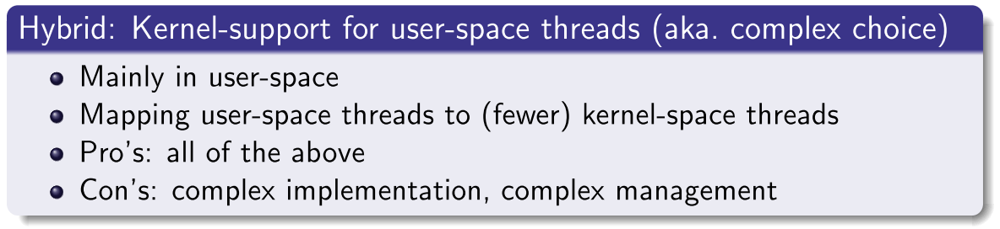

# 1 - Processes and Threads

*Keywords:* Definition of process/thread, process-/thread-control block, 5-state process model, process creation, process image, process/thread switching, multithreading, implementation strategies for thread support, user-/kernel-mode.

## Litterature

OSTEP Chapters 3, 4, 5

## Learning Goals

After lecture 1 you can:

* :heavy_check_mark: Define and explain the concept of a **process **
* :heavy_check_mark: ​Explain what a **process image** is. 
* :heavy_check_mark: Explain what a **process control block** is, what it is used for and why it is needed.
* :heavy_check_mark: Explain in general terms, how process creation, switching and termination works
* :heavy_check_mark: Define and discuss **process states**
* :heavy_check_mark: Define and explain the concept of a **thread**
* :heavy_check_mark: Discuss when, where and how (multi-)threads are usefull
* :heavy_check_mark: Explain what a **thread control block** is, what it is used for and why it is needed
* :heavy_exclamation_mark: Discuss **implementation strategies** for thread support and explain the associated **trade-offs**

## Noter

### Process

En **process** er kørende program med alt tilhørende data.

Et program er bare data på disken.

#### Process Image

Et **process image** er en samling af process relateret data. Det består af:

* **Process control block (PCB)**
* Program (code)
* **Stack**
* **Heap** (user data)

#### Process Control Block (PCB)

PCB er en datastruktur der indeholder data om en process.

Indeholder ting som:

* Identifier
* State (tilstand)
* Prioritet
* Program Counter (PC)
* Memory counter
* I/O Status

* Context (gemte registre til hvis processen skal køre igen)

!!! snippet "XV6"
	Implementering i xv6 kan findes i filen ``proc.h``

En PCB bruges til at kunne skifte mellem processer.  

Task listen, eller process tabellen i operativsystemet er en liste over PCB'er. Den har dermed al den information den skal bruge om de processer den skal skifte imellem.

#### Process creation, switching and termination

!!! snippet "XV6"
	Implementering i xv6 kan findes i filen ``proc.c``

##### Creation

Når en process bliver oprettet, læses programmet og program data ind i memory. 

* I simple operativsystemer, gøres dette **eagerly**, hvilket betyder at al data læses ind inden programmet starter.

* I mere moderne systemer gøres dette **lazily**, hvilket betyder at data læses ind når det skal bruges.

Herefter allokeres memory til stakken (**runtime-stack**) og eventuelt **heap**. 

* Stakken bruges i C til lokale variable, funktionsparametre, return adresser.
* Heapen bruges i C til explicit requested, dynamisk allokeret memory, som ved ``malloc()`` kald. 

##### Switching

Når en process bliver scheduled, skifter dens tilstand fra ready til running. 

Først bliver PCB for den kørende process oprettet, og information lagres.

Derefter udpakkes PCB for den skiftede til process. Registre sættes, dette kaldes context switch.

Den nye process køres, via den nyindstillede PC (program counter)

Ekstra info

<https://medium.com/@ppan.brian/context-switch-from-xv6-aedcb1246cd>

#### Process state

En process's tilstande bruges af scheduleren til at vide hvilke processer den kan køre. OSTEP definerer følgende tilstande.

* **Running:** Processen kører lige nu på en processor, instruktioner udføres.
* **Ready:** Processen er klar til at køre, men af en eller anden grund, har OS valgt ikke at køre den.
* **Blocked:** Processen er **ikke** klar til at køre. Et eksempel kan være mens den venter på I/O.

xv6 har tilmed: ``EMBROYO`` : den er oprettet, men ikke udfyldt med nødvendig data endnu. 
``ZOMBIE``: den er termineret, men endnu ikke opryttet af OS endnu. (Bruges af f.eks. parent processes, til at se return code)

##### 5-State Process Model

### Thread

En tråd (**thread**) er den mindste eksekverbare del af en process.

En process kan have 1 eller flere tråde.

#### Multithreading

Opsplitningen af en process i flere tråde. 

Multithreading kan eksempelvis være **nyttigt ved GUI.**

* Nogle tråde arbejder på hovedarbejdet (baggrunden)
* Nogle tråde arbejder på at opdatere GUI, så den virker mere responsiv.

Eksempel: Der trykkes på en opdateringsknap med der opdatere en liste med data fra internettet. Ved single-thread, vil GUI'en "holde stille" og vente på al data. Ved multithreading, kan man hente data i en anden tråd, og dermed er GUI stadig brugbar imens.

* **Low cost** creation, switching and termination
* Interthread communication (**memory sharing**)

* Kan udnytte **multi-processor/-core** platforme.

Skaber bedre arkitektur / design.

* Modularitet

Thread-local data:

* thread-ID
* priority
* stack

Process-local data:

* Address space, heap, open files
* process-ID
* parent, ownership, CPU reg (copy)

Shared data:

* Program text

#### Thread Control Block

Ligesom process control block (PCB), men indeholder information om tråden som thread-ID, som beskrevet ovenfor.

#### Thread Support Implementation Strategies

### Amdahls Law

Potientel performance speedup:
$$
Speedup=\frac{1}{(1-f)+\frac{f}{N}}
$$
hvor

​	$f$ er "parallelisable fraction" (hvor meget execution time der bliver paralleliseret)
​	$N$ er antallet af tilgængelige cores/CPUs

