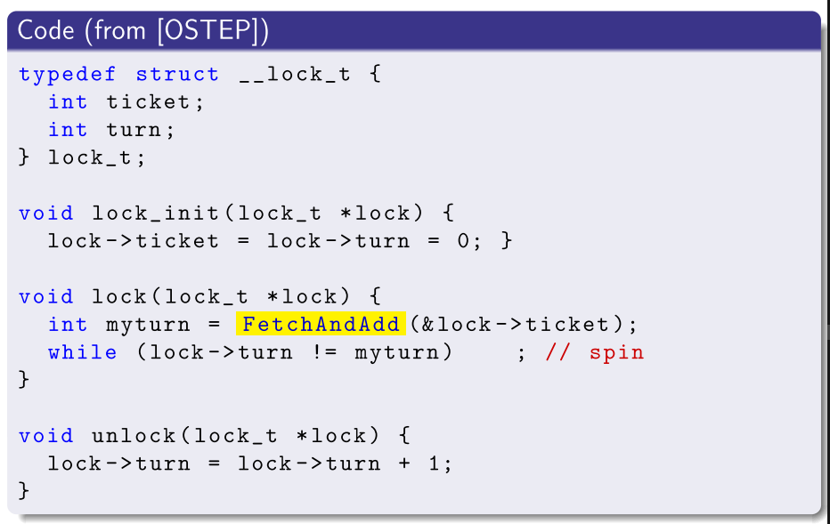
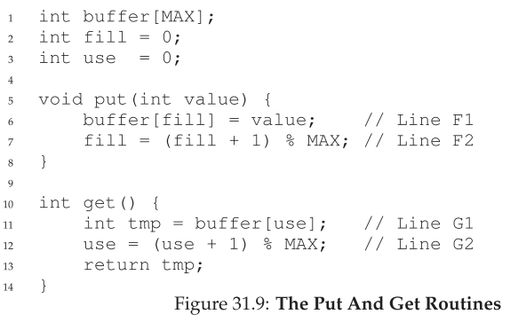
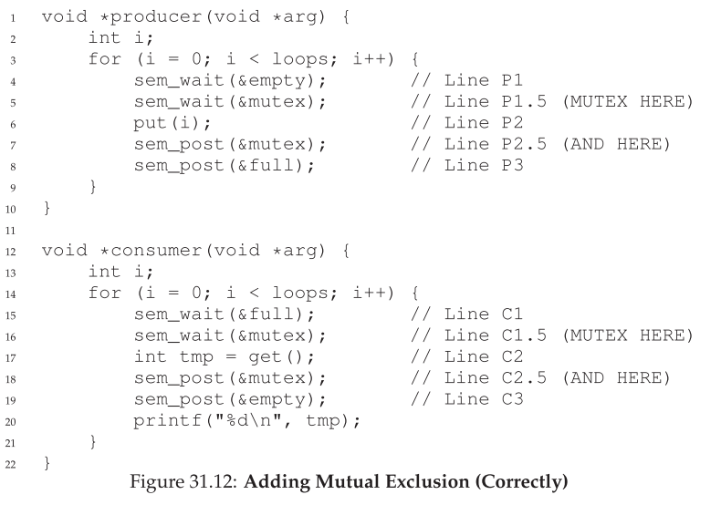
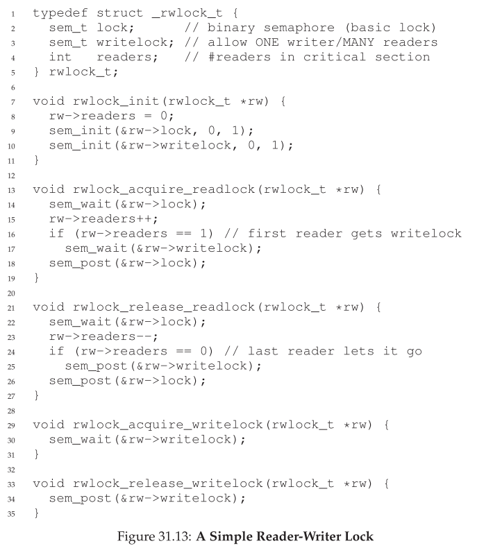

# 5 - Concurrency

*Keywords*: Multi-threading, implementation strategies for multi-threading (concurrency), concurrency vs. parallelism, inter-process communication, race conditions, mutual exclusion, ensuring mutual exclusion (algorithms, hardware supported, mutexes, semaphores, monitors).

## Litterature

OSTEP Chapter 25, 26, (27), 28, (29), (30), 31, 32, (33), 34

Kapitler med parenteser skimmes: (x)

## Learning Goals

After this lecture, you

* :heavy_check_mark: ... can define what a **race condition** is
* :heavy_check_mark: ... can explain how **mutual exclusion** can be used to avoid race conditions
* :heavy_check_mark: ... can explain strategies for **achieving and implementing** mutual exclusion
* ... can define the notions of **mutex**, **semaphore**, and **monitor** and explain how they work and where they are useful
* :heavy_check_mark: ... can explain how to **synchronise** two (or more) threads and why it may be necessary

## Noter

### Threads

Threads kan ses som en abstrahering i processer.

En tråd er lige som en seperate process, botset fra at de deler adress space, og kan derfor access samme data.

Hver tråd har sit eget sæt registre

Hvis 2 tråde kører på samme CPU skal der laves **context switch** hvis CPU skal skifte tråd.

* Address space forbliver det samme

Ligesom ved processer har vi en datastruktur til at gemme informationen. Her en **thread control block (TCB)** i stedet for PCB.

Hver tråd har sin egen stack:

* **thread-local** storage


#### Hvorfor Tråde?

**Parallelism**

En opgave splittes op, og kan køre på flere CPU'er. **Parallelization**.

**I/O**

For at undgå at programmet er blocked pga. langsom I/O.


Mange server-based applikationer bruger tråde.

* (web servere, databaser osv.)


### Race Conditions

Hvis 2 tråde arbejder på den samme variabel, kan der opstå det der kaldes **race condition** eller **data race**.


Hvis begge henter variabel *k* ind på samme med mens den er 42.

* Så tæller de den begge op, og resultatet bliver 43, selvom det burde være 44.

#### Definitioner

**Race condition:**

* Når resultatet af en beregning afhænger af **relative speed** af de individuelle tråde
* Med andre ord: Resultatet afhænger af **interleaving** af trådene.
* Svære at debug

**Critical region (critical section)**:

* Program fragment sårbar overfor race conditions
* "Kritisk region"
* Kritiske regioner skal eksekveres under mutual exclusion

**Mutual exclusion (mutex)**:

* Når kun en tråd (blandt mange) kan tilgå en given resource eller execute en specifik del af program-text.
* "gensidig udelukkelse"

**Atomic**

* Event eller sekvens af events som sker uafbrudt.


### Locks

Critical region kode omgives a lock og unlock.

```C
lock_t mutex;
...
lock(&mutex);
balance = balance + 1;
unlock(&mutex);
```

Her er `mutex` **lock variable** (lock for short). Lock variablen holder lock'ens tilstand.

En lock er enten **available (unlocked/free)**

* Ingen tråde holder lock'en

Eller **aquired (locked/held)**

* Præcis 1 tråd holder lock'en


Kald til `lock()` forsøger at aquire låsen. 

* Hvis ingen tråde holder låsen (låsen er available), vil tråden aquire låsen, og eksekvere den critical region.

* Hvis låsen er held, vil tråden vente på at låsen bliver available

Kald til `unlock()` vil gøre låsen available igen, og hvis nogle tråde venter på låsen, vil de nu aquire låsen, og eksekvere critical region.


#### Building a Lock

Mål:

* **Correctness:** Provides **mutual exclusion**
* **Fairness**: Får alle tråde et fair forsøg på at aquire. (Er der nogle tråde der **starver**, og dermed aldrig får fat i låsen)
* **Performance**


**Tidlig løsning** for single-processor systemer var at disable interrupts under critical region

```C
void lock() 	{DisableInterrupts();}
void unlock()	{EnableInterrupts();}
```

* Simpelt at implementere

Ulemper:

* Lader alle tråde kalde priviligeret instruktion, kan abuses
* Virker ikke på multi-processor systemer. 
    * Hvis 2 tråde kører på 2 forskellige processorer, er det ligegyldigt om interrupts er disabled
* Kan gøre til at interrupts bliver tabt.
    * Eksempelvis hvis CPU misser at disk læsning er færdig
* Ineffektivt

##### Lock Variables


* VIRKER IKKE
* Race conditions

##### Dekkers Algorithm


* Ikke effektiv
* Compiler vil måske allokere nogle variable i registers (ikke delt mellem tråde)
* Svær (umulig?) at scalere til mere end 2 tråde.


##### Spin Lock Med Test-And-Set

Hardware instruktion **test-and-set (atomic exchange)**

Gør følgende atomically:

```c
int TestAndSet(int *old_ptr, int new) {
	int old = *old_ptr;	// fetch old value at old_ptr
	*old_ptr = new;		// store 'new' into old_ptr
	return old;			// return the old value
}
```


```c
typedef struct __lock_t { 
    int flag;
} lock_t; 

void init(lock_t *lock) {
	// 0: lock is available, 1: lock is held 
    lock->flag = 0;
} 
void lock(lock_t *lock) {
	while (TestAndSet(&lock->flag, 1) == 1) 
        ; // spin-wait (do nothing)
}
void unlock(lock_t *lock) { 
    lock->flag = 0;
}
```

**Spin-locks** kræver **preemptive scheduler** (interrupter via timer).

* Ellers clogger de CPU


##### Evaluering af Spin Locks

**Correctness**:

* Ja, lader kun 1 tråd eksekvere critical region af gangen.

**Fairness:**

* Nej, ingen garanti for ikke at **starve**

**Perfomance**

* Ikke så god på single CPU.
    * Hvis tråd bliver afbrudt midt i critcal region
    * Så kan alle andre tråde, ventende, stå at spinne i en hel time slice
* Rimelig god på multiple CPU, hvis antallet af CPUs ca. passer med antallet af tråde


##### Compare-And-Swap

Ny hardware instruktion, **atomically**:

```c
int CompareAndSwap(int *ptr, int expected, int new) { 
    int original = *ptr;
    if (original == expected) 
    	*ptr = new;
    return original; 
}
```

Implementering:

```c
void lock(lock_t *lock) {
	while (CompareAndSwap(&lock->flag, 0, 1) == 1) 
        ; // spin
}
```


##### Fetch-And-Add

Hardware instruktion, atomically:

```c
int FetchAndAdd(int *ptr) { 
	int old = *ptr;
    *ptr = old + 1;
    return old;
}
```



* Sikrer progress for alle tråde. Laver en "kø".


#### Undgå Tidsspild Ved Spinning

Hvis der sker context-switch midt i en critical region, vil en tråd der venter på lock, bare spinne uden at gøre noget, hele time slice.

* Kaldes **busy wait**. 

Mulig løsning: yield.

* I stedt for at gøre ingenting, så kald `yield`
* Stadig ikke helt god. 100 threads der venter:
    * RR scheduler, waster 99 cycles
    * Stadig bedre end at wase 99 time slices


##### Brug af Queues: Sleeping Instead of Spinning


### Semaphores

**Semaphore:** Et objekt med en integer værdi der kan manipuleres med 2 routiner.

I POSIX er det:

* `sem_wait()`
* `sem_post()`

Initialiseres med

```c
#include <semaphore.h>
sem_t s;
sem_init(&s, 0, 1); // initilizere den til 1, arg2 (0) betyder at den er delt mellem tråde i den samme process
```


```c
int sem_wait(sem_t *s) {
	/* decrement the value of semaphore s by one 
	   wait if value of semaphore s is negative */
}

int sem_post(sem_t *s) { 
	/* increment the value of semaphore s by one 
	   if there are one or more threads waiting, wake one */
}
```


#### Binary Semaphore (Lock)

```c
sem_t m;
sem_init(&m, 0, 1); // initialize to 1;

sem_wait(&m);
// critical section here
sem_post(&m);
```


#### Semaphores For Ordering

```c
sem_t s;

void *child(void *arg) { 
	printf("child\n");
	sem_post(&s); // signal here: child is done
	return NULL;
} 

int main(int argc, char *argv[]) {
	sem_init(&s, 0, X); 
    printf("parent: begin\n"); 
    pthread_t c;
    Pthread_create(&c, NULL, child, NULL); 
    sem_wait(&s); // wait here for child 
    printf("parent: end\n");
    return 0;
}
```


#### The Producer/Consumer Problem (Bounded Buffer Problem)

* En eller flere **producer** threads
    * Genererer data items, placerer dem i en buffer
* En eller flere **consumer** threads
    * Tager items fra bufferen og consumer dem




* Virker hvis MAX er 1
* Hvis MAX er eks 10, får vi race condition




#### Reader/Writer Lock




#### The Dining Philosophers

* 5 filosoffer
* Mellem hver er en enkelt gaffel.
* En filosof kan enten tænke eller spise
    * Tænke: ingen gaffel
    * Spise: gaffel


