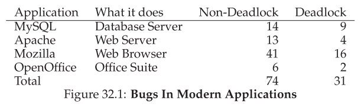
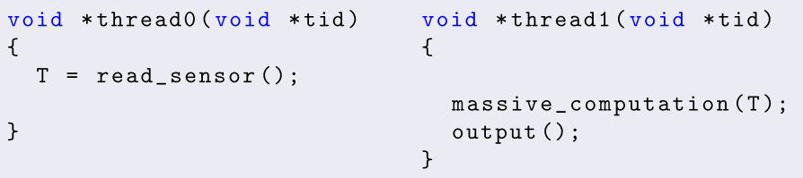
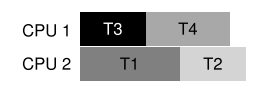

# 6 - Concurrency Problems

*Keywords*: Definition of deadlock, mutual exclusion, resource allocation graph, Coffman’s conditions, solution strategies (prevention, avoidance, detection and recovery), how to achieve deadlock prevention (breaking Coffman’s conditions), safe states and deadlock avoidance, deadlock detection and recovery, livelock, priority inversion.

## Litterature

OSTEP Chapter 25, 26, (27), 28, (29), (30), 31, 32, (33), 34

Kapitler med parenteser skimmes: (x)

## Learning Goals

After today’s lecture, you:

* ... can define and explain the concept of **deadlock**
* ... can define and explain **Coffman’s conditions** for deadlock
* ... can explain and use **deadlock prevention strategies**:
    * **prevention**
    * **avoidance**
    * **detect-and-recover**
* ... can define and explain the following concepts
    * **livelock**
    * **priority inversion**
* ... can use the **Dining Philosophers** example to explain concurrency
    issues

## Noter

Concurrency bugs in modern applications




### Non-Deadlock Bugs

97 % af non-deadlock bugs er en af følgende:

* **Atomicity Violation**
* **Order Violation**

#### Atomicity Violation

Eksempel fra MySQL:

```c
Thread 1::
if (thd->proc_info) {
	fputs(thd->proc_info, ... );
}

Thread 2::
thd->proc_info = NULL
```

Koden i thread 1, har en *atomicity assumption*, den tror at kode line 2-3 sker i et hug.
Men hvis den laver null-check først, og så tråd 2 sætter den til null før linje 3 køres, så er der fejl

**Løsning:** Locks rundt om lines 2-4 + line 7


#### Order-Violation

```c
float T;
```



Koden i thread 2, tror at `T` er initialiseret.

**Løsning**:

Kan løses med en semaphore


### Deadlock

Se [The Dining Philosphers Eksempel](#the-dining-philosophers)


Sker hvis lad os sige Tråd 1 holder en lock `L1` og venter på `L2`. 
Og Tråd 2 holder `L2` og venter på `L1`


Sker blandt andet pga store code bases og **encapsulation**

#### Conditions for Deadlock

Fire conditions skal holde før en deadlock kan ske:

* **Mutual exclusion:** Tråde holder eksklusiv kontrol over en resource som de skal bruge. (eks. en lock)
* **Hold-and-wait:** Tråde holder resourcer allokeret til dem, eks. aquired locks, mens de venter på flere resourcer (eks. locks de gerne vil aquire).
* **No preemption:** Resourcer (eks. locks) kan ikke blive forcefully removed fra tråde der holder dem.
* **Circular wait:** Der eksistere en cirkular kæde af tråde, så at hver tråd holder en eller flere resourcer (eks. locks) som bliver requestet af den næste tråd i kæden.

Alle disse conditions skal overholdes før der kan ske en deadlock.


#### Prevention

##### Circular Wait

Nok den mest praktiske prevention teknik. Undgå circular wait.

Den mest ligetil løsning er **total ordering**.

* Hvis der kun er 2 locks i systemet, så sørg for at eks `L1` altid aquires før `L2`.
* Kan være svært i et system med mere end 2 locks.

**Partial ordering:**

* En rækkefølge for forskellige locks.


Kræver careful design. Er kun en convention, og en "doven" programmør kan ignorere dem.

Kræver dyb forståelse for kode basen.


##### Hold-and-wait

Kan undgås ved at tage alle locks på en gang:

```
pthread_mutex_lock(prevention); 	// begin aquisition
pthread_mutex_lock(L1);
pthread_mutex_lock(L2);
...
pthread_mutex_unlock(prevention);	// end
```

Problematisk:

* Encapsulation arbejder imod os.
    * Kræver at vi ved hvilke locksder skal holdes, og at de skal aquires før tid.
* Nedsætter concurrency, da alle locks skal aquires på en gang i stedet for når de rigtigt skal bruges


##### No Preemption

Flere libraries tilbyder flexibelt sæt interfaces til at hjælpe.

Routinen: `pthread_mutex_trylock()` grabber enten lock'en hvis den er klar og returnerer sucess, eller returnerer error hvis låsen holdes.

Kan bruges til at lave en deadlock-free ordering-robust lock aquisition protocol:

```c
top:
pthread_mutex_lock(L1);
if (pthread_mutex_trylock(L2) != 0) { 
	pthread_mutex_unlock(L1); 
	goto top;
}
```

Et nyt problem er dog skabt: **livelock**

* Det kan ske (dog usansynligt) at 2 tråde begge prøver og fejler gentagne gange på at aquire begge locks.
* Begge tråde kører gennem koden om og om igen (altså ingen deadlock), men der sker intet, derfor livelock.
* En løsning på dette kan være at inføre et random delay.

Dog:

* Problem igen, encapsulation
* Hvis koden har aquired andre resources, skal den huske at release dem igen.
* Tilføjer ikke preemption. men bruger trylock til at lade udvilkeren trække sig ud af et lock ownership.


##### Mutual Exclusion

Undgå behovet for mutual exclusion.

Ide: design data strukturer uden locks. (**lock-free** and **wait-free**)

* Brug hardware instruktioner.

Eksempel vi bruger [compare-and-swap](../exam/5-concurrency.md#compare-and-swap) til at atomically increment en værdi.

```c
void AtomicIncrement(int *value, int amount) { 
	do {
		int old = *value; 
    } while (CompareAndSwap(value, old, old + amount) == 0); 
}
```

Istedet for at aquire en lock, update og release lock, har vi en metode der bliver  ved med at prøve at opdatere value med compare-and-swap.


##### Deadlock Avoidance via Scheduling

Lad os sige at vi har 2 CPU'er og 4 tråde, samt 2 locks.

Lad os sige at vi ved at de 2 locks aquires af trådene som vist i tabellen: 


En smart scheduler kan nu vide at så længe at T1 og T2 ikke køre på samme tid kan der ikke ske deadlock.

Eksempel på schedule:



Andet eksempel:


* Static scheduling koster i performance


#### Detect and Recover

Sidste generelle strategi er at lade deadlocks være "tilladet", og så take action hvis en deadlock bliver detected.

* Eksempel, hvis OS fryser, kan det genstartes.

Mange databasesystemer kører deadlock detection.

* Bygger en resource graf, og tjekker for cycles.
* Hvis det findes skal systemet genstartes.


### The Dining Philosophers

* 5 filosoffer
* Mellem hver er en enkelt gaffel.
* En filosof kan enten tænke eller spise
    * Tænke: ingen gaffel
    * Spise: Kræver 2 gafler


Her er basic loop for hver philospher, hvor hver filosof har en thread idientifier `p` fra 0 til 4

```
while (1) { 
    think();
    get_forks(p); 
    eat(); 
    put_forks(p);
}
```

Udfordringen er at skrive routinerne `get_forks()` og `put_forks()` sådan at:

* Der er ingen deadlock
* Ingen filosof starves
* Høj concurrency (så mange filosoffer som muligt spiser på samme tid)

Vi bruger følgende helper funktioner:

```c
int left(int p) 	{ return p; }
int right(int p)	{ return (p + 1) % 5; }
```

Når en filisof vil have gaflen til venstre kaldes `left(p)` og samme for højre `right(p)`.

Vi har også nogle semaphores, lad os sige vi har 5, en for hver fork: `sem_t forks[5]`

#### Umiddelbare Løsning (FORKERT)

```c
void get_forks(int p) {
	sem_wait(&forks[left(p)]);
	sem_wait(&forks[right(p)]);
}

void put_forks(int p) {
	sem_post(&forks[left(p)]); 
	sem_post(&forks[right(p)]);
}
```

==DETTE ER FORKERT==

Det fører til **deadlock**.

Hvis hver filosof tager deres gaffel til venstre før nogen når at tage deres gaffel til højre, vil de alle sammen være stuck ventende på at deres højre gaffel bliver ledig.


#### Løsning: Breaking The Dependency

Vi ændre på hvordan gafler bliver taget hos mindst en af filosofferne.

```c
void get_forks(int p) { 
	if (p == 4) {
		sem_wait(&forks[right(p)]); 
		sem_wait(&forks[left(p)]);
	} else {
		sem_wait(&forks[left(p)]); 
		sem_wait(&forks[right(p)]);
    } 
}
```


