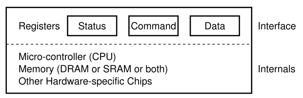
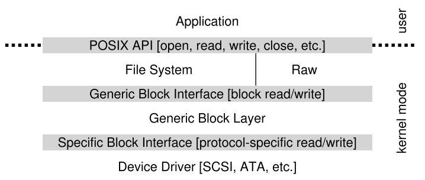
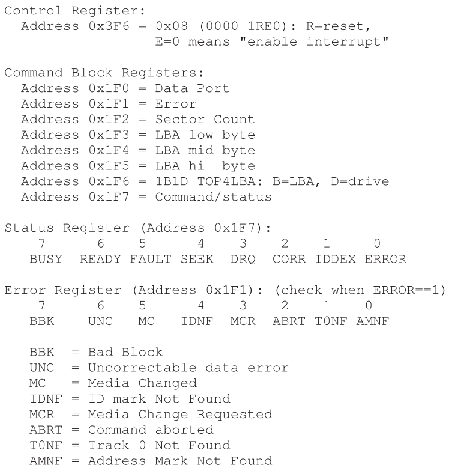

# 7 - I/O and Device Drivers

*Keywords*: Types of I/O (programmed, interrupt-driven, DMA), implementation of I/O (as system calls), definition and implementation of system call, device drivers.

## Litterature

OSTEP Chapter 35, 36, 37, (38), (39), (40), [41], [42], [43], [44], [45]

Kapitler med parenteser skimmes: (x)
Kapitler med kantede paranteser er optional: [x]


## Noter

### System Arkitektur

"Klassisk" diagram af et system:


Hvorfor har vi hierakisk struktur?

* Fysik
    * Jo hurtigere en bus er, jo kortere skal den være
* Pris
    * Det er dyrt at lave high performance busses


Intel's Z270 Chipset:


* CPU connecter med en I/O chip via Intel's proprietary **DMI (Direct Media Interface)**
* Resten af devices connecter til I/O chuppen via forskellige interconnects.
    * Harddrives via **eSATA** 
        * **ATA - AT Attachement**
        * **SATA** - **Serial ATA**
        * eSATA - **external SATA**
    * **USB (Universal Serial Bus)** connections
        * Low performance devices
    * Higher performance devices gennem **PCIe (Peripheral Component Interconnect Express)**
        * Network
        * **NVMe** storage devices


### En Canonical Device



* **Interface** som præsenteres til systemet.
* **Internal structure**. 

Denne enhed består af 3 registre:

* **status**: læses for at se enhedens nuværende status
* **command**: fortæller enheden hvilken opgave den skal udføre
* **data:** til at videregive data til enheden, eller til at modtage data fra enheden.

Typisk simpel interaktion som OS kan have med enheden:

```pseudocode
While (STATUS == BUSY)
	; // wait until device is not busy
Write data to the DATA register
Write command to the COMMAND register
	(starts device and executes the command)
While (STATUS == BUSY)
	; // wait ontil devices is done with your request
```

1. OS venter på at enheden er klar ved at læse STATUS (**polling** the device) (line 1-2)
2. OS sender data til DATA (line 3)
    * Når main CPU er involveret i data flytning kaldes det **programmed I/O (PIO)**
3. OS skriver kommando til COMMAND
    * Fortæller implicit til enheden både at data er tilstede og at den skal begynde kommandoen
4. OS venter på enheden færdiggører arbejdet ved polling

Simpel men ineffektiv protokol.

CPU spilder tid ved polling.


### Løsning: Interrupts

OS laver I/O request, putter processen i sleep, laver context switch.

Når I/O enheden er færdig, laver den et **hardware interrupt**.

**Interrupt handler **aka **interrupt service routine (ISR)** tager over.

* Ikke altid den bedste løsning. Hvis en enhed er meget hurtig, vil interrupts sænke farten. Polling bedre.

Hybrid:

* poll'er lidt i starten og bruger interrupts hvis ikke enheden er færdig.


Networks

* Kan være skidt at bruge interrupts, hvis der kommer en masse packets der genererer interrupts.
    * OS kan gå i **livelock** hvor det ikke laver andet end at behandle interrupts

Polling giver lidt mere kontrol


**Coalescing** er en anden optimering.

* En device der skal interrupt, venter først med at sende.
* Mens den venter, kan andre requests klares, og flere interrupts kan samles (coalesced).


### Effektiv Data Overførsel Med DMA

Det kræver tid for CPU'en at overføre data. (Markeret med grå 'c' bokse)


En løsning på dette problem er **Direct Memory Access (DMA)**

En DMA engine, er en specifik enhed i systemet der orkestrerer overførseler mellem enheder og main memory uden meget CPU intervention.

* OS programmerer DMA engine ved at fortælle den hvor dataen befinder sig, hvor meget data, og hvor det skal sendes hen.


### Device Interaction

2 forskellige måder at kommunikere med enheder er udviklet over tid.

* Explicit **I/O instructions**.
    * Hardware instruktioner der specificere en måde for OS at sende data til device registre.
    * x86 har `in` og `out` instruktioner
        * Caller specificerer register med data og en specifik *port*.
    * Instruktioner er **priviligerede**.
* **Memory-mapped I/O**
    * Hardware gør device registre ledige som var de memory locations.
    * OS kalder load eller store til adressen, og hardware router til enheden i stedet for main memory.


### Device Drivers

**Abstraction**

Et stykke software i OS, **device driver** kender i detajler hvordan en enhed fungerer.

Linux File System Stack:



* Et file system, er ligeglad med hvilken disk den bruger.
* **Raw interface** er også stillet til rådighed.
    * Lader specielle applikationer som **file-system checker** eller **disk defragmentation** tools læse og skrive direkte.

Kan have ulemper: 

* Hvis en device har specielle capabilities, men skal have en generic interface, går disse capabilities til spilde.


Studier viser at over 70% af Linux OS code er device drives.


### IDE Disk

Interface:



4 registre:

* Control
* Command block
* Status
* Error

Tilgås ved at læse de specifikke I/O adresser med `in` og `out` instruktionerne i x86.

Basic protocol er som følger:

* **Wait for drive to be ready**: Læs Status Register until drevet er READY og ikke BUSY
* **Skriv parametre til command registre**: Skriv sector count, logical block address (LBA) på sektorerne der skal tilgås, og drive number (master=0x00 eller slave=0x10) til command registre
* **Start I/O**: ved at issue read/write til command registre. 
* **Data transfer (ved writes):** vent til drive status er READY og DRQ (drive request for data). Skriv data til data port.
* **Håndter interrupts**
* **Error handling:** efter hver operation, læs status register. Hvis ERROR bit er 1 læs error register for detaljer.


!!! snippet "xv6"
	IDE drive i xv6 findes i `ide.c`