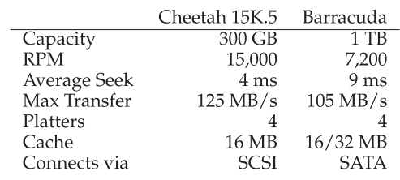

# 7 - I/O and Device Drivers

*Keywords*: Types of I/O (programmed, interrupt-driven, DMA), implementation of I/O (as system calls), definition and implementation of system call, device drivers.

## Litterature

OSTEP Chapter 35, 36, 37, (38), (39), (40), [41], [42], [43], [44], [45]

Kapitler med parenteser skimmes: (x)
Kapitler med kantede paranteser er optional: [x]


## Noter

### System Arkitektur

"Klassisk" diagram af et system:


Hvorfor har vi hierakisk struktur?

* Fysik
    * Jo hurtigere en bus er, jo kortere skal den være
* Pris
    * Det er dyrt at lave high performance busses


Intel's Z270 Chipset:


* CPU connecter med en I/O chip via Intel's proprietary **DMI (Direct Media Interface)**
* Resten af devices connecter til I/O chuppen via forskellige interconnects.
    * Harddrives via **eSATA** 
        * **ATA - AT Attachement**
        * **SATA** - **Serial ATA**
        * eSATA - **external SATA**
    * **USB (Universal Serial Bus)** connections
        * Low performance devices
    * Higher performance devices gennem **PCIe (Peripheral Component Interconnect Express)**
        * Network
        * **NVMe** storage devices


### En Canonical Device


* **Interface** som præsenteres til systemet.
* **Internal structure**. 

Denne enhed består af 3 registre:

* **status**: læses for at se enhedens nuværende status
* **command**: fortæller enheden hvilken opgave den skal udføre
* **data:** til at videregive data til enheden, eller til at modtage data fra enheden.

Typisk simpel interaktion som OS kan have med enheden:

```pseudocode
While (STATUS == BUSY)
	; // wait until device is not busy
Write data to the DATA register
Write command to the COMMAND register
	(starts device and executes the command)
While (STATUS == BUSY)
	; // wait ontil devices is done with your request
```

1. OS venter på at enheden er klar ved at læse STATUS (**polling** the device) (line 1-2)
2. OS sender data til DATA (line 3)
    * Når main CPU er involveret i data flytning kaldes det **programmed I/O (PIO)**
3. OS skriver kommando til COMMAND
    * Fortæller implicit til enheden både at data er tilstede og at den skal begynde kommandoen
4. OS venter på enheden færdiggører arbejdet ved polling

Simpel men ineffektiv protokol.

CPU spilder tid ved polling.


### Løsning: Interrupts

OS laver I/O request, putter processen i sleep, laver context switch.

Når I/O enheden er færdig, laver den et **hardware interrupt**.

**Interrupt handler **aka **interrupt service routine (ISR)** tager over.

* Ikke altid den bedste løsning. Hvis en enhed er meget hurtig, vil interrupts sænke farten. Polling bedre.

Hybrid:

* poll'er lidt i starten og bruger interrupts hvis ikke enheden er færdig.


Networks

* Kan være skidt at bruge interrupts, hvis der kommer en masse packets der genererer interrupts.
    * OS kan gå i **livelock** hvor det ikke laver andet end at behandle interrupts

Polling giver lidt mere kontrol


**Coalescing** er en anden optimering.

* En device der skal interrupt, venter først med at sende.
* Mens den venter, kan andre requests klares, og flere interrupts kan samles (coalesced).


### Effektiv Data Overførsel Med DMA

Det kræver tid for CPU'en at overføre data. (Markeret med grå 'c' bokse)


En løsning på dette problem er **Direct Memory Access (DMA)**

En DMA engine, er en specifik enhed i systemet der orkestrerer overførseler mellem enheder og main memory uden meget CPU intervention.

* OS programmerer DMA engine ved at fortælle den hvor dataen befinder sig, hvor meget data, og hvor det skal sendes hen.


### Device Interaction

2 forskellige måder at kommunikere med enheder er udviklet over tid.

* Explicit **I/O instructions**.
    * Hardware instruktioner der specificere en måde for OS at sende data til device registre.
    * x86 har `in` og `out` instruktioner
        * Caller specificerer register med data og en specifik *port*.
    * Instruktioner er **priviligerede**.
* **Memory-mapped I/O**
    * Hardware gør device registre ledige som var de memory locations.
    * OS kalder load eller store til adressen, og hardware router til enheden i stedet for main memory.


### Device Drivers

**Abstraction**

Et stykke software i OS, **device driver** kender i detajler hvordan en enhed fungerer.

Linux File System Stack:


* Et file system, er ligeglad med hvilken disk den bruger.
* **Raw interface** er også stillet til rådighed.
    * Lader specielle applikationer som **file-system checker** eller **disk defragmentation** tools læse og skrive direkte.

Kan have ulemper: 

* Hvis en device har specielle capabilities, men skal have en generic interface, går disse capabilities til spilde.


Studier viser at over 70% af Linux OS code er device drives.


### IDE Disk

Interface:


4 registre:

* Control
* Command block
* Status
* Error

Tilgås ved at læse de specifikke I/O adresser med `in` og `out` instruktionerne i x86.

Basic protocol er som følger:

* **Wait for drive to be ready**: Læs Status Register until drevet er READY og ikke BUSY
* **Skriv parametre til command registre**: Skriv sector count, logical block address (LBA) på sektorerne der skal tilgås, og drive number (master=0x00 eller slave=0x10) til command registre
* **Start I/O**: ved at issue read/write til command registre. 
* **Data transfer (ved writes):** vent til drive status er READY og DRQ (drive request for data). Skriv data til data port.
* **Håndter interrupts**
* **Error handling:** efter hver operation, læs status register. Hvis ERROR bit er 1 læs error register for detaljer.


!!! snippet "xv6"
	IDE drive i xv6 findes i `ide.c`


### Hard Disk Drive

Består af et stort antal sektorer (512-byte blocks)

* Som hver kan læses eller skrives
* Numereret fra 0 til $n-1$ på en disk med $n$ sektorer
* Kan ses som et array af sektorer
* 0 til $n-1$ er **address space** for drevet

Multi-sektor operationer er mulige.

* Mange fil-systemer læser eller skriver 4KB af gangen.
* Eneste garanti er at 512-byte writes er **atomic**
    * Hvis der sker power loss, er det måske kun en del af en skrivning der færdiggøres (**torn write**)


Assumptions som klienter af disk dreve gør sig (unwritten contract)

* Access af 2 blocks tæt på hinanden er hurtiger end 2 blocks langt fra hinanden
* Access af blocks i en sammenhængende chunk er hurtigst


#### Disk Geometri


* Vi har en **platter** en cirkulær plade med en hård overflade
    * Hver platter har 2 sider (**surface**)
    * En disk har en eller flere platters
    * Ofte lavet af aluminium
    * Coated med tyndt magnetisk lag
* Platters er bundet sammen omkring **spindle**
    * Som er connected til en moter
    * Spinner ofte mellem 7,200 og 15,000 **RPM (rotations per minute)**
        * 10,000 RPM $\rightarrow$ 1 rotation tager ca 6 ms
* Data er encoded på hver surface i  koncentriske cirkler af sektorer. (**track**)
* **Disk head** læser og skriver sektorer ved at læse eller påvirke magnetic patterns 
    * 1 per surface
    * Attached til en **disk arm**


#### Simple Disk Drive

Vi tager udgangspunkt i figur 37.2 ovenfor.

Hvis vi laver request til block 0. Så skal disken bare vente på at 0 roterer under disk head.

* Kaldes **rotational delay** aka **rotation delay**


Moderne diske har flere millioner tracks. Eksempel med flere tracks:


Request til sektor 11. Først skal disk armen bevæge sig til det korrekte track. Kaldet et **seek**.

Seeks sammen med rotations er de dyreste disk operationer.

Seek har flere faser:

* *acceleration*
* *coasting*
* *deceleration*
* *settling*: **settling time** er signifikant e.g., 0.5 til 2 ms
    * drev skal være sikker på at finde det rigtige track.

Når sector 11 passerer under disk head kan sidste fase af I/O ske (**transfer**).


Ofte bruges **track skew**


Så når head repositioner armen, passer det bedre.

Ydre tracks har ofte flere sektorer (pga geometri). Kaldes **multi-zoned** disk drives: Disk er organiseret i mange zoner.

* Hver zone har det samme antal sektorer per track. Ydre zoner har flere sektoerer end indre zoner.


##### Cache

Også kaldet **track buffer**.

Lille stykke memory, ofte omkring 8- eller 16 MB

Disk skal vælge ved writes, om den vil anerkende et write når den har puttet data i memory, eller først når den har skrevet på disk?

* **Write back: ** når det er skrevet i memory (også kaldet **immediate repporting**)
    * Kan få drevet til at se hurtigere ud, men kan være farligt hvis filsystemet kræver at data skrives i en bestemt rækkefølge.
* **Write through**: når der er skrevet til disk.


#### I/O Time

I/O Time:
$$
T_{I/O}=T_{seek}+T_{rotation}+T_{transfer}
$$
Rate of I/O:
$$
R_{I/O}=\frac{Size_{Transfer}}{T_{I/O}}
$$

##### Eksempler



**Random** workload laver små reads (eg 4KB) til random lokationer

**Sequential** workload læser et stort antal sammenhængende sektorer


#### Disk Scheduling

Da I/O er dyrt spiller OS en rolle i scheduling.

* **Disk scheduler**

I/O "job"-tid er nogenlunde kendt i modsætning til job-scheduling.

Prøver at følge **principle of SJF (shortest job first)**


##### SSTF: Shortest Seek Time First

AKA **shortest-seek-first (SSF)**.

* Rangerer køen af I/O request baseret på track.
* Vælger den request på det nærmeste track først.
* Kender dog ikke geometrien af disk, ses som array af blocks.

Kan derfor implementere **nearest-block-first (NBF)** i stedet for SSTF.

Kan føre til **starvation**, hvis der kommer strøm af requests til de indre track eksempelvis.


##### Elevator (AKA SCAN or C-SCAN)

Algoritmen bevæger sig frem og tilbage over disken, og håndterer request i rækkefølge over tracks.

* Et enkelt pass over disken kaldes et *sweep*.

Varianter:

* **F-SCAN:** fryser køen når den sweeper.
    * Requests der kommer ind under sweep sættes i en sekundær kø
    * Undgår at far-away requests bliver starved ved at delay sent-ankomne (men tættere på) requests.
* **C-SCAN**: **Circular SCAN**
    * I stedet for frem og til bage, køre den i "cirkel".
    * Mere fair over for de midterste tracks.

Hverken SCAN eller SSTF er den bedste scheduling technology, de adhere ikke til principle of SJF som de kunne.

* De ignorerer rotation.


##### SPTF: Shortest Positioning Time First


Hvis det tager længere tid at rotere, giver det mere mening at lave det lange seek, ex 8, så den ikke skal rotere så meget. 

På moderne drives er seek og rotation ca. ens. Derfor er SPTF brugbart og increaser performance.

Svært at implementere i OS, så ofte implementeret inde i drevet.


##### Andre Scheduling Problemer

**I/O Merging**: Der kommer 3 request til 33, så 8, så 34. Scheduler burde her merge 33 og 34 indtil en two-block request.

Hvor lang tid skal OS vente med at sende request?

Naiv approach: **work-conserving:** send så snart der er en I/O.

* Harddisk arbejder hele tiden.

Research om **anticpatory disk scheduling** viser at det kan betale sige at vente lidt. Kaldet **non-work-conserving**

