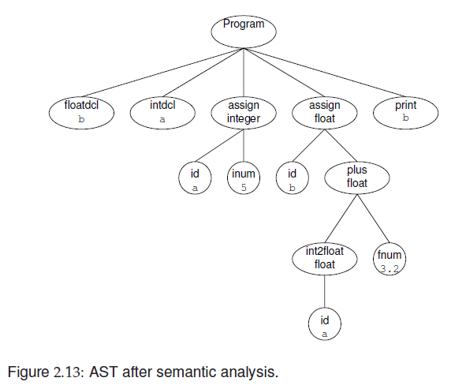

# The Language 'ac'

> ac: adding calculator

## Informal Definition

Types:

* `integer`
* `float`: 5 fractional digits after the decimal point.
* Automatic type conversion from `int` to `float`

Keywords

* `f: float`
* `i: integer`
* `p: print`

Variables

* 23 names from lowercase Roman alph. except the 3 reserved keywords.

Flat scope

* Names are visible in the program when they are declared

Target of translation: dc (desk calculator)

* Reverse Polish Notation (RPN)


## Example Program

Example ac program:

```ac
f b			// declare var b as float
i a			// declare var a as int
a = 5		// assign a the value 5
b = a + 3.2	// assign b teh result of calculation a + 3.2
p b			// print content of b
$ 			// end of input
```
Corresponding dc program:

```dc
5
sa
la
3.2
+
sb
lb
p
```


## Formal Definition

* Syntax specification: context-free grammar (CFG)
* Token specification: Regular Expressions


No formal definition of Type Rules or Runtime semantics (in Fisher et. Al.)


### Context Free Grammar (CFG)

- A set of productions or rewriting rules

- Eg.: 

  ```CFG
  Stmt	->	id assign Val Expr
  		|	print id
  
  // A statement (Stmt) can either be line 1 or line 2
  ```

- Two kinds of symbols:

  - Terminals - Cannot be rewritten
    - Eg. *id, assign, print*
    - Start symbol: Prog
    - Empty or null string: $\lambda$ (some references use $\varepsilon$ for empty string)
    - End of input stream or file: $
  - Nonterminals
    - Eg. *Val*, *Expr*

*Note: nonterminals begin with uppercase in Fisher et. al.*


LHS - **left-hand side** (`Prog`)

RHS - **right-hand side** (`Dcls Stmts $`)


* We begin with the **start-symbol** usually the LHS of the first rule.

* We proceed by replacing it with the RHS of some production for that symbol
* We continue choosing some nonterminal symbol in out derived string of symbols, finding a production for that nonterminal, replacing it with the string of symbols on the production's RHS.
* We continue until no nonterminal remain.

Any string of terminals produced in this manner is considered syntactically valid.

​	Any other string has a **syntax error**


#### Syntax Specification with CFG for 'ac'


#### Example Derivation of an 'ac' program


### Parse Tree


### Token Specification

Using Regular Expressions


## Phases of an ac compiler

* Scanning
  * The **scanner** reads a src **ac** program as a text file and produces a stream of tokens
* Parsing
  * Determine if the stream of tokens conforms to the language's grammar spec. And creates an **abstract syntax tree (AST)**.
    * For ac, *recursive descent* is used
* Symbol Table
  * The AST is traversed to create a *symbol table*, associating type and other contextual information with variables used in an 'ac' program.
* Semantic Analysis
  * The AST is traversed to perform Semantic Analysis.
  * In 'ac' its fairly minimal, in most languages, multiple passes over the AST may be required.
  * Often decorates or transforms portions of the AST.
    * The actual meaning of those portions become clear
* Translation
  * The AST is traversed to generate a Translation of the original program.

### Scanning

Translating stream of chars into a stream of **tokens.**

Each token found by the scanner has the following two components:

* A token's *type* explain s the token's membership in the terminal alphabet. All instances of a given terminal have the same token type.
* A token's **semantic value** provides additional information about the token.

For terminals such as `plus` no semantic info is required (only one token (+) can correspond to it).

Other, such as `id` and `num` require semantic info, so the compiler can record *which* identifier or number has been scanned.


#### Scanner pseudocode


### Parsing

Responsible for determining if the stream of tokens provided by the scanner conforms to the language's grammar spec.

The parsing technique used for the ac compiler is called **Recursive descent**.

* Mutually recursive parsing routines that in effect descent through a derivation tree.

We look at recursive descent parsing procedures for `Stmt` and `Stmts`

#### Pseudocode for Stmt and Stmts


First it examines the next input token to predict which production to apply.

Ex. `Stmt` offers two productions:

```
Stmt	->	id assign Val Expr
Stmt	->	print id
```

This is done at marker 1 and 6 in figure 2.7.

If 'id' is the next input token, then the parse must proceed with a rule that generates 'id' as its first terminal.

* We say that the **predict set** for `Stmt -> id assign Val Expr` is {id}

  The predict set for `Stmt -> print id` is {print}


### Semantic Analysis





### Code Generation

* Assumes that program has been thoroughly checked and is well formed (scope and type rules)
* Takes semantics of both the source and target language into account
* Transforms source program into target code


### Tree Traversal

* "Traditional" OO approach
* Visitor Approach
    * GOF
    * Using static overloading
    * Reflective
* "Functional" approach
* Active patterns in Scala (or F#)


#### Traditional

Method for each phase in every node

#### Visitor

##### GOF

```java hl_lines="2"
@Override
void visitAssigning(Assigning n) {
    // TODO Auto-generated method stub
    n.child1.accept(this);
    emit(" s");
    emit(n.id);
    emit(" 0 k ");
}
```

##### Static Overloading

```java hl_lines="2"
@Override
void visit(Assigning n) {
    // TODO Auto-generated method stub
    n.child1.accept(this);
    emit(" s");
    emit(n.id);
    emit(" 0 k ");
}
```

##### Reflective

Using **double dispatch**

Visitor decides the best class / method to use


#### Functional

If-else chain or switch


#### Scala Active Patterns


