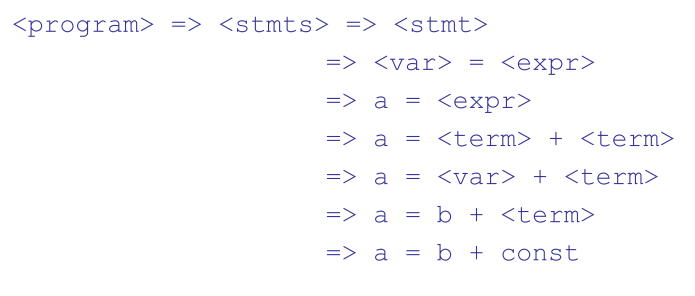
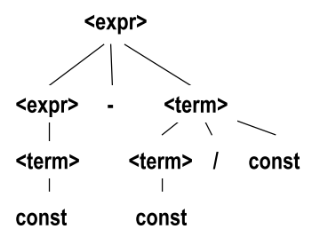

# Language Specification

A communication device between people who need to have a common understanding of the PL.


**What to specify?**

* What is a well formed program
  * Syntax
  * Contextual constraints (static semantics)
    * sope rules
    * type rules
* What is the meaning of (well formed) programs.
  * Semantics (runtime semantics)


**How to specify?**

* Formal specification
  * Some kind of precisely defined formalism
* Informal specification
  * Description in eg. English


* Usually a mix of both (eg. Java spec.)
  * Syntax -> Formal spec. using RE and CFG
  * Contextual constraints and semantics -> informal
  * Formal semantics has been retrofitted.


* Trend towards more formality (C#, Fortress)


## Terminology

A **sentence** is a string of characters over some alphabet

A **language** is a set of sentences

A **lexeme** is the lowest level syntactic unit of a language (eg. `*`, `sum`, `begin`)

A **token** is a category of lexemes (eg. identifier)


**Generators**

* A device that generates sentences of a language
* One can determine if syntax of particular sentence is syntactically correct, by comparing it to the structure of the generator.


**Recognizers**

* A recognition device reads input strings over the alphabet of the language and decides whether the input strings belong to the language
* Ex: syntax analysis part of a compiler


## Syntax Analysis

Portion of a language processor nearly always consists of two parts.

* A low-level part called a lexical analyzer.
  * Finite automaton based on regular grammar.
* A high-level part called syntax analyzer, or parser.
  * Push-down automaton based on a CFG or BNF


### Context-Free Grammars and BNF

CFG Developed by Noam Chomsky in mid-1950's

Language generators, meant to describe syntax of natural languages.


* A finite set of **terminal symbols** (tokens)
* A finite set of **non-terminal symbols**
* A **start symbol**
* A finite set of **production rules**


CFG's are written in BNF notation.

A **production rule** in BNF is written as:

​	$N::=\alpha$	

where *N* is a non terminal and $\alpha$ a sequence of terminals and non-terminals

​	$N::=\alpha|\beta|..$

is an abbreviation for several rules with *N* as LHS


#### Example


#### BNF Fundamentals

* Abstractions are used to represent classes of syntactic structures
  * They act like syntactic variables (also called *non-terminal symbols*)

* *Terminals* are lexemes or tokens

* A rule has a LHS, which is nonterminal and a RHS which is a string of terminals and/or nonterminals

* Nonterminals are often enclosed in angle brackets

* Grammar: a finite non-empty set of rules

* A *start symbol* is a special element of nonterminals of a grammar.


* An abstraction (or nonterminal symbol) can have more than one RHS

  

  * Alternative rules are written with `|`

  

  

* Syntactic list are described using recursion

  

* A derivation is a repeated application of rules, starting with the start symbol and ending with a sentence (all terminal symbols)


##### Example


##### Example derivation



#### Derivations

* Every string of symbols in a derivation is a *sentential form*
* A *sentence* is a sentential form that has only terminal symbols
* A *leftmost derivation* is one in which the leftmost nonterminal in each sentential form is the one that is expanded
* A *rightmost derivation* is one in which the rightmost nonterminal in each sentential form is the one that is expanded
* A derivation may be neither leftmost nor rightmost


#### Ambiguity in Grammars

A grammar is **ambiguous** if and only if it generates a sentential form that has two or more distinct parse trees.

##### **Example**


##### Fix the example

If we use the parse tree to indicate precedence levels of the operators, we cannot have ambiguity.





##### Associativity of Operators

Operator associativity can also be indicated by a grammar.


#### Extended BNF

* Optional parts are placed in brackets []

```
<proc_call> -> ident [(<expr_list>)]
```

* Alternative parts of RHS are placed inside parenthethes and seperated via vertical bars

```
<term> -> <term> (+|-) const
```

* Repetitions (0 or more) are placed inside braces {}

```
<ident> -> letter {letter|digit}
```


##### BNF vs EBNF

**BNF**


**EBNF**


## Important

* Syntax is the visible part of a programming language
  * Programming language designers can waste a lot of time discussing unimportant details of syntax
* The language paradigm is the next most visible part
  * The choice of paradigm, and therefor language, depends on how humans best think about the problem
  * There are no right models of computations - just different models of computation, some more suited for cerain classes of problems than others.
* The most invisible part is the language semantics
  * Clear semantics usually leads to simple and efficient implementations.