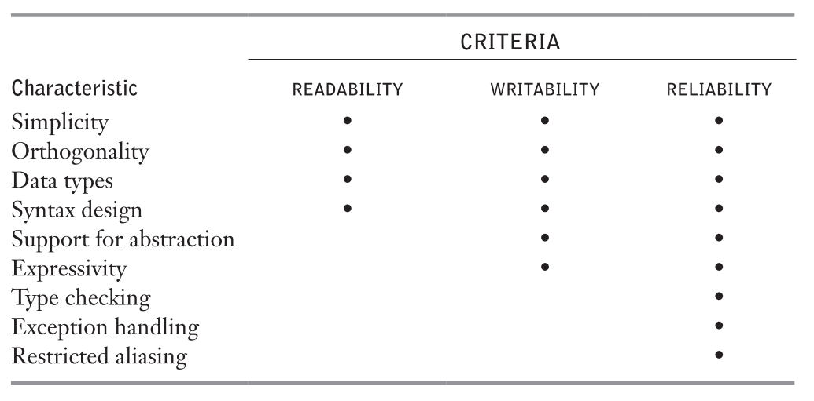

# Compiler

Translates **human-oriented** programming languages into **computer-oriented** machine languages.

A compiler allows **virtually** all computer users to ignore **machine independent** details of machine language.

* Making programs and programming expertise **portable** across wide variety of computers.

**Compiler Distinction**

Compilers may be distinguished by:

* By the kind of machine code they generate
* By the format of the target code they generate

## Machine Code Generated by Compilers

May generate any of three:

* Pure Machine Code
* Augmented Machine Code
* Virtual Machine Code

### Pure Machine Code

Code for a particular machines instruction set.

Called **pure code**, because it only includes instructions part of that instruction set.

Rare because most compilers rely on runtime libraries and OS's

Most commonly used in compilers for **system implementation languages**, which are inteded for implementing OS's ore embedded applications.

Can execute on bare hardware without dependence on any other software.

### Augmented Machine Code

Augmented with OS routines and runtime language support routines.

Requires that a particular OS be present.

### Virtual Machine Code

Consists of entirely of virtual instructions.

* Increases portability

An interpreter for the virtual machine (VM) is written for every target architecure.I

Example: Java

#### Bootstrapping a Compiler

If a compiler accepts source language *L*. Any instance of this compiler can translate from *L* to VM instructions.

If the compiler itself is written in *L*, the compiler can compile itself into the VM instructions.

## Language Criteria

Sebesta's Language Criteria

