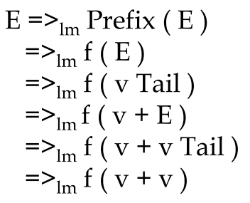

# Context Free Grammar (CFG)

* A finite set of **terminal symbols**
* A finite set of **non-terminal symbols**
* A **start symbol**
* A finite set of **production rules**


## How to Design a Grammar

Lets write a CFG for C-style function prototypes.

**Examples**

- `void myf1(int x, double y);`
- `int myf2();`
- `int myf3(double z);`
- `double myf4(int, int w, int);`
- `void myf5(void);`


### One Possible Grammar


#### Examples

```
void ident(int ident, double ident);
int ident();
int ident(double ident);
double ident(int, int ident, int);
void ident(void);
```


### Another Possible Grammar


#### Examples

```
void ident(int ident, double ident);
int ident();
int ident(double ident);
int ident(int, int ident, int);
void ident(void);
```


## Definition

**Components: ** $G=(N,\Sigma,P,S)$

* A finite **terminal alphabet** $\Sigma$
  * The set of tokens produced by the scanner
* A finite **nonterminal alphabet** N
  * variables of the grammar
* A **start symbol** S 
  * $S \in N$ that initiates all derivations (also called goal symbol)
* A finite set of **productions** P:
  * $P:A \rightarrow X_1...X_m, \space \text{where} \space A \in N, X_i \in N \cup \Sigma, 1\leq i \leq m \space \text{and} \space m \geq 0$
  * (also called rewriting rules)


**Vocabulary** $V=N\cup \Sigma​$

* $N \cap \Sigma = \phi​$


## Notation

The book Fisher et. al. uses the following notation:

| Names Beginning With      | Represent Symbols In | Examples                      |
| ------------------------- | -------------------- | ----------------------------- |
| Uppercase                 | N                    | A, B, C, Prefix               |
| Lowercase and punctuation | $\Sigma$             | a, b, c, if, then, (, ;       |
| $\mathcal{X,Y}$           | $N \cup \Sigma$      | $\mathcal{X}_i,\mathcal{Y}_3$ |
| Other Greek letters       | $(N\cup\Sigma)^*$    | $\alpha, \gamma$              |

A production rule is written:

​	$A \rightarrow \alpha$ or $A \rightarrow \mathcal{X_1...X_m}$ depending on the RHS.

A production rule with multiple RHS is written with `|`
$$
\begin{align*}
A \rightarrow \alpha \\
|\space\space \beta \\
... \space \space \\
|\space\space \beta
\end{align*}
$$
Derivation:

​	$\alpha A \beta \Rightarrow \alpha \gamma\beta$ is one step of derivation if $A\rightarrow \gamma$ is a production rule.

​	$\Rightarrow^+$ derives in one or more steps.

​	$\Rightarrow^*$ derives in zero or more steps.

Sentential form:

​	$S\Rightarrow^*\beta:\beta$ is a sentential form of the CFG

​	$SF(G):$ the set of sentential forms of G

thus:

​	$L(G)=\{w\in\Sigma^* \mid S\Rightarrow^+w\}$

​		also

​	$L(G)=SF(G)\cap\Sigma^*$


## Derivation

Two conventions for rewriting nonterminals in a systematic order:

* **Leftmost derivation** (expands from left to right)
* **Rightmost derivation** (expands from right to left)


### Leftmost Derivation

A derivation that always chooses the leftmost possible nonterminal at each step.

Denoted with $\Rightarrow_{lm}$

#### Example


##### Derivation

`f ( v + v )`



### Rightmost Derivation

The rightmost possible terminal is always expanded

Denoted with $\Rightarrow_{rm}$


### Parse Trees

A graphical representation of a derivation

* Root: start symbol S
* Each node: either grammar symbol or $\lambda$ or $\varepsilon​$ 
* Interior nodes: nonterminals
  * An interior node and its children: production


#### Example


## BNF Form

Backus-Naur Form (BNF)

* Formal grammar for expressing CFG


### Extended BNF (EBNF)

An extended form of BNF.

Three additional postfix operators +, ?, and * are introduced.

* R+ indicates the occurrence of one or more Rs to express repetition
  * R~opt~ is sometimes used.
* R? indicates the occurrence of zero or one Rs to express optionality
  * [R] is sometimes used.
* R* indicates the ocurrence of zero or more Rs to express repetition
  * {R} is sometimes used.


EBNF can be rewritten to BNF

**Example:**

```
expression -> term (+ term)*
```

Rewritten to:

```
	expression 	-> 	term term_tmp
    term_tmp 	-> 	+ term term_tmp
    			|	λ
```


#### Algorithm to rewrite


## Properties of grammars

A non-terminal N is **left-recursive** if starting with at sentential form N, we can produce another sentential form starting with N

```
	expression 	->	expression ‘+’ factor | factor
```

Right-recursion also exists, is less important

```
	expression 	->	term '+' expression
```

A non-terminal N is **nullable**, if starting with a sentential form N, we can produce an empty sentential form.

```
	expression 	->	λ
```

A non-terminal is **useless**, if it can never produce a string of terminal symbols.

```
	expression	->	+ expression
				|	- expression
```


## Grammar Transformations

We can rewrite the rules without changing the output of the rules.

This can create less readable code grammars.

### **Left factorization**


**Example:**


### Elimintaion of Left Recursion


**Example:**


### Substitution


## Dangling Else Problem

We have this rule:

```
single-Command
	::= 	if Expression 	then single-Command
	|		if Expression 	then single-Command
							else single-Command
```

This parse tree? 


Or this parse tree?


Rewrite the grammar:

```
sC	::=		if E then sC endif
	|		if E then sC else sC endif
```

or

```
sC 	::= 	CsC 
	| 		OsC
CsC	::= 	if E then CsC else CsC 
CsC	::= … 
OsC ::= 	if E then sC 
	| 		if E then CsC else OsC
```