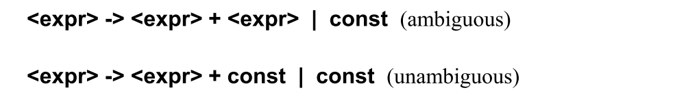
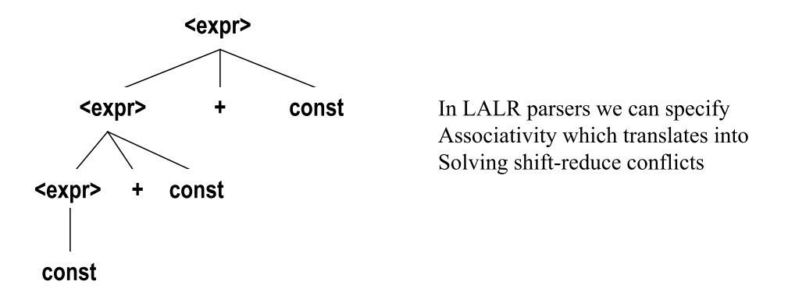
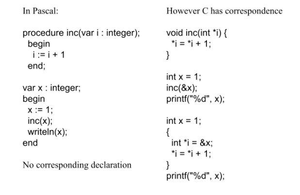

# Language Design and Control Structures

* Language Design Criteria
* Evaluation of expressions
* Explicit sequence control vs. structured sequence control
* Loop constructs
* Subprograms
* Parameter mechanisms

## Design Criteria

### Orthogonality

> “The number of independent primitive concepts has been minimized in order that the language be easy to describe, to learn, and to implement. On the other hand, these concepts have been applied “orthogonally” in order to maximize the expressive power of the language while trying to avoid deleterious superfluities” 
>
> -Adriaan van Wijngaarden et al., Revised Report on the Algorithmic Language ALGOL 68, section 0.1.2, Orthogonal design

> “A precise definition is difficult to produce, but languages that are called orthogonal tend to have a small number of core concepts and a set of ways of uniformly combining these concepts. The semantics of the combinations are uniform; no special restrictions exist for specific instances of combinations.”
>
> -David Schmidt

#### Lack of Orthogonality

Examples of exceptions from C:

* Structures (but not arrays) may be returned from a function.
* An array can be returned if it is inside a structure.
* A member of a structure can be any data type
    * (except void, or the structure of the same type).
* An array element can be any data type (except void)
* Everything is passed by value (except arrays)
* Void can be used as a type in a structure, but a variable of this type cannot be declared in a function

## Sequence Control

Implicit and explicit sequence control

* Expressions
    * Precedence rules
    * Associativity
* Statements
    * Sequence
    * Conditionals
    * Loop Constructs
    * Unstructured vs structured sequence control

### Expressions

* Operator evaluation order
* Operand evaluation order

Operators

* Most operators are infix or prefix
* Order of evaluation determined by operator precedence and associativity

 

The following grammar is ambiguous

The grammar can express operator precedence:

In LL(1)

Gives us:

Association can be expressed with grammar also:

### Statements

* Sequential
* Conditional
* Looping Construct

Must have all three to provide full power of a Computing Machine!

#### Sequential

* Skip
* Assignments
    * Most languages treats assignments as a basic operation
    * Some languages have derived assignment operators such as:
        * `+=` and `*=` in C
* I/O
    * Some languages treat I/O as basic operations
    * Others treat I/O as functions/methods
* Sequencing
    * `C;C`
* Blocks
    * `begin...end`, `{...}`, `let...in...end`

#### Conditional

* Single-way
    * `IF...THEN...`
    * Controlled by boolean expression
* Two-way
    * `IF...THEN...ELSE...`
    * Controlled by boolean expression
    * `IF...THEN` is usually treated as degenerate of `IF...THEN...ELSE...`
* Multi-way
    * `SWITCH`

#### Loops

* Counter-controlled iterators
    * `For-loops`
* Logical-iterators
* Iterations based on data structures
* Recursion

##### For-loops

Controlled by loop variable of scalar type with bounds and increment size.

##### Logic-Test

* While-loops
    * Test performed before entry
* `repeat...until` and `do...while`
    * Test performed at end
    * Always executed at least once

## Subprograms

1. A subprogram has a single entry point
2. The caller is suspended during execution of the called subprogram
3. Control always returns to the caller when the called subprogram's execution terminates

<u>Functions vs Procedures</u>

* **Procedures** provide user-defined **statements**
    * Abstractions over statements
* **Functions** provide user-defined **operators**
    * Abstraction over expressions
* **Methods** used for both functions and procedures

**Specification**:

* Name
* Signature
    * Number and types of input arguments, number and types of output results
* Actions
    * Direct function relating input values to output values
    * Side effects on global state and subprogram internal state

### Local Referencing Envirionments

Local variables can be stack-dynamic

* Support for recursion
* Storage for locals is shared among some subprograms

But

* Allocation/de-allocation, initialization time
* Indirect addressing
* Subprograms cannot be history sensitive

Local variables can be static

* Advantages and disadvantages are the opposite of those for stack-dynamic local variables

### Actual/Formal Parameter Correspondence

* Positional

    * Binding is by position
    * First actual is bound to first formal, and so forth
    * Safe and effective

* Keyword

    * Name of the formal to which the actual is to be bound, is specified with actual.
    * Parameters can appear in any order, avoiding parameter correspondence errors
    * BUT: User must know the formal parameters's names

    

In some languages, formal parameters can have default values.

Some languages allow variable number of parameters

Attributes of variables are used to exchange information

* Name - **Call-by-name**
* Memory location - **Call-by-reference**
* Value
    * **Call-by-value** (one way, from **actual** to **formal** parameter)
    * **Call-by-value-result** (two ways between actual and formal parameter)
    * **Call-by-result** (one way, from **formal** to **actual** parameter)
        * `out` in C#

#### Design Considerations

1. Efficiency
2. One-way or two-way

These are in conflict

* Good programming $\rightarrow$ Limited access to variables, meaning one-way whenever possible
* Efficiency $\rightarrow$ Pass by reference is fastest way to pass structures of significant size
* Functions should not allow reference parameters 

### Subprograms as Parameter

First class functions

Lamdas

* C and C++: functions cannot be passed as parameters but pointers to functions can be passed and their types include the types of the parameters, so parameters can be type checked
* Ada does not allow subprogram parameters; an alternative is provided via Ada’s generic facility
* Java until Java 8 did not allow method names to be passed as parameters
* C# supports functions a parameters through delegates 
    * Delegates can now be anonymous or lambda expression
    * We talk about first class functions
* Functional languages supports functions as first class functions

## Tennent's Language Design Principles

**The Principle of Abstraction**

* All major syntactic categories should have abstractions defined over them.
    For example, functions are abstractions over expressions.

**The Principle of Correspondence**

* Declarations $\approx$ Parameters

**The Principle of Data Type Completeness**

* All data types should be first class without arbitrary restriction on their use

\- Originally defined by R.D.Tennent

### Abstraction

Nearly all programming languages support **process (or command) abstractions** with subprograms (procedures)

Many programming languages support **expression abstraction** with functions.

Nearly all programming languages designed since 1980 have supported **data abstraction**

* Abstract data types
* Objects
* Modules

### Correspondence

