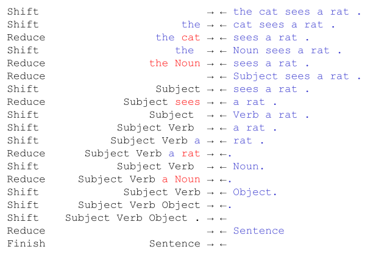
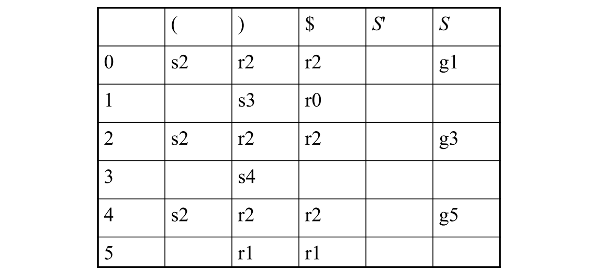

# Parsing

* Describe the purpose of the parser
* Discuss top down vs. bottom up parsing
* Explain necessary conditions for construction of recursive descent parsers
* Discuss the construction of an RD parser from a grammar
* Discuss bottom up / LR parsing

To Read:

- [ ] Sebesta Chapter 4.4-
- [ ] Fischer Chapter 5, 6

## Context Free Grammar

See [Context Free Grammars](../../SPO/05a-context-free-grammars.md)

## Parsers

See [From Tokens to Parse Trees](../../SPO/05b-from-tokens-to-parse-trees.md)

### Recursive Descent Parsing (Top-Down)

[LL(1)](../05b-from-tokens-to-parse-trees.md#formal-definition-of-ll1) grammars can be parsed with a Recursive Descent Parser.

#### Algorithm to Convert EBNF to RD Parser

1. Express grammar in EBNF
2. Grammar Transformations
    * Left factorizations and Left recursion elemination
3. Create a parser class with
    * Private variable `currentToken`
    * Methods to call the scanner `accept` and `acceptIt`
4. Implement private parsing methods
    * Add private `parseN` method for each non-terminal $N$
    * public `parse` method that
        * gets the first token from the scanner
        * calls `parseS` ($S$ is the start symbol of the grammar)

### Bottom-Up Parsers

[LR grammars](../05b-from-tokens-to-parse-trees.md#lr-grammars).

* **LR(0)**: Simplest algorithm
    * Theoretically important but rather weak (not practical)
* **SLR**: An improved version of LR(0)
    * More practical but still rather weak
* **LR(1)** : LR(0) algorithm with extra lookahead token
    * Very powerful algorithm. Not used often because of large memory requirements (big parsing tables)
    * Note: LR(0) and LR(1) use 1 lookahead token when operating
        * 0 res. 1 refer to token used in table construction
* **LR(k)** for $k>0$, k tokens are used for operation and table
* **LALR**: "Watered down" version of LR(1)
    * Still very powerful, but much smaller parsing tables
    * Most commonly used algorithm today

#### Terminology

* $\alpha$ is a **right sentential form** if $S \Rightarrow^*_{rm} \alpha$ with $\alpha=\beta x$ where $x$ is a string of terminals

* A **handle** of a right sentential form $\gamma \ (=\alpha \beta w)$ is a production $A \rightarrow \beta$ and a position in $\gamma$ where $\beta$ may be found and replaced by $A$ to produce the previous right-sentential form in a rightmost derivation of $\gamma:$

    $$
    S \Rightarrow^*_{rm} \alpha A w \Rightarrow_{rm} \alpha \beta w
    $$

    * A handle is a production we can reverse without getting stuck
    * If the handle is $A \rightarrow \beta$, we will also call $\beta$ the handle.

#### Handles and Reductions

#### Shift-Reduce

##### Resembles Knitting

#### Algorithm

All bottom up parsers have similar algorithm

* A loop with these parts
    * Try to find the leftmost node of the parse tree which has not yet been constructed, but all of whose children *have* been constructed.
        * This sequence of children is called a **handle**
        * The sequence of children is built by pushing, also called **shifting**, elements on a stack
    * Construct a new parse tree node
        * Called **reducing**

The difference between different algorithms is only in the way they find the handle.

##### Parse Table

* For every state and every terminal
    * Either shift x
        * Put next input-symbol on the stack and go to state x
    * or reduce production
        * On the stack we now have symbols to go backwards in the production - afterwards do a goto
* For every state and every non-terminal
    * Goto x
        * Tells us, in which state to be in after a reduce-operation
* Empty cells in the table indicate an error

##### LR(0)-DFA

To get parse table: Build DFA and encode it in a table.

* Every state is a set of items
* Transitions are labeled by symbols 
* States must be closed
* New states are constructed from states and transitions

**Item**:

