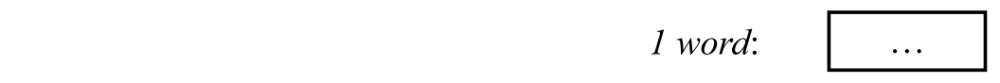

# Runtime Organization

* Data representation (direct vs. indirect)
* Storage allocation strategies: static vs. stack dynamic
* Activation records (sometimes called frames)
* Routines and Parameter passing


## Data Representation

**Data representation:** how to represent values of the source language on the target machine.


Important properties of a representation schema

* **Non-confusion**
    * Different values of a given type should have different representations
* **Uniqueness**
    * Each value should always have the same representation


Important issues

* **Constant-size representation**
    * The representation of all values of a given type should occupy the same amount of space
* **Direct** vs **indirect** representation


### Indirect Representation

Why chose indirect representation?

* Make the representation "constant size" even if representation requires different amounts of memory for different values.


### Indirect vs Direct

* Direct representations are often preferable for efficiency
    * More **efficient access** (no need to follow pointers)
    * More **efficient "storage class"** (e.g stack- rather than heap allocation)
* For types with widely varying size of representations, it is almost **a must** to use indirect. 


### Notation

If $T$ is a type then:

* $\#[T]$ is the cardinality of the type (the number of possible values)
* $\text{size}[T]$ is the size of the representation (in number of bits/bytes)

In general: if $\#[T]=n$ then $\text{size}[T]=\log_2n \text{ bits}$


### Primitive Types

Types that cannot be decomposed into simpler types. For example:

* `integer`,`boolean`, `char` etc.


#### Boolean 

2 values: `true` and `false`

$\Rightarrow \#[\mathtt{boolean}]=2$

$\Rightarrow \text{size}[\mathtt{boolean}]=1 \text{ bit}$


Possible representations


#### Integer

Typically uses one word (16, 32 or 64 bits).

$\Rightarrow \#[\mathtt{integer}]=\leq 2^{16}=65536$

$\Rightarrow \text{size}[\mathtt{boolean}]=word\ (=16 \bits)$


Modern processors use two's complement representation of integers:


### Composite  Types

* Records
* Arrays
* Variant Records or Disjoint Unions
* Pointers or References
* (Objects)
* Functions


#### Records

Example: Triangle Record Representations

```pascal
type Date = record
	y : Integer,
	m : Integer,
	d : Integer
end;
type Details = record
	female 	: Boolean,
	dob		: Date,
	status	: Char
end;
var today 	: Date;
var my		: Details
```




$\Rightarrow \text{size}[\mathtt{Date}]= 3*\size{integer}=3\ words$ 

$\text{address}[\mathtt{today.y}]=\text{address}[\mathtt{today}]+0\\
\text{address}[\mathtt{today.m}]=\text{address}[\mathtt{today}]+1\\
\text{address}[\mathtt{today.d}]=\text{address}[\mathtt{today}]+2$

$\text{address}[\mathtt{my.dob.m}]=\text{address}[\mathtt{my.dob}]+1=\text{address}[\mathtt{my}]+2$


#### Disjoint Unions

Example: Pascal variant records

```pascal
type Number = record
	case discrete: Boolean of
		true: (i: Integer);
		false: (r: Real)
end;
var num: Number
```


Assuming $\size{Integer}=\size{Boolean}=1$ and $\size{Real}=2$ then

$\size{Number}=\size{Boolean}+ \max{(\size{Integer}, \size{Real})}=1+\max{(1,2)}=3$


### Arrays

Two kinds of arrays

* **Static** arrays: **size** is known at **compile time**
* **Dynamic** arrays: Number of elements is computed at run-time and sometimes may vary at run-time (Flex-arrays)

#### Static Arrays

```pascal
type Name = array 6 of Char;
var me: Name;
var names: array 2 of Name
```


```pascal
type Coding = record
	Char c, Integer n
end
var code: array 3 of Coding
```


#### Dynamic Arrays

Example: Java arrays

```java hl_lines="4"
char[] buffer;
buffer = new char[buffersize];
...
for (int i = 0; i < buffer.length; i++) // can ask for size at run time
	buffer[i]= '';
```

```java
char[] buffer;
buffer = new char[7];
```

Possible representation:


Another possible representation:


$$
\newcommand{\bits}{\text{ bits}}
\newcommand{\bit}{\text{ bit}}
\newcommand{\size}[1]{\text{size}[\mathtt{#1}]}
$$