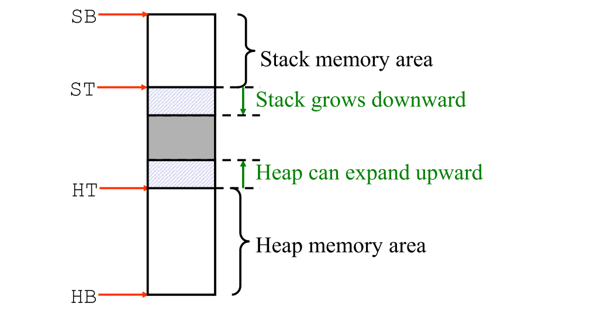
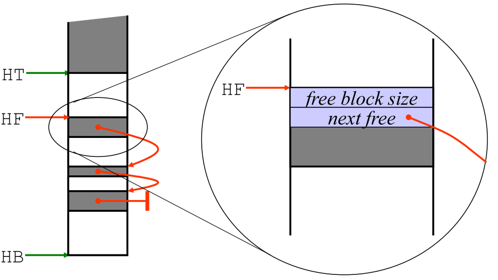

# Heap Allocation and Garbage Collection

* Why may we need heap allocation?
* Garbage collection strategies
    * Types of GCs


## Heap Allocation

- Memory allocation under explicit programmatic control
    - C `malloc`, C++ / Pascal / Java / C# `new`-operation

- Memory allocation implicit in language constructs
    - Lisp, Scheme, Haskell, SML, ... most functional languages.
    - Autoboxing/unboxing in Java 1.5 and C#
- Deallocation under explicit programmatic control
    - C, C++, Pascal (`free`, `delete`, `dispose` operations)
- Deallocation implicit
    - Java, C#, Lisp, Scheme, Haskell, SML, ...


### Garbage

```c hl_lines="3 4"
int *p, *q;
...
p = malloc(sizeof(int));
p = q;
```

Created space becomes garbage.

```java hl_lines="2"
for (int i = 0; i < 10000; i++) {
	SomeClass obj = new SomeClass(i);
	System.out.println(obj);
}
```

Creates 10 000 objects which becomes garbage just after the print.


### Problems with Explicit Heap Management

#### Dangling Pointer

```c hl_lines="4 5"
int *p, *q;
...
p = malloc(sizeof(int))
q = p;
free(p);
```

Dangling pointer in `q` now.

#### Hard to Recognize

```c
float myArray[100];

p = myArray;
*(p+i) = ...	//equivalent to myArray[i]
```


### Stacks and Dynamic Allocations are Incompatible

We can't do dynamic allocation within the stack.


### Where to put the Heap?

* It may grow and shrink during runtime.
* It is not LIFO like the stack
* We will typically have both heap- and stack allocated memory coexisting.




### Implicit Memory Management

A current trend of modern programming language development is to give only implicit means of memory management to the programmer.

* The constant increase of hardware memory justifies the policy of automatic memory management
* The explicit memory management distracts the programmer from his primary tasks
* The philosophy of high-level languages conforms to the implicit memory management.


## Garbage Collection

> 1. Garbage collection provides the "illusion of infinite memory"!
>
> 2. A garbage collector predicts the future!

**Types of garbage collectors**

* The "Classic" algorithms
    * [Reference counting](#reference-counting)
    * [Mark and Sweep]()
* [Copying garbage collection](#copying-garbage-collection)
* [Generational garbage collection](#generational-garbage-collection)
* [Incremental Tracing garbage collection](#incremental-tracing-collectors)

**Direct Garbage Collectors:** a record is associated with each node in the heap. The record for node $N$ indicates how many other nodes or roots points to $N$.

**Indirect/Tracing Garbage Collectors:** usually invoked when a user's request for memory fails. The garbage collector visits all live nodes, and returns all other memory to the free list. If sufficient memory has been recovered from this process, the user's request for memory is satisfied.

### Terminology

* **Roots**
    * Values that a program can manipulate directly (values held in registers, on the program stack, and global variables)
* **Node/Cell/Object**
    * An individually allocated piece of data in the heap
* **Children Nodes**
    * The list of pointers that a given node contains
* **Live Node**
    * A node whose address is held in a root or is the child of a live node
* **Garbage**
    * Nodes that are not live, but are not free either.
* **Garbage Collection**
    * The task of recovering (freeing) garbage nodes
* **Mutator**
    * The program running alongside the garbage collection system


### Reference Counting

* Every cell has a ***reference count*** field, containing the number of pointers to that cell from roots or heap cells.
* Initially all cells in the heap are placed in the *free list*
* When a cell is allocated from the *free list*, its reference count is set to 1
* When a pointer is set to reference a cell, the cells reference count is **incremented** by 1.
    * If a pointer to the cells is deleted, its reference count is **decremented** by 1.
* When a cell's reference count reaches 0, its pointers to its children are deleted and it is returned to the free list


#### Advantages and Disadvantages

Advantages:

* GC overhead is distributed
* Locality of reference is no worse than mutator
* Free memory is returned to free list quickly

Disadvantages:

* High time cost (every time a pointer is changed, reference count must be updated)
    * In place of a single assignment `x.f = p`:
        * 
* Storage overhead for reference counter can be high
* If the reference counter overflows, the object becomes permanent
* Unable to reclaim cyclic data structures


### Free Memory Management

The **Heap** is not LIFO like the stack, how to manage free space in the "middle" of the heap?


We can use a free list


Which we can store in the free memory itself since it is not used by anything else




### Mark-Sweep

* The first tracing garbage collection algorithm
* Garbage cells are allowed to build up until heap space is exhausted (a user program requests a memory allocation, but there is insufficient free space on the heap)
* At this point, the mark-sweep algorithm is invoked, and garbage cells are returned to the free list
* Performed in two phases:
    * **Mark:** identifies all live cells by setting a mark bit. Live cells are cells reachable from a root
    * **Sweep:** returns garbage cells to the free list


#### Pseudo Code

```pseudocode
void garbageCollect() {
	mark all heap variables as free
	foreach frame in stack 
		scan(frame)
    foreach heapvar marked as free
    	add heapvar to freelist
}
void scan(region) {
	foreach pointer p in region{
		if p points to region marked as free then{
			mark region at p as reachable
			scan(region at p)
		}
	}
}
```

#### Advantages and Disadvantages

Advantages:

* Cyclic data structures can be recovered
* Tends to be faster than reference counting

Disadvantages:

* Computation must be halted while GC is being performed
* Every live cell must be visited in the mark phase, and every cell in the heap must be visited in the sweep phase.
* GC becomes more frequent as residency of a program increases
* May fragment memory


#### Mark-Sweep-Compact

Advantages:

* The contiguous free area eliminates fragmentation problem
    Allocating objects of various sizes is simple
* The garbage space is "squeezed out", without disturbing the original ordering of objects. This improves locality.

Disadvantages:

* Requires several passes over the data.
    "Sliding compactors" takes two, three or more passes over the live objects.
    * One pass computes the new location
    * Subsequent passes update the pointers to refer to new locations, and actually move the objects


### Copying Garbage Collection

Cheney's Algorithm

* Like mark-compact, copying garbage collection, but does not really "collect" garbage.


* The heap is subdivided into two contiguous subspaces
    * FromSpace and ToSpace
* During normal program execution, only one of these semispaces is in use.
* When the garbage collector is called, all the live data are copied from the current semispace (FromSpace) to the other semispace (ToSpace), so that objects need only be traversed once.
* The work needed is proportional to the amount of live data (all of which must be copied).


#### Advantages and Disadvantages

Advantages:

* Allocation is extremely cheap.
* Excellent asymptotic complexity.
* Fragmentation is eliminated.
* Only one pass through the data is required.

Disadvantages: 

* The use of two semi-spaces doubles memory requirement
* Poor locality. Using virtual memory will cause excessive paging.


### Generational Garbage Collection

Attempts to address weaknesses of simple tracing collectors such as mark-sweep and copying collectors

* All active data must be marked or copied
* For copying collectors, each page of the heap is touched every two collection cycles, even though the user program is only using half the heap, leading to poor cache behavior and page faults
* Long-lived objects are handled inefficiently

Generational garbage collection is based on the *generational hypothesis*:

<center>Most objects die young</center>

As such, concentrate GC efforts on objects likely to be garbage: young objects

#### Advantages and Disadvantages

Advantages:

* Keeps youngest generation's size small
* Helps address mistakes made by the promotion policy by creating more intermediate generations that still get garbage collected fairly frequently.

Disadvantages:

* Collections for intermediate generations may be disruptive.
* Tends to increase number of inter-generational pointers, increasing the size of the root set for younger generations.

Performs poorly if any of the main assumptions are false:

* That objects tend to die young.
* That there are relatively few pointers from old objects to young ones.


### Incremental Tracing Collectors

Program (Mutator) and Garbage Collector run concurrently.

* Can think of system as similar to two threads. One performs collection, and the other represents the regular program in execution.

Can be used in systems with real-time requirements. For example, process control systems.

* Allow mutator to do its job without destroying collector’s possibilities for keeping track of modifications of the object graph, and at the same time
* Allowing collector to do its job without interfering with mutator


### Summary

