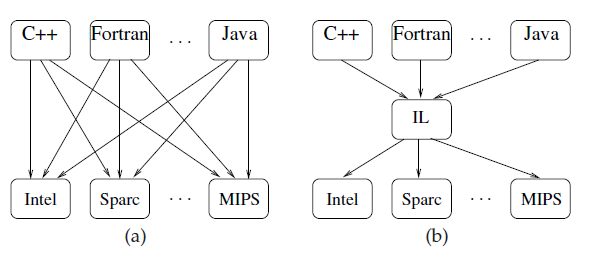
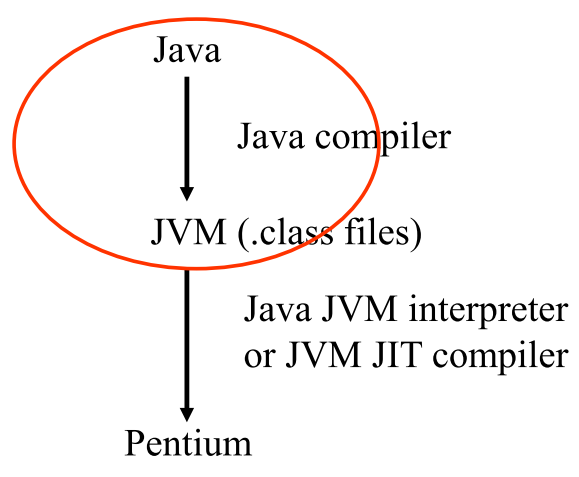
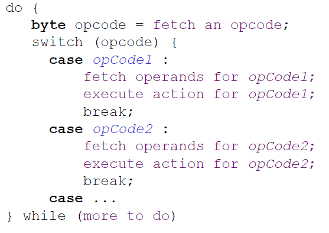
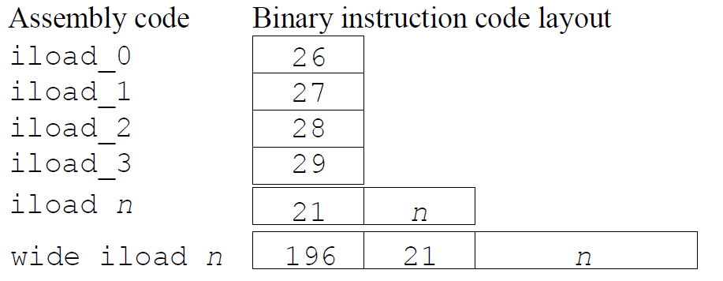
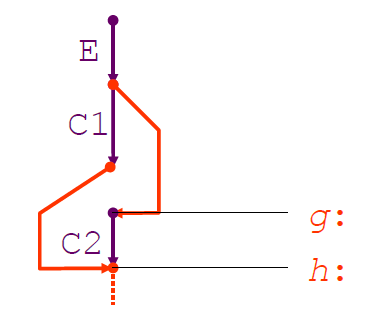
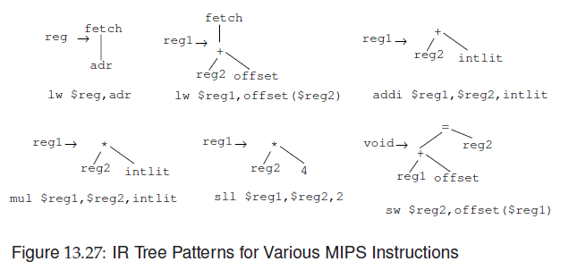
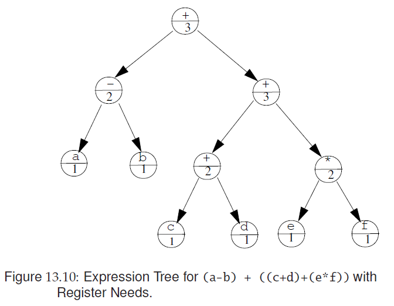
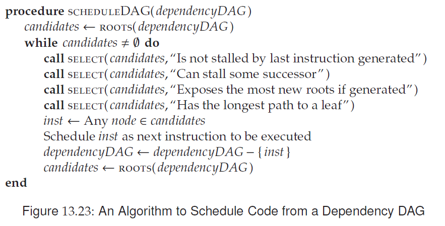
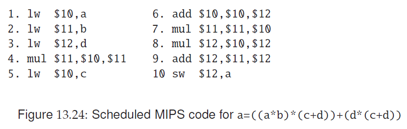
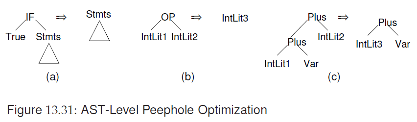

---

title: 8 - Code Generation
---

# Code Generation

* Describe the purpose of the code generator
* Discuss Intermediate representations
* Describe issues in code generation
* Code templates and implementations
* Back patching
* Implementation of functions/procedures/methods
* Register Allocation and Code Scheduling


## The Code Generation Phase


## Intermediate Representations

* "Neutral" architecture
* Easy to translate to native code
* Can abstract away complicated runtime issues
    * Stack Frame Management
    * Memory Management
    * Register Allocation


### Challenges

* IL must be precisely defined

* Translators and processors must be crafted for an IL

* Connections must be made between levels so feedback from intermediate steps can be related to the source program
* Efficiency 


### S*T vs S+T



### JVM

Easy conversion between java types and JVM types


The JVM is an **abstract machine**.




#### Class Files

Binary encodings of the data and instructions in a Java program

Contains:

* Table of constants
* Tables describing the class
    * Name, superclass, interfaces, attributes, constructors
* Tables describing fields and methods
    * Name, type/signature
    * attributes (private, public, etc)
* Code for methods


#### Internal Architecure


#### Runtime Data Areas

Supports multi-threading.

* Two kinds of runtime data areas
    1. Shared between all threads
    2. Private to a single thread


#### Stack Machine

JVM is a stack machine.

```java
(a * b) + (1 - (c * 2))
```

On the stack machine:


#### Interpreter

The core of a JVM interpreter is basically this:



#### Instruction-set

Typed instructions

```
iload	integer load
lload	long load
fload	float load
dload	double load
aload	reference-type load
```

Different operands:




## Code Generation Visitor

TopVisitor

* Starts at root of AST
* Handles class/method declarations
* Calls others for specific needs

MethodBodyVisitor

* Generates most of the actual code
* Calls others for specific needs

Signature Visitor

* Handles AST subtrees for method definition or invocation
    * Method name, parameter types, return type
* Used by MethodBodyVisitor for invocations

LHSVisitor

* Generates code for LHS of assignments
* May call other visitors if LHS contains subexpressions
    * Java example: `a[x+y] = ...`
    * Remember that LHS of assignment use the address of a variable, whereas the RHS uses the value


### Code Emmision

```java
MethodBodyVisitor.visit(Plus){
	visit(E1);
	visit(E2);
	emit("iadd\n");
}
```


#### Postludes

Sometimes a single emission isn't enough

Assignments:

* Visit LHS to find storage location and type
* Visit RHS to compute value
* Re-visit LHS to emit storage operations

Inefficient!

Better:

* LHS visitor builds storage operation
* Saves in a Postlude
* Parent requests postlude emission

 

#### Class Declarations


### Code Templates

If-then-else:





#### Template Invariants

* A statement and a void expression leaves the stack height unchanged
* A non-void expression increases the stack height by one

This is a local property of each template


* The generated code must be verifiable

This is not a local property, since the verifier performs a global static analysis


### Instruction Selection


We define patterns for instructions.



We can now match pattern to find the best instruction to use.


## Register Allocation

Compiler generating code for register machine needs to pay attention to register allocation, since it is a limited resource.

Routine protocol

* Allocate arg1 in R1, arg2 in R2, ... and result in R0
* But what if there are more args than regs?

On MIPS all calculations takes place in registers

* Reduces traffic between memory and regs


### Register Needs





## Code Scheduling

Modern computers are pipelined

* Instructions are processed in stages
* Instructions take different time to execute
* If result from previous instruction is needed but not yet ready, then we have a **stalled pipeline**
* Delayed load
    * Load from memory takes 2, 10 or 100 cycles
* Also FP instructions takes time







### Register Allocation and Code Scheduling

Register allocations algorithms try to minimize number of regs used

* May conflict with pipeline architecture
    * Using more regs than strictly necessary may avoid pipeline stalls

Solution:

* Integrated register allocator and code scheduler


As long as registers are available, they are used.

When registers grow scarce, the algorithm switches emphasis and begins to schedule code to free registers.


## Peephole Optimizations




