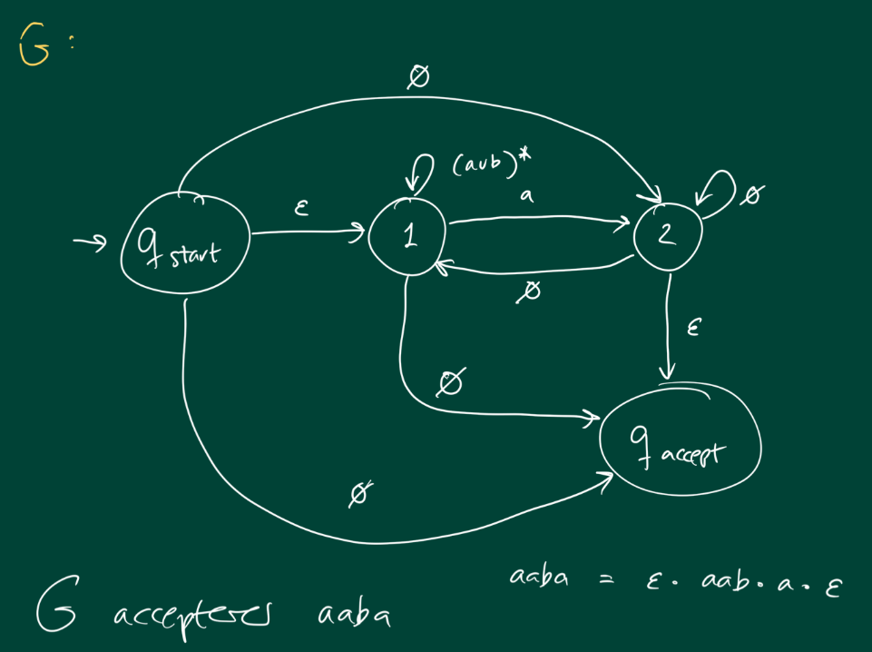
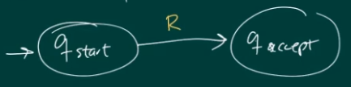

# Regulære Udtryk

Regulære udtryk og NFA'er er ækvivalente.

Man taler om regulære udtryk over et alfabet.

**Basis-udtryk**

| Regulært udtryk R | Sproget betegnet af R, L(R) |
| ----------------- | --------------------------- |
| a $[a\in \Sigma]$ | {a}                         |
| Ø                 | {}                          |
| $\varepsilon$     | {$\varepsilon$}             |

**Sammensatte udtryk**

| Regulært udtryk R | Sproget betegnet af R, L(R) |
| ----------------- | --------------------------- |
| $(R_1\cup R_2)$   | $L(R_1) \cup L(R_2)$        |
| $(R_1 \circ R_2)$ | $L(R_1) \circ L(R_2)$       |
| $R^*$             | $L(R)^*$                    |

## Regulære Udtryk er Ækvivalente med NFA'er

**Eksempel:**
$$
(aa \space \cup \space b)^*
$$
Kan tegnes som NFA:

<svg width="800" height="400" version="1.1" xmlns="http://www.w3.org/2000/svg">
	<ellipse stroke="black" stroke-width="1" fill="none" cx="101.5" cy="224.5" rx="30" ry="30"/>
	<ellipse stroke="black" stroke-width="1" fill="none" cx="101.5" cy="224.5" rx="24" ry="24"/>
	<ellipse stroke="black" stroke-width="1" fill="none" cx="234.5" cy="224.5" rx="30" ry="30"/>
	<ellipse stroke="black" stroke-width="1" fill="none" cx="380.5" cy="134.5" rx="30" ry="30"/>
	<ellipse stroke="black" stroke-width="1" fill="none" cx="380.5" cy="305.5" rx="30" ry="30"/>
	<ellipse stroke="black" stroke-width="1" fill="none" cx="484.5" cy="134.5" rx="30" ry="30"/>
	<ellipse stroke="black" stroke-width="1" fill="none" cx="586.5" cy="134.5" rx="30" ry="30"/>
	<ellipse stroke="black" stroke-width="1" fill="none" cx="685.5" cy="134.5" rx="30" ry="30"/>
	<ellipse stroke="black" stroke-width="1" fill="none" cx="685.5" cy="134.5" rx="24" ry="24"/>
	<ellipse stroke="black" stroke-width="1" fill="none" cx="484.5" cy="305.5" rx="30" ry="30"/>
	<ellipse stroke="black" stroke-width="1" fill="none" cx="484.5" cy="305.5" rx="24" ry="24"/>
	<polygon stroke="black" stroke-width="1" points="27.5,224.5 71.5,224.5"/>
	<polygon fill="black" stroke-width="1" points="71.5,224.5 63.5,219.5 63.5,229.5"/>
	<polygon stroke="black" stroke-width="1" points="131.5,224.5 204.5,224.5"/>
	<polygon fill="black" stroke-width="1" points="204.5,224.5 196.5,219.5 196.5,229.5"/>
	<text x="163.5" y="245.5" font-family="Times New Roman" font-size="20">&#949;</text>
	<polygon stroke="black" stroke-width="1" points="260.038,208.758 354.962,150.242"/>
	<polygon fill="black" stroke-width="1" points="354.962,150.242 345.528,150.184 350.776,158.697"/>
	<text x="312.5" y="200.5" font-family="Times New Roman" font-size="20">&#949;</text>
	<polygon stroke="black" stroke-width="1" points="260.733,239.054 354.267,290.946"/>
	<polygon fill="black" stroke-width="1" points="354.267,290.946 349.697,282.693 344.846,291.437"/>
	<text x="294.5" y="286.5" font-family="Times New Roman" font-size="20">&#949;</text>
	<polygon stroke="black" stroke-width="1" points="410.5,134.5 454.5,134.5"/>
	<polygon fill="black" stroke-width="1" points="454.5,134.5 446.5,129.5 446.5,139.5"/>
	<text x="428.5" y="155.5" font-family="Times New Roman" font-size="20">a</text>
	<polygon stroke="black" stroke-width="1" points="514.5,134.5 556.5,134.5"/>
	<polygon fill="black" stroke-width="1" points="556.5,134.5 548.5,129.5 548.5,139.5"/>
	<text x="531.5" y="155.5" font-family="Times New Roman" font-size="20">&#949;</text>
	<polygon stroke="black" stroke-width="1" points="616.5,134.5 655.5,134.5"/>
	<polygon fill="black" stroke-width="1" points="655.5,134.5 647.5,129.5 647.5,139.5"/>
	<text x="631.5" y="155.5" font-family="Times New Roman" font-size="20">a</text>
	<path stroke="black" stroke-width="1" fill="none" d="M 247.955,197.703 A 280.306,280.306 0 0 1 662.79,114.92"/>
	<polygon fill="black" stroke-width="1" points="247.955,197.703 256.264,193.235 247.58,188.276"/>
	<text x="427.5" y="52.5" font-family="Times New Roman" font-size="20">&#949;</text>
	<polygon stroke="black" stroke-width="1" points="410.5,305.5 454.5,305.5"/>
	<polygon fill="black" stroke-width="1" points="454.5,305.5 446.5,300.5 446.5,310.5"/>
	<text x="427.5" y="326.5" font-family="Times New Roman" font-size="20">b</text>
	<path stroke="black" stroke-width="1" fill="none" d="M 463.658,326.998 A 139.843,139.843 0 0 1 238.775,254.136"/>
	<polygon fill="black" stroke-width="1" points="238.775,254.136 235.914,263.126 245.602,260.647"/>
	<text x="318.5" y="373.5" font-family="Times New Roman" font-size="20">&#949;</text>
</svg>

Og som vi så i [Lektion 2](../SS/02-nondeterministiske-endelige-automater.md#ækvivalens-mellem-dfa-og-nfa), så kan en NFA skrives om til en DFA.

### Generaliseret NFA (GNFA)

**Definition**:

En GNFA er en 5-tupel

​	$(Q, \Sigma,q_{start},q_{accept},\delta)$

Q:           mængde af tilstande

$\Sigma$:           input alfabet

$q_{start}$:     starttilstand $q_{start} \in Q$

$q_{accept}$:   accepttilstand $q_{accept} \in Q$

$\delta$:            Skal over en "**bordskik**"

**Bordskik**:

* Én transition mellem hvert par af  tilstande, dog
* Ingen transitioner fra $q_{accept}$
* Ingen transition til $q_{start}$
* Regulære udtryk på transitionerne.

#### Eksempel

### Konstruer Regulært Udtryk ud fra GNFA

Fjern tilstande i G én efter én og opdater.

Til sidst har vi 2 tilstande med et regulært udtryk mellem.

#### Fjerne tilstande

* Må ikke være $q_{start}$ eller $q_{accept}$
* Kald den tilstand vi fjerne $q_{rip}$

#### Opdatere transitioner

Før og efter

<svg width="800" height="300" version="1.1" xmlns="http://www.w3.org/2000/svg">
	<ellipse stroke="black" stroke-width="1" fill="none" cx="119.5" cy="215.5" rx="30" ry="30"/>
	<text x="106.5" y="221.5" font-family="Times New Roman" font-size="20">q_i</text>
	<ellipse stroke="black" stroke-width="1" fill="none" cx="357.5" cy="215.5" rx="30" ry="30"/>
	<text x="344.5" y="221.5" font-family="Times New Roman" font-size="20">q_j</text>
	<ellipse stroke="black" stroke-width="1" fill="none" cx="238.5" cy="131.5" rx="30" ry="30"/>
	<text x="217.5" y="137.5" font-family="Times New Roman" font-size="20">q_rip</text>
	<ellipse stroke="black" stroke-width="1" fill="none" cx="476.5" cy="215.5" rx="30" ry="30"/>
	<text x="463.5" y="221.5" font-family="Times New Roman" font-size="20">q_i</text>
	<ellipse stroke="black" stroke-width="1" fill="none" cx="723.5" cy="215.5" rx="30" ry="30"/>
	<text x="710.5" y="221.5" font-family="Times New Roman" font-size="20">q_j</text>
	<polygon stroke="black" stroke-width="1" points="50.5,215.5 89.5,215.5"/>
	<polygon fill="black" stroke-width="1" points="89.5,215.5 81.5,210.5 81.5,220.5"/>
	<path stroke="black" stroke-width="1" fill="none" d="M 131.123,187.936 A 114.715,114.715 0 0 1 208.635,133.221"/>
	<polygon fill="black" stroke-width="1" points="208.635,133.221 199.84,129.807 201.712,139.63"/>
	<text x="139.5" y="143.5" font-family="Times New Roman" font-size="20">R&#8321;</text>
	<path stroke="black" stroke-width="1" fill="none" d="M 268.39,132.565 A 111.224,111.224 0 0 1 346.487,187.692"/>
	<polygon fill="black" stroke-width="1" points="346.487,187.692 346.928,178.268 338.21,183.167"/>
	<text x="318.5" y="142.5" font-family="Times New Roman" font-size="20">R&#8323;</text>
	<path stroke="black" stroke-width="1" fill="none" d="M 330.646,228.83 A 237.916,237.916 0 0 1 146.354,228.83"/>
	<polygon fill="black" stroke-width="1" points="330.646,228.83 321.334,227.319 325.207,236.538"/>
	<text x="228.5" y="268.5" font-family="Times New Roman" font-size="20">R&#8324;</text>
	<path stroke="black" stroke-width="1" fill="none" d="M 225.275,104.703 A 22.5,22.5 0 1 1 251.725,104.703"/>
	<text x="228.5" y="55.5" font-family="Times New Roman" font-size="20">R&#8322;</text>
	<polygon fill="black" stroke-width="1" points="251.725,104.703 260.473,101.17 252.382,95.292"/>
	<path stroke="black" stroke-width="1" fill="none" d="M 500.177,197.132 A 182.784,182.784 0 0 1 699.823,197.132"/>
	<polygon fill="black" stroke-width="1" points="699.823,197.132 695.852,188.574 690.391,196.951"/>
	<text x="544.5" y="158.5" font-family="Times New Roman" font-size="20">R&#8324; U R&#8321;R&#8322;*R&#8323;</text>
	<polygon stroke="black" stroke-width="1" points="424.5,215.5 446.5,215.5"/>
	<polygon fill="black" stroke-width="1" points="446.5,215.5 438.5,210.5 438.5,220.5"/>
</svg>

* For hvert par $q_i,q_j \neq q_{rip}$ lav denne opdatering

#### Algoritme

$\text{CONVERT}(G)=$

1. Lad mængden af tilstande i $G$ være $Q_G$.

    Hvis $Q_G =\{q_{start}, q_{accept}\}$ så stop.

    Returner $R$, hvor:

2. Ellers vælg $q_{rip} \notin \{q_{start}, q_{accept}\}$

3. For hvert par $(q_i, q_j)$ opdatér transitioner som vist [ovenfor](#opdatere-transitioner).

    Kald ny GNFA for $G'$.

    $Q_{G'}=Q_G \smallsetminus \{q_{rip}\}$

4. $\text{CONVERT}(G')$