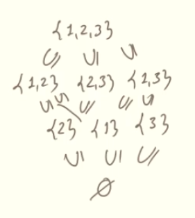

# Rekursive Definitioner

* En rekursiv definition giver anledning til en **højresidefunktion** $f$
* Definitionen har en "løsning" hvis $f$ har et **fikspunkt**

$$
L_S=\{a\}\ L_S\ \{b\} \cup \{c\} \cup L_s
$$
Lav en højresidefunktion:

$$
f(X)=\{a\}\ X\ \{b\} \cup \{c\} \cup X
$$

$f$ er en funktion over sprog - Eks:

$$
\begin{align*}
f(\{aa,b\}) \\
&= \{a\}\{aa,b\}\{b\} \cup \{c\} \cup \{aa,b\} \\
&= \{aaab,abb\} \cup\{c\} \cup \{aa,b\} \\
&= \{aaab,abb,c,aa,b\}
\end{align*}
$$

Vi vil gerne have et $L_s$ så $f(L_s)=L_s$

​	$L_s$ er et **fikspunkt** for funktionen $f$

## Fikspunkt

Lad $f:A\to A$

$x$ er et fikspunkt for $f$ hvis $f(x)=x$

Jagten på en "løsning" til en rekursiv definition er faktisk jagten på et fikspunkt for højresidefunktionen.

Følge af tilnærmelser:

$$
\begin{align*}
f^0(\varnothing) &= \varnothing \\
f^1(\varnothing) &= \{a\} \varnothing \{b\} \cup \{c\} \cup \varnothing &&= \{c\} \\
f^2(\varnothing) &= f(f(\varnothing)) &&= \{acb,c\} \\
f^3(\varnothing) &= f(f^2(\varnothing)) &&= \{aacbb, acb,c\} \\
f^4(\varnothing) &= f(f^3(\varnothing)) &&= \{aaacbbb, aacbb, acb,c\} \\
f^n(\varnothing) &&&= \{a^icb^i\ |\ 0 \leq i < n\} \\
\end{align*}
$$

**Grænseværdien** for følgen: $\{a^icb^i\ |\ i \geq 0\}$

## Partiel Ordning

Lad $D$ være en mængde og $\sqsubseteq$ være en binær relation over $D$, (dvs. relaterer par af elementer).

$(D,\sqsubseteq)$ er en **partiel ordning** hvis:

$$
\begin{align*}
&(1) &&\text{For alle }d \in D : &&d \sqsubseteq d \\
&(2) &&\text{For alle }d_1d_2 \in D : &&\text{hvis } d_1  \sqsubseteq d_2 \text{ og } d_2  \sqsubseteq d_1 \text{ så } d_1=d_2 \\
&(3) &&\text{For alle } d_1,d_2,d_3 \in D: &&\text{hvis } d_1 \sqsubseteq d_2 \text{ og } d_2 \sqsubseteq d_3 \text{ så } d_1 \sqsubseteq d_3
\end{align*}
$$

En partiel ordning er altså bare en  ordnet mængde der opfører sig ligesom $\N$ (de naturlige tal) ordnet under $\leq$

$(\N, \leq)$ er en partiel ordning

### Eksempel

Lad $S$ være en mængde.

$(\mathcal{P}(S),\subseteq)$ er en partiel ordning.

​	$S=\{1,2,3\}$

### Øvre Grænse

Lad $(D, \sqsubseteq)$ være en po (partiel ordning), og lad $Y\subseteq D$

Lad $x\in D$.	$x$ er en **øvre grænse** for $y$ hvis:

​	for alle $y \in Y:y \sqsubseteq x$

Hvis x er det mindste sådanne, kalder vi x for den mindste øvre grænse for y.

#### Eksempel

$D=\{1,2,3,4,5,6\}$

$\sqsubseteq$ defineres ved $x \sqsubseteq y$ hvis $x \leq y$

​	$(D, \sqsubseteq)$ er en po.

Lad $Y=\{1,2,3\}$

​	4 er en **øvre grænse** for $Y$.

​	3 er den **mindste øvre grænse** for $Y$.

#### Notation

Hvis $x$ er den mindste øvre grænse for $y$ kalder vi $x$ for $\lim{Y}$

### Kæde

Lad $(D, \sqsubseteq)$ være en po.

En **kæde** i $D$ er en voksende følge af elementer i $D$

​	$Y=\{y_0,y_1,...\}$

hvor

​	$y_0 \sqsubseteq y_1 \sqsubseteq y_2 \ ...$

### Fuldstændig Partiel Ordning

Lad $(D,\sqsubseteq)$ være en po. Den kaldes **fuldstændig partial ordning** (fpo) hvis det gælder at:

1. For enhver kæde i $D,Y$, har vi at $\lim{Y}$ findes
    (enhver voksende følge har en mindste øvre grænse)
2. Der findes et mindste element, $\perp$ så: $\perp \sqsubseteq x$ for alle $x \in D$
    ($\perp$ er mindst af alle)

## Monoton

Lad $(D,\sqsubseteq)$ være en po og $f:D\to D$ være en funktion.

$f$ er **monoton** hvis:

​	for alle $x,y \in D : $ hvis $x \sqsubseteq y$ så $f(x) \sqsubseteq f(y)$
​		(voksende mht. $\sqsubseteq$)

## Kontinuert Funktion

Lad $(D, \sqsubseteq)$ være en fpo.

$f: D \to D$ er monoton.

$f$ er kontinuert hvis for enhver kæde $Y= \{y_0,y_1,...\}$ har vi at

​	$f(\lim{Y})= \lim{f(y_0)}$ 
​		($f$ bevarer grænseværdi; $f$ kan flyttes ind under $\lim$)

## Eksistens af Mindste Fikspunkt for Funktion

Lad $(D, \sqsubseteq)$ være en fpo, og lad $f:D \to D$ være kontinuert.

Så har $f$ et mindste fikspunkt (mht $\sqsubseteq$) som er givet ved:

$$
\begin{align*}
x^* &= \lim_{i \geq 0}{\{f^0(\perp), f^1(\perp), f^2(\perp),\ ...\}} \\
&= \lim{\{f^i(\perp)\ |\ i \geq 0\}}
\end{align*}
$$

