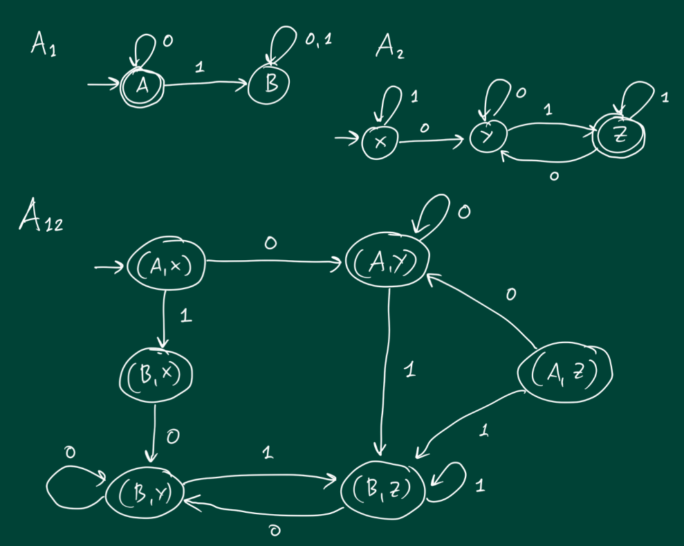

# Grundlæggende Sprogteori

Et **sprog** er en mændge af **strenge**.

## Alfabet

**Definition:** 

En endelig mængde af tegn.

**Notation:**

Skrives $\Sigma$

### Eksempler

​	$A=\{a,b,c,d,...,æ,ø,å\}$	(danske alfabet)

​	$B=\{0,1\}$ 					(binære alfabet)

​	ASCII-tegnene

## Streng

**Definition:**

Givet et alfabet $\Sigma$,
er en streng over $\Sigma$ er en endelig følge af tegn fra $\Sigma​$ 

**Notation:**

Længden af en streng s betegnes $|s|$

### Eksempler:

Streng over A

​	$|abe|=3​$

​	$|kpst|=4$

Streng over B

​	$|01001|=5​$

​	$|100|=3$

En lille streng:

​	$\varepsilon​$ 	(**den tomme streng**)

​	$|\varepsilon|=0$ 

## Sprog

**Definition:**

Givet et alfabet $\Sigma$, er et sprog over $\Sigma$ en endelig mængde af strenge over $\Sigma$ 

### Eksempler

Alfabet A:

​	$L_1=\{a,aa,bba\}$

​	$L_2=\{a,aa,aaa,...\}$

​	$L_3=Ø$		(det tomme sprog)

### $\Sigma^*$ - Sigma-stjerne

**Definition:**

Lad $\Sigma$ være et alfabet.

$\Sigma^*​$ er sproget bestående af *alle* strenge over $\Sigma​$

#### Eksempel

$\Sigma=\{0,1\}$

$\Sigma^*=\{\varepsilon,0,1,00,01,10,11,000,001,... \}​$

## Konkatination

**Definition:**

Lad *u* og *v* være strenge over $\Sigma$

​	($u\in\Sigma^*,v\in\Sigma^*$)

Så er $u\circ v$ 	(skrives tit $uv$) 
strengen bestående af symbolerne i u efterfulgt af symbolerne i v

### Eksempler

$u=abc$

$v=hat$

$uv=abchat$

--

$u=kat​$

$v=\varepsilon$

$uv=kat$

## Husk!

Et sprog er bare en mængde af strenge.

Så vi kan bruge alle de sædvanlige mængdeoperation, **så længe de igen giver os et sprog.**

$L_1\cup L_2 :\{x|x\in L_1\or x \in L_2\}$

$L_1 \cap L_2 : \{x|x\in L_1 \and x\in L_2\}​$

$L_1 -L_2: \{x|x \in L_1 \and x \notin L_2 \}$

Men f.eks.:

$L_1 \times L_2$ giver ingen mening

## Regulære Sprog

L er regulært hvis $\exists \space \text{DFA} \space A:L=L(A)$

​	L er regulært hvis der findes en DFA der læser L

### Regulære Operationer

Foreningsmængde:

​	$L_1 \cup L_2 = \{w \mid w \in L_1 \text{eller} \space w \in L_2\}$

Konkatination:

​	$L_1 \circ L_2 = \{w \mid \exists u, \exists v:u \in L_1, v \in L_2, w=uv\}$ 

L-stjerne (Kleene-stjerne):

​	${L_1}^* = \{x_1...x_k \mid k \geq 0, x_i \in L_1 \space \text{for} \space 0 \leq i \leq k\}​$

### Lukket Under Foreningsmængden

**Sætning:**

Hvis $L_1$ og $L_2$ er regulære sprog, så er $L_1 \cup L_2$ også et regulært sprog.

#### Produktkonstruktionen

