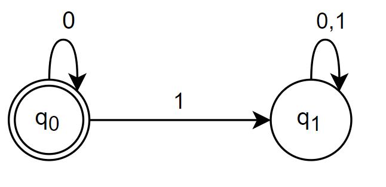

# Endelige automater

Man ledte efter en model ag neuroner i hjernen.

I datalogi anvendes endelige automater:

- I den fase af en compiler kaldet 'Leksikalske analyser' (lexer)
- I specifikation af systemer.

Endelige automater er simple algoritmer til sproggendkendelse.

"Givet w, har vi $w\in L$?"

**Tilstand** er markeret af en cirkel.

**Transition** er markeret med en pil.

**Accepttilstand** er markeret med en ekstra cirkel.

**Definition**:

En endelig automat (DFA) er en 5-tupel

​	$(Q,\Sigma,q_0,\delta,F)$

$Q$ 	endelig mængde af tilfælde

$\Sigma$ 	input alfabet

$q_0$ 	starttilstand $q_0\in Q$

$\delta$ 	overføringsfunktion

$F$ 	mængden af accepttilstande $F\subseteq Q$

### Overføringsfunktion

$\delta(q,a)=q_1$

$\delta:Q\times \Sigma \rightarrow Q$

### Eksempel

$Q=\{q_0,q_1\}$

$\Sigma =\{0,1\}$

$q_0=q_0$

$F=\{q_0\}$

| $\delta$ | 0     |   1   |
| -------- | ----- | :---: |
| $q_0$    | $q_0$ | $q_1$ |
| $q_1$    | $q_1$ | $q_1$ |

## Andet

Et lille værktøj til at tegne endelige automater:

[http://madebyevan.com/fsm/](http://madebyevan.com/fsm/)

<!-- Indsæt definition for Accept https://youtu.be/VeM2Riy91SM?t=383 -->