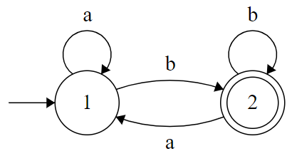

# Kontekstfrie Grammatikker

|                                                     | **Beskrive**                               | **Genkende**                                                 |
| --------------------------------------------------- | ------------------------------------------ | ------------------------------------------------------------ |
| **[Regulære  sprog](../SS/1a-regulære-sprog.md)** | [Regulære udtryk](../SS/3-regulære-udtryk.md) | [Endelige automater](../SS/1b-endelige-automater.md)  - [NFA](../SS/2-nondeterministiske-endelige-automater.md) og DFA (ækv.) |
| **Kontekstfrie  sprog**                        | <u>Kontekstfrie grammatikker</u>           | Pushdown-automater - NDPDA og DPDA (ikke ækv.)          |

 

## Definition - CFG

En **kontekstfri grammatik** er en 4-tupel
$$
(V,\Sigma,R,S)
$$

| Symbol   | Betydning                                       |
| -------- | ----------------------------------------------- |
| V        | Endelig mængde af variable (aka. nonterminaler) |
| $\Sigma$ | Endelig mængde af terminaler                    |
| R        | Endelig mængde af regler                        |
| S        | Startvariabel $S\in V$ (aka. startsymbol)       |

Regler i R er på formen:
$$
A \longrightarrow w, \quad w \in (V\cup\Sigma)^*
$$

### Eksempel

Sprog:
$$
L=\{a^nb^n | n \geq0\}
$$
CFG:
$$
\text{S} \longrightarrow \varepsilon \ |\  \text{aSb}
$$

​	svarer til:

$$
\begin{align*}
\text{S} &\longrightarrow \varepsilon \\
\text{S} &\longrightarrow \text{aSb}
\end{align*}
$$

#### Byggelse af en streng

Strengen *aaabbb*

$$
\begin{align*}
\text{S} &\Rightarrow \text{aSb} \\
& \Rightarrow \text{aaSbb} \\
& \Rightarrow \text{aaaSbbb} \\
& \Rightarrow \text{aaabbb}
\end{align*}
$$

## Definition - Derivition

**Derivition**

Lad G være en CFG hvor $G=(V,\Sigma,R,S)​$ 
og lad $u,v \in (V\cup\Sigma)^*​$

Hvis

$$
\begin{align*}
u&=u_1Au_2 \quad og \quad A\longrightarrow w \\
og \quad v &=u_1wu_2 
\end{align*}
$$

så skriver vi

$$
u \Rightarrow v
$$

 u deriverer i et skridt til v 

$$
u \Rightarrow^* v
$$

 u deriverer i 0 eller flere et skridt til v 

## Definition - Sproget beskrevet af en CFG

Lad $G=(V,\Sigma,R,S)$  være en CFG

Sproget defineret af G er

$$
L(G)=\{w\in\Sigma^* \ | \ S \Rightarrow^*w\}
$$

Et sprog L kalder vi **kontekstfrit** hvis
der findes en CFG G så $L=L(G)$

## Eksempel 2

Sprog

$$
L_2=\{w \in \{a,b\}^* \ | \ \text{w er et palindrom}\}
$$

​	Eksempler:
$$
aaa \in L_2 \quad abba \in L_2 \quad ab \notin L_2
$$
Regler:
$$
S \longrightarrow \varepsilon \ | \ a \ | \ b \ | \ aSa \ | \ bSb
$$
Derivation af *abba*
$$
S \Rightarrow aSa \Rightarrow abSba \Rightarrow abba
$$

## Kontekstfrie sprog vs Regulære sprog

**<u>Sætning</u>**

Hvis M er en DFA, kan vi konstruere en CFG G så $L(G)=L(M)​$

**Eksempel:**

​	M:

Ide i konstruktion: Til hver tilstand svarer en variabel i vores CFG

$$
\begin{align*}
A_1 &\longrightarrow aA_1 \ | \ bA_2 \ | \ b\\ 
A_2 &\longrightarrow vA_2 \ | \ aA_1 \ | \ b \ | \ \varepsilon
\end{align*}
$$

**Generelt:**

Hvis $\delta(q,a)=q'$ lav reglen:

​	$A_q\longrightarrow aA_{q'}$ 	Hvis $q'\in F: \quad A_q\longrightarrow a$
​					Hvis $q\in F : \quad A_q\longrightarrow \varepsilon$

### Verdenskort

## Derivitionstræer / Parsetræer

Et parsetræ er en trærepræsentation af en derivition.

### Eksempel

Aritmetiske udtryk

$$
V=\{E\},\Sigma=\{+,*,a\} \\
E \longrightarrow E+E \ | \ E*E \ | \ a
$$

"a+a*a"

$$
E\Rightarrow E+E \Rightarrow a+E \Rightarrow a+E*E \Rightarrow a+a*E \Rightarrow a+a*a
$$

#### Parsetræ

### MEN

Kan også deriveres på en anden måde:

$$
E\Rightarrow E*E \Rightarrow E+E*E \Rightarrow a+E*E \Rightarrow a+a*E \Rightarrow a+a*a
$$

Grammatikken er **tvetydig** (ambigous).

Begge derivitioner er **venstrederivitioner**, 2 forskellige venstrederivitioner.

