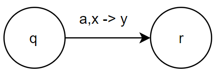

# Pushdown Automater

> PDA = en automat med en stak

!!! warn "Udvid noter"
    indsæt information om overføringsfunktion fra SS6 afsnit 2 [https://www.youtube.com/watch?v=KUZwifJbGxE&list=PLA8H0-CuqhGGH6lTKmcgzzmK7kkwX75rF&index=2](https://www.youtube.com/watch?v=KUZwifJbGxE&list=PLA8H0-CuqhGGH6lTKmcgzzmK7kkwX75rF&index=2)

**Definition**

En pushdown-automat (PDA) er en 6-tupel
$$
(Q,\Sigma, \Gamma, q_0, \delta, F)
$$

| Symbol   | Betydning                      |
| -------- | ------------------------------ |
| Q        | Mængde af tilstande            |
| $\Sigma$ | Input alfabet                  |
| $\Gamma$ | Stak alfabet                   |
| $q_0$    | Starttilstand $q_0 \in Q$      |
| $\delta$ | Overførselsfunktion            |
| F        | Accepttilstande $F\subseteq Q$ |

$$
\delta:\quad Q \times \Sigma_{\varepsilon} \times \Gamma_{\varepsilon} \longrightarrow \mathcal{P}(Q \times \Gamma_{\varepsilon})
$$

## PDA Som en Orienteret Graf

**Betyder:**

Når PDA'en er i tilstand *q* og ser *a* som næste input tegn og *x* er øverst på stakken, så skift til tilstand *r* og erstat *x* med *y*.
$$
(r,y)\in\delta(q,a,x)
$$

## Eksempel

$$
L=\{a^nb^n\ | \ n\geq 0\}
$$

$ bruges som bundmarkør i stakken.

Inputstreng: *aabb*

Stakindhold:

## Sprog Accepteret af PDA

Lad $M=(Q,\Sigma, \Gamma, q_0, \delta, F)$ være en PDA

Lad $w\in\Sigma^*$, hvor $w=u_1...u_k$, hvor $u_i\in\Sigma_{\varepsilon} \quad (1\leq i\leq k)$

**M accepterer w** hvis:

1. Der findes en følge af tilstande $r_0...r_k​$

2. Der findes en følge af stakindhold $s_0...s_k​$

    $(s_i\in\Gamma^* \ \text{for} \ 0\leq i \leq k)$

    

    Der gælder om (1) og (2) at:

    * $r_0=q_0,\quad s_0=\varepsilon$
    * $\text{for alle}\ 0\leq i \leq k$ gælder:

    $$
    \begin{align*} 
    && s_i &=a_iS_i' \\
    (r_{i+1}&,a_{i+1}) \in \delta(r_i,u_{i+1},a_i) & s_{i+1} &=a_{i+1}S_i'
    \end{align*}
    $$

    

    * $r_k\in F$

## Eksempel 2-3

!!! warn "Udvid noter"
    indsæt eksempler fra SS6 afsnit 4 [https://www.youtube.com/watch?v=eBgtVhYUf50&list=PLA8H0-CuqhGGH6lTKmcgzzmK7kkwX75rF&index=4]