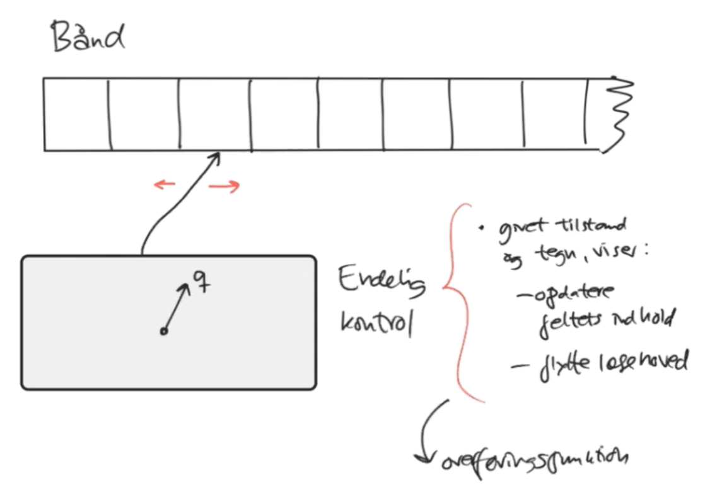
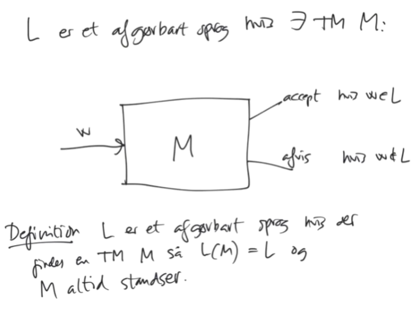

$$
\newcommand{\TM}{(Q,\Gamma, \Sigma, \delta, q_0, q_{accept}, q_{reject})}
$$

# Turing Maskiner

## Turing Maskine

**Definition**

En 7-tuppel	$\TM$

* $Q$ endelig mængde af tilstande
* $\Gamma$ bånd-alfabet
* $\Sigma$ input alfabet ($\Sigma \subseteq \Gamma$)
* $\delta$ overføringsfuntion
* $q_0$ starttilstand ($q_0 \in Q$)
* $q_{accept}$ accepttilstand ($q_{accept} \in Q$)
* $q_{reject}$ forkasttilstand ($q_{reject} \in Q$)

$q_{accept} \neq q_{reject}$
$$
\delta: (Q \setminus \{q_{accept, q_{reject}}\}) \times \Gamma \to Q \times \Gamma \times \{L,R\}
$$
$L: $ Venstre	 $R: $ Højre

!!! example
    Se eksempel [Lektion 1, Video 2](https://youtu.be/Sta_jhp0Bw0?t=513)

### Konfiguration

**Definition**

Givet en $TM$ $M = \TM$

er en konfiguration en streng
$$
uqav,
$$
hvor $u$ er del af bånd til venstre for hoved $(u\in\Gamma^*)$,
og $q\in Q$,
og $a$ indhold af det felt $M$ ser nu $(a \in \Gamma)$,
og $v$ ikke-tomme del af bånd til højre for hoved $(v \in \Gamma^*)$

### Beregning

**Definition**

#### Standsende Beregning

En turing maskine kan gå i en uendelig løkke!

### Accept af Streng

**Definition**

En $TM$ $M$ accepterer input $w$, hvis:

* $M$ har en accepterende beregning på input $w$

En $TM$ $M$ afviser input $w$ hvis:

* $M$ har en afvisende beregning på input $w$

**Bemærk:** At $M$ ikke accepterer $w$ er ikke det samme som at $M$ afviser $w$, da en $TM$ kan gå i en uendelig løkke!

### Turing Genkendelig Sprog

Med andre ord:

### Afgørbart

!!! note
    Indsæt fra afsnit 4 og frem