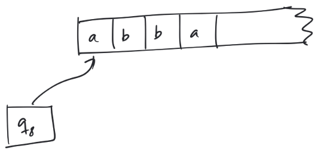
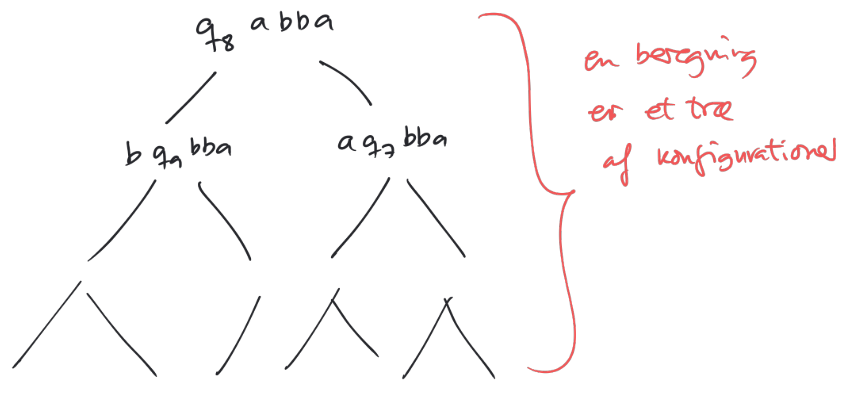

$$
\newcommand{\TM}{(Q,\Gamma, \Sigma, \delta, q_0, q_{accept}, q_{reject})}
$$

# Chuch-Turing-Tesen

## Læringsmål

* Forstå ækvivalensen mellem de udvidede turing-maskin-modeller og den oprindelige Turing-maskin-model
* Forstå Church-Turing-tesen og hvad dens forudsætninger er.
* Forstå at der er en dualitet mellem beslutningsproblemer og medlemskab af sprog
* Andvende dualiteten mellem beslutningsproblemer og sprog til at oversætte instanser af det ene begreb til instanser af det andet.
* Forstå strengbeskrivelses-notation og dens rolle og kunne anvende den til at oversætte beslutningsproblemer til sprog.

## Flere Bånd?

**Overføringsfunktion:**
$$
\delta: Q \times \Gamma^k \longrightarrow Q \times (\Gamma \times \{L,R\})^k
$$

### Simulering af en k-bånds TM med ét Bånd

Prikkerne markerer læsehovedets placering

$$
\Gamma_{\text{ny}} = \Gamma \cup \{\dot{a} \mid a \in \Gamma\} \cup \{\#\}
$$

**Simulering af et skridt:**

1. Scan den ikke-blanke del af båndet, og find ud af hvad prikkerne peger på (Husk det vhja. tilstand)
2. Flytte prikker og erstat tegn sådan som k-bånds-maskinen ville kræve det.
    * Skub indhold mod højre, om nødvendigt

#### Sætning

Hvis et sprog $L$ kan genkendes af en k-bånds-TM, kan $L$ også genkendes af en 1-bånds-TM.

* Flere bånd betyder **ikke noget** for regnekraft!

## Nondeterminisme

$$
DFA \sim NFA\\
DPDA \nsim PDA\\
\scriptstyle (DPDA \to PDA)\\
\scriptstyle (DPDA \nleftarrow PDA)\\
$$

$$
TM \sim NTM
$$

**Overføringsfunktion for NTM:**
$$
\delta : Q \times \Gamma \longrightarrow \mathcal{P}(Q \times \Gamma)
$$

### Eksempel

$$
\delta(q_8, a)=\{(q_9,b,R),(q_7, a,R)\}
$$

### Accept

**Definition**

En NTM $M$ accepterer en streng, hvis der i beregningstræet for strengen forekommer en konfiguration hvis tilstand er $q_{accept}$

### Simulering af NTM

Sker ved at gennemvandre beregningstræet og lede efter en accepterende konfiguration

Problem: NTM'er kan gå i uendelig løkke, så grene i træet KAN være uendeligt lange!

**Løsning:**

Idé: Brug breddesøgning

På input $w$

1. Kopier $w$ over på bånd 1
2. For $k=0,1,2,...$ 
    1. Kopier input fra bånd 1 til bånd 2
    2. Generer næste indexfølge af længde $k$
    3. Simuler en beregning på bånd 2 svarende til indexfølgen på bånd 3
    4. Hvis beregningen besøger $q_{accept}$: <u>accepter!</u>

### Sætning

Hvis $L$ kan genkendes af en NTM, kan $L$ genkendes af en TM!

* Vigtigt af flere grunde: 
    * Nondeterminisme giver **ikke** øget regnekraft
    * Vi må **godt** gøre brug af nondeterminisme!

## Enumerator

TM'er som sproggenkendere:

$$
L_{input}(M)=\{ w \in \Sigma^* \mid M\ \text{accepterer}\ w \}0
$$

TM'er som sproggeneratorer (**enumerator**):

$$
L_{output}(M)=\{ w \in \Gamma^* \mid M\ \text{udskriver}\ w\ \text{på tomt input} \}
$$

### Sætning

$L$ er et genkendeligt

​	$\Updownarrow$

$\exists$ enumerator $E$ så $E$ outputter $L$ ($L_{output}(E)=L$)

[Se bevis i Lektion 2, afsnit 4](https://youtu.be/qxrdOYRx_Zw?t=230)