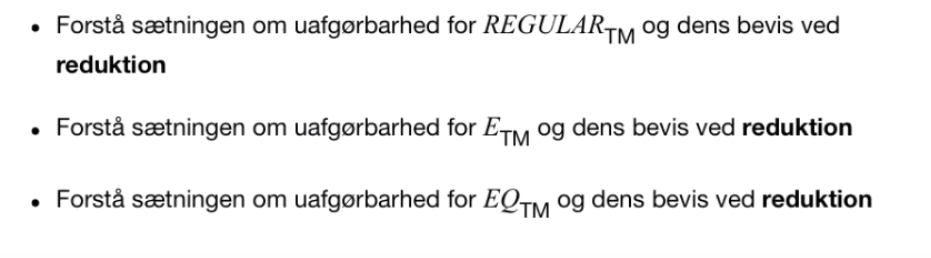
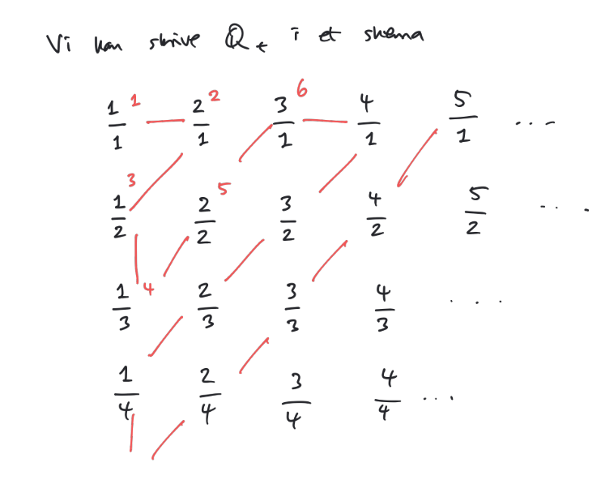
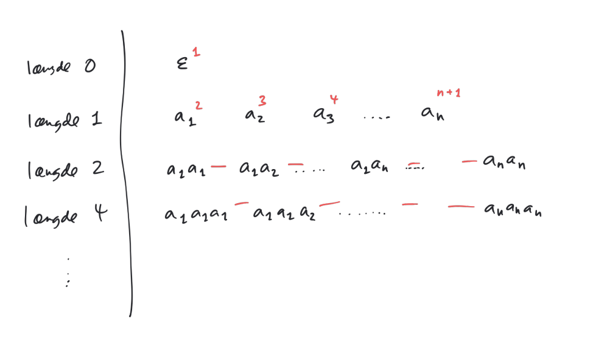

# Er der Flere Problemer end Algoritmer? Og er Problemer Beslægtede?

**Læringsmål**

* Forstå begreberne "samme størrelse" for mængder og de begreber, der er nødvendige for at definere det (herunder bjektioner)

* Forstå og kunne anvende teknikken til diagonalisering

* Forstå hvordan diagonaliseringsteknikken og beviset for uafgørbarhed er relateret

* Forstå sætningen om uafgørbarhed for $HALT_{TM}$ og dens bevis ved reduktion

    

## Mængdens Størrelse

**Enentydig (1-1)**

Lad $A,B$ være mængder og $f:A\to B$

$f$ er *1-1* eller *enentydig* hvis:
$$
\forall a_1,a_2\in A: f(a_1)\neq f(a_2)
$$
hvis $a_1 \neq a_2$

(Altså hvis 2 forskellige værdier, giver 2 forskellige outputs i funktionen)

**På**

Lad $A,B$ være mængder og $f:A\to B$

$f$ er *på* hvis:
$$
\forall b \in B : \exists a \in A: f(a) = b
$$

**Bijektion**

Lad $A,B$ være mængder og $f:A\to B$

$f$ er en **bijektion** hvis $f$ er 1-1 og på.

**Samme Størrelse**

Lad $A,B$ være mængder.

Vi siger at $A$ og $B$ har samme størrelse (**kardinalitet**) hvis:
$$
\exists f: A\to B, \text{så } f \text{ er en bijektion}
$$

**Tællelig Mængde**

Lad $A$ være en mængde.

$A$ er tællelig hvis $A$ har samme størrelse som de naturlige tal ($\N$).

### Tællelige Mængder 

#### Positive Rationelle Tal

$\Q_+$ er en tællelig mængde! (Positive rationelle tal)

#### Alle Strenge over Sigma

$\Sigma^*$ er en tællelig mængde!

* **Konsekvens**: 
    * Der er kun tælleligt uendeligt mange TM'er
        * Da hver TM $M$ beskrives med en strengkonstruktion $<M>$

### Overtællelige Mængder

Lad $A$ være en uendelig mængde.

Hvis $A$ ikke er tællelig, kalder vi $A$ for overtællelig.

#### Positive Reelle Tal

$\R_+$ er overtællelig.

Bevis: [Diagonalisering](https://youtu.be/elvOZm0d4H0?t=280).

#### Potensmængden af alle Strenge

$\mathcal{P}(\Sigma^*)$ er en overtællelig mængde.

Bevis ved diagonalisering:

Observation: Ethvert sprog svarer til en uendelig 0-1-følge (og omvendt)

