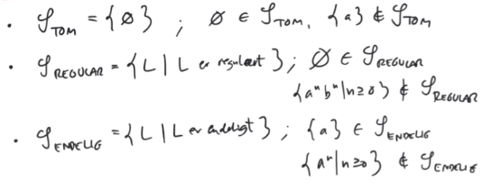

# Rice's Sætning

$$
\newcommand{\egsk}{\mathscr{S}}
$$

## Egenskab

**Definition**

En **egenskab** er en klasse  af genkendelige sprog.

En egenskab $\egsk$ er **ikke-triviel** hvis der er genkendeligesprog $L_1.L_2$ så

​	$L_1 \in \egsk$ men $L_2 \notin \egsk$

Der findes kun to trivielle egenskaber:

* $\egsk_{ALT}$
* $\egsk_{INTET}=\{\}$

### Sprog 

Givet en egenskab $\egsk$, definerer vi:

$$
\egsk_{TM}=\left\{ <M> \mid M \text{ er en TM},\ L(M)\in\egsk  \right\}
$$

## Rice's Sætning

**Sætning**

Hvis $\egsk$ er en ikke-triviel egenskab, så er $\egsk_{TM}$ <u>uafgørbart</u>.

**Korollar**

* $E_{TM}$ er uafgørbart
* $REGULAR_{TM}$ er uafgørbart
* $ENDELIG_{TM}$ er uafgørbart

**Bevis**

