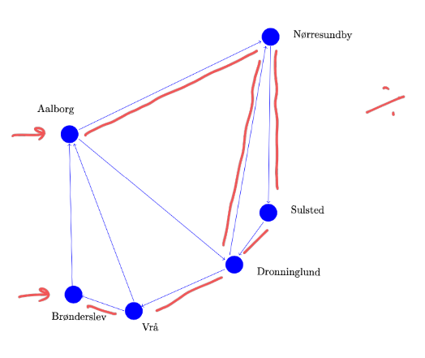
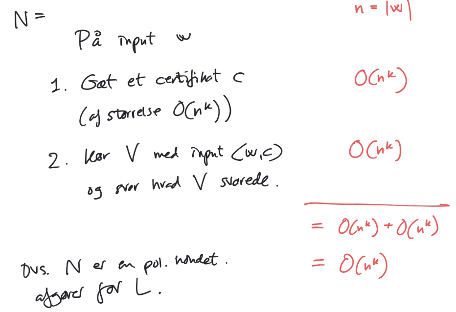

# NP og NP-fuldstændighed

## Verifikator

Lad $A$ være et sprog.

En **verifikator** $V$ for sproget $A$ er en TM som opfylder at
$$
A=\{w \mid V \text{ accepterer } \langle w,c\rangle\}
$$
hvor $c$ er et **certifikat** (bud på løsning / vidne til medlemskab)

En verifikator er **polinomiel** hvis den har polinomiel tidskompleksitet mht. $|w|$

* $c$ kan kun have størrelser der er polinomiel i $|w|$

### HAMPATH Eksempel

**Definition**

Givet en orienteret graf $G$, er en sti i $G$ en Hamilton-sti, hvis stien besøger hver knude i $G$ præcis en gang.

**Problem**

"Givet orienteret graf $G$, startknude $s$, slutknude $t$, findes der da en Hamilton-sti i $G$ fra $s$ til $t$?"

$$
HAMPATH=\{\langle G,s,t\rangle \mid G \text{ er en orienteret graf med en Hamilton-sti fra knude } s \text{ til } t\}
$$

Det er nemt (hurtigt) at tjekke om et bud på en Hamilton-sti faktisk er en sådan.

Eksempel:

Men er det nemt at finde ud af om en $G$ har en Hamilton-sti?

#### Verifikator for HAMPATH

### COMPOSITE Eksempel

Et $n\in \N$ er **sammensat** hvis

$\exists p,q \in \N$ så $p,q>1$ og $p\cdot q=n$

"Givet $n\in \N$ er n sammensat?"

$$
COMPOSITE=\{\langle n \rangle \mid n\in \N, n \text{ sammensat}\}
$$

#### Verifikator for COMPOSITE

Hvad er certifikat for $COMPOSITE$?

​	Et vidne for at $n\in COMPOSITE$, dvs. $p,q$

**Verifikator**: "

​	Givet $\langle n, \langle p,q \rangle\rangle$

1. Hvis $p<n$ og $q < n$ så
    så
    hvis $p\cdot q = n$ <u>accepter</u> ellers <u>afvis</u>
2. 

"

## NP

**Definition**
$$
NP = \{L \mid L \text{ har en polynomiel verifikator}\}
$$
(sprog hvor det er nemt at tjekke om et bud på et vidne for medlemskab er korrekt, men ikke nødvendigvis nemt at tjekke for medlemskab)

nemt: lav (polynomiel tidskompleksitet)

$$
NP = \bigcup_{k\geq 0} NTIME(n^k)
$$
$NP$ er klassen af sprog der kan afgøres i nondererminiistisk polynomiel tid.

**Sætning**
$$
\begin{align}
\forall L:\quad 
&L \text{ har en polynomiel verifikator}\nonumber\\
&\Updownarrow\nonumber\\
&L \text{ kan afgøres i nondet. polynomiel tid}\nonumber
\end{align}
$$

### NTIME

Lad $f: \N \to \N$

$$
NTIME(f(n)) = \{ L\mid L \text{ kan afgøres af en NTM med tidskompleksitet } O(f(n))\}
$$

Bemærk:

$TIME(f(n))\subseteq NTIME(f(n))$

### Bevis for Sætning (6)

$\Downarrow$)

Antag at $L$ har en polynomiel verifikator $V$:

$V$ har pol. tidskompleksitet mht. $w$ dvs $O(n^k)$    (så $|c|$ kan højst være $O(n^k)$)

Vi vil lave en nondet. polynomiel afgører $N$:

$\Uparrow$)

Antag at $L$ kan afgøres i nondet. polynomiel tid med afgører $N$.

Vi vil lave en polynomiel verifikator $V$ for $L$.

Certifikat skal være et bud på en accepterende sti i beregningstrået (dvs. en følge af konfigurationer)

Verifikator $V$:

$\square$

## P NP

Da $TIME(f(n)) \subseteq NTIME(f(n))$ har vi

$$
P \subseteq NP
$$

### Reduktion

Før:

* $\leq_m \approx$ er ikke sværere end

Nu:

* $\leq_p \approx$ er ikke sværere end (nu med tidskompleksitet)

**Definition**

Lad $A, B$ være sprog over $\Sigma^*$ 

$A \leq_p B$ ($A$ polynomial reducerer til $B$), hvis $\exists f: \Sigma^*\to\Sigma^*$ så

*  $\forall w \quad w\in A \Leftrightarrow f(w)\in B$ ($f$ er trofast)

    og $f$ er beregnbar <u>i polynomiel tid</u>

**Sætning**

Hvis $A \leq_p B$ og $B \in P$, så $A\in P$ 

## NP Fuldstændighed

**Definition**

Et sprog $L$ kaldes **NP-fuldstændigt** hvis

1. $L\in NP$
2. $\forall L' \in NP.\quad L'\leq_p L$

Hvis $L_1, L_2$ er NP-fuldstændige, har vi

* $L_1\in NP,\quad L_2\in NP$
* $\forall L' \in NP. \quad L'\leq_p L_1, \quad L' \leq_p L_2$

Så:

* $L_1 \leq_p L_2 \quad L_2 \leq_p L_1$