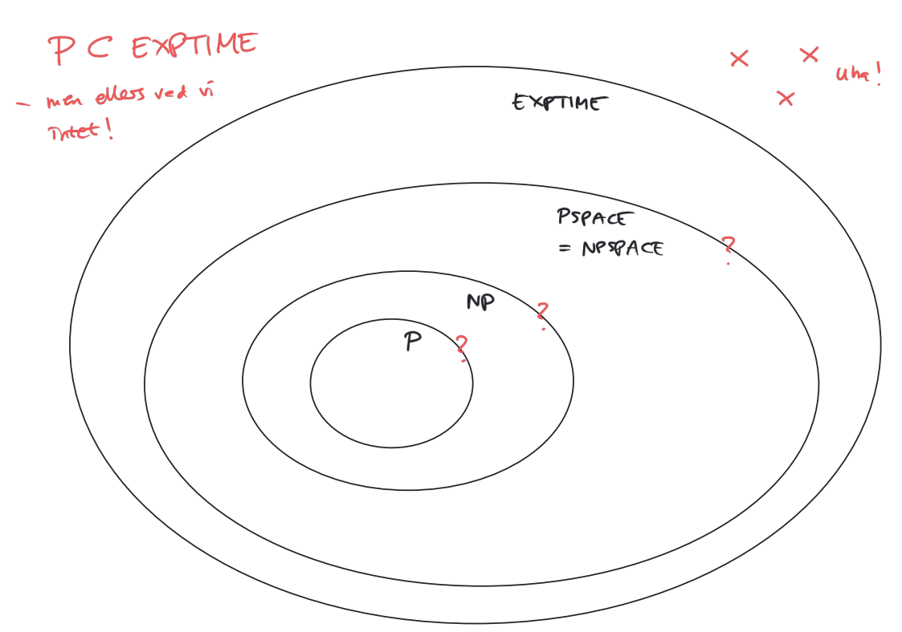

# Pladskompleksitet

**Definition**

<u>Deterministisk</u>

En DTM har pladskompleksitet $f(n)$, hvor $f: \N \to \N$
hvis enhver beregning på et input af længde $n$ højst bruger $f(n)$ felter på båndet

(for alle input af længden $n$)

**Definition** 

<u>Nondeterministisk</u>

En NTM har pladskompleksitet $f(n)$, hvor $f: \N \to \N$
hvis enhver beregning på et input af længde $n$ højst bruger $f(n)$ felter på båndet

(for ethvert input af længden $n$ og enhver mulig beregning på et sådant input)

## Pladskompleksitetsklasser

**Definition**

Lad $f:\N\to\N$

$$
\begin{align}
SPACE(f(n))&=\{L \mid L \text{ kan afgøres af en DTM med pladskompleksitet } O(f(n))\}\\
NSPACE(f(n))&=\{L \mid L \text{ kan afgøres af en NTM med pladskompleksitet } O(f(n))\}
\end{align}
$$

Klart at 

$$
SPACE(f(n))\subseteq NSPACE(f(n))
$$

### Eksempler

#### **SAT**

$SAT\in SPACE(n)$

**Afgører**

## Sammenhæng Mellem Tids- og Pladskompleksitet

**Sætning**

Hvis en TM har pladskompleksitet $O(f(n))$, så har den tidskompleksitet $2^{O(f(n))}$

**Bevis**

### EXPTIME

$$
EXPTIME=\bigcup TIME(2^{n^k})
$$

**Sætning**

Hvis $L \in SPACE(n^k)$

så $L\in TIME(2^{n^k})$, dvs $L\in EXPTIME$

Altså hvis $L$ kan afgøres i polynomiel plads, kan $L$ afgøres i eksponentiel tid.

### PSPACE

$$
\begin{align}
PSPACE&=\bigcup_{k\geq0} SPACE(n^k)\\
NPSPACE &= \bigcup_{k\geq0} NSPACE(n^k)
\end{align}
$$

Klart at

$$
PSPACE\subseteq NPSPAC
$$
Det vides at

$$
PSPACE = NPSPAC
$$

## Verdenskort

