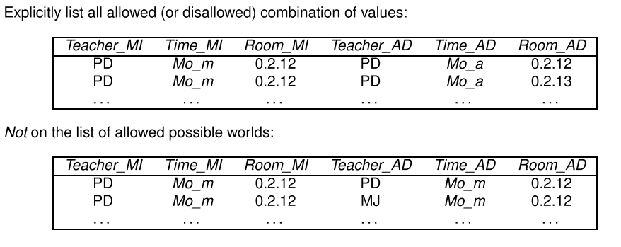
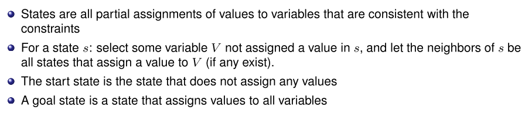
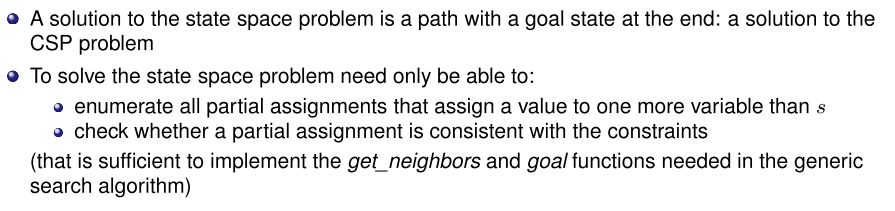
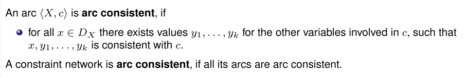
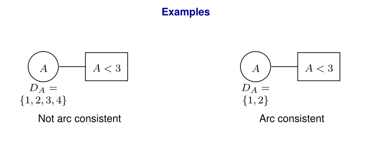
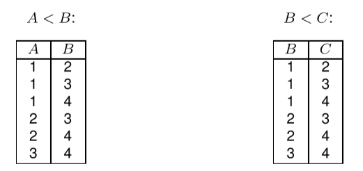
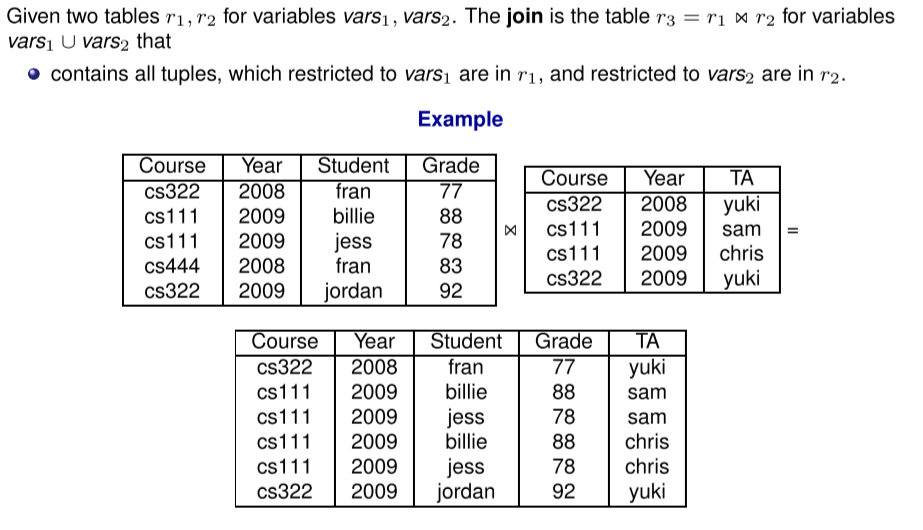
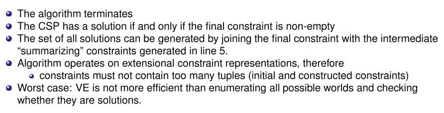

# Constraints Satisfaction Problems

## Features and Variables

Describing the world (environment) by features:

A **possible world** for a set of variables is an assignment of a value to each variable.

**Example (Cooking)**:

## Constraint Satisfaction Problems

A **constraint** is a condition on the values of variables in a possible world.

Can be specified with:

### Extensional Constraint Specification

### Intensional Constraint Specification

* If teacher for AD and MI is the same, then the time of AD cannot be the same as time of MI.

### Example: Sudoku

Constraints:

### Definition

A **Constraint Satisfaction Problem (CSP)** is given by

* a set of variables
* a set of constraints (usually intensional)

A **solution** to a CSP consists of a possible world that satisfies all the constraints (also called a **model** of the constraints)

### CSP as State Space Problem

A CSP can be represented as a state space problem:

#### Solving the CSP

##### Example

## Consistency Algorithms

**Idea**

### Constraint Network

The **constraint network** for a CSP consists of:

* 1 (oval) node for each variable $X$
* 1 (rectangular) node for each constraint $c$
* An (undirected) arc $\langle X,c \rangle$ between every constraint and every variable involved in the constraint

With each variable node $X$ is associated a **(reduced) domain** $D_X$:

* Initially the domain of the variable
* Reduced by successively deleting values that cannot be part of a solution

#### Arc Consistency

**Examples**

##### Algorithm Outline

Example: Slide 18

**Algorithm Outcomes**

### Variable Elimination

* Simplify problem by eliminating variables

Operates on extensional (table) representations of constraints

Algorithm requires **projection** and **join** operations on tables

**Project**

**Join**

**Algorithm Outline**

Example slide 24

#### Properties

