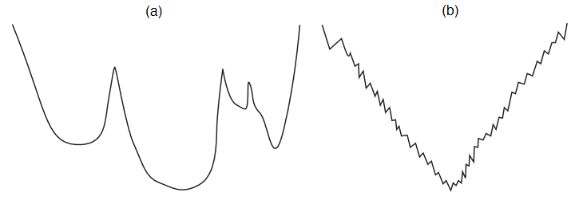
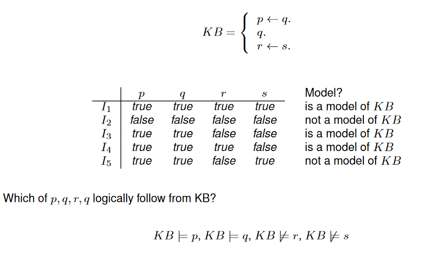

# Constraints Satisfaction Problems

## Features and Variables

Describing the world (environment) by features:


A **possible world** for a set of variables is an assignment of a value to each variable.

**Example (Cooking)**:


<div style="page-break-after: always; break-after: page;"></div>
## Constraint Satisfaction Problems

A **constraint** is a condition on the values of variables in a possible world.

Can be specified with:

### Extensional Constraint Specification

Explicitly list all allowed (or disallowed) combination of values:


Not on the list of allowed possible worlds:


### Intensional Constraint Specification

Use logical expressions:

$$
\begin{align*}
Teacher\_AD=Teacher\_MI \to Time\_AD \neq Time\_MI\\
Time\_AD = Time\_MI \to Room\_AD \neq Room\_MI
\end{align*}
$$

* If teacher for AD and MI is the same, then the time of AD cannot be the same as time of MI.

<div style="page-break-after: always; break-after: page;"></div>

### Example: Sudoku


Constraints:


### Definition

A **Constraint Satisfaction Problem (CSP)** is given by

* a set of variables
* a set of constraints (usually intensional)

A **solution** to a CSP consists of a possible world that satisfies all the constraints (also called a **model** of the constraints)


### CSP as State Space Problem

A CSP can be represented as a state space problem:

* States are all partial assignments of values to variables that are consistent with the constraints
* For a state $s$: select some variable $V$ not assigned a value in $s$, and let the neighbors of $s$ be all states that assign a value to $V$ (if any exist)
* The start state is the state that does not assign any values
* A goal state is a state that assigns values to all variables


#### Solving the CSP

* A solution to the state space problem is a path with a goal state at the end:

    * A solution to the CSP problem

* To solve the state space problem need only be able to:

    * enumerate all partial assignments that assign a value to one or more variable than $s$
    * check whether a partial assignment is consistent with the constraints

    (That is sufficient to implement the *get_neighbors* and *goal* functions needed in the generic search algorithm)

    

##### Example


<div style="page-break-after: always; break-after: page;"></div>
## Consistency Algorithms

**Idea**


### Constraint Network


The **constraint network** for a CSP consists of:

* 1 (oval) node for each variable $X$
* 1 (rectangular) node for each constraint $c$
* An (undirected) arc $\langle X,c \rangle$ between every constraint and every variable involved in the constraint

With each variable node $X$ is associated a **(reduced) domain** $D_X$:

* Initially the domain of the variable
* Reduced by successively deleting values that cannot be part of a solution


#### Arc Consistency

An arc $\langle X,c \rangle$ is **arc consistent**, if

* For all $x\in D_X$ there exists values $y_i,...,y_k$ for the other variables involved in $c$, 
    such that $x,y_i,...,y_k$ is consistent with $c$

A constraint network is **arc consistent**, if all its arcs are arc consistent


**Examples**


<div style="page-break-after: always; break-after: page;"></div>

##### Algorithm Outline


Example: Slide 18 ([Appendix of this page](./09-16appendix.md))


**Algorithm Outcomes**

Algorithm is guaranteed to terminate.
Result independent of order in which arcs are processed.

Possible cases at termination:

* $D_X=\empty$ for some $X:$ 
    * CSP has no solution

* $D_X$ contains exactly one value for each $X:$ 
    * CSP has unique solution, given by the $D_X$ values.
* Other
    * If the CSP has a solution, then the solution can only consist of current $D_X$ values


### Variable Elimination

* Simplify problem by eliminating variables

Operates on extensional (table) representations of constraints


Algorithm requires **projection** and **join** operations on tables

<div style="page-break-after: always; break-after: page;"></div>

#### **Project**


#### **Join**

Given two tables $r_1, r_2$ for variables $vars_1,vars_2$.

The **join** is the table $r_3=r_1 \bowtie r_2$ for variables $vars_1 \cup vars_2$ that

* contains all tuples, which restricted to $vars_1$ are in $r_1$, and restricted to $vars_2$ are in $r_2$

##### Example


<div style="page-break-after: always; break-after: page;"></div>

#### **Algorithm Outline**


Example slide 24 ([Appendix of this page](./09-16appendix.md#variable-elimination-example))

#### Properties

* The algorithm terminates
* The CSP has a solution if and only if the final constraint is non-empty
* The set of all solutions can be generated by joining the final constraint with the intermediate "summarizing" constraint generated in line 5.
* Algorithm operates on extensional constraint representations, therefore
    * constraints must not contain too many tuples (initial and constructed constraints)
* Worst case: VE is not more efficient than enumerating all possible worlds and checking whether they are solutions

##### Constraint Graph

Consider the graph where

* there is one node for each variable
* two variables are connected when they appear together in one constraint


Then VE will work better if the constraint graph is sparsely connected!

<div style="page-break-after: always; break-after: page;"></div>
## Local Search

So far all methods systematically explored the state space (possible worlds)

Problem: Time and space when search space is large

Local Search approach:

* Explore state space without "bookkeeping" (where have we been, and what needs to be explored?)
* no success/terminatiuon guarantees
* in practice, often the only thing that works


Another state space graph representation for CSPs:

* Nodes are possible worlds
* Neighbors are possible worlds that differ in the value of exactly one variable


### Algorithm Outline

```pseudocode
select some node in state space graph as current_state
while current_state is not a solution
	current_state = some neighbor of current_state
```


#### Random Search

* Make choices in line 1. and 3. completely random
* "Random Walk"
* Unlikely to find a solution if state space is large with only a few solutions


#### Greedy Search

AKA Hill Climbing.

* Use an evaluation function on states
    * Example: number of constraints not satisfied by state
* Always choose neighbor with minimal evaluation function value
* Terminates when all neighbors have higher value than current state
    * (Current  state is a **local minimum**)

Possible greedy search paths starting from different states:


##### Problem

Search terminates with local minimum of evaluation function. This may not be a solution to the CSP


##### Solution Approaches

* Random restarts
    * repeat greedy search with several randomly chosen initial states
* Random moves
    * combine greedy moves with random steps

Examples

a)	Small number of random restarts will find global minimum

b)	Make random move when local minimum reached




#### Local Seach

* Maintain an assignment of a value to each variable
* At each step, select a "neighbor" of the current assignment (e.g. one that improves some heuristic value)
* Stop when a satisfying assignement is found, or return the best assignment found

**Requires**

* What is a neighbor?
* Which neighbor should be selected?


#### Most Improving Step

Select the variable-value pair that gives the highest improvement

* Maintain a priority queue with variable-value pairs not part of the current assignment
* $Weight\langle X,v \rangle=eval(current\ assignment)-eval(current\ assignment\ but\ with\ X=v)$
* If $X$ is given a new value, update the weight of all pairs participating in a changed constraint


#### Two-Stage Choice

1. Choose variable
2. Choose state

**Data Structure**

* Maintain priority queue of variables; weight is the number of participating conflicts
* After selecting a variable, pick the value minimizes the  number of conflicts
* Update weights of variables that participate in a conflict that is changed

<div style="page-break-after: always; break-after: page;"></div>

#### Simulated Annealing

**Algorithm**

* Pick a variable at random and a new value at random
* If it is an improvement, adopt it.
* If it isnt an improvement, adopt it probabilistically depending on a temperature paramenter, $T$
    * With current assignment $n$ and proposed assignment $n'$ we move to $n'$ with probability:

$$
e^{(h(n')-h(n))/T}
$$

* Reduce the temperature

**Probability of Accepting a Change**


<div style="page-break-after: always; break-after: page;"></div>
## Propositional Logic Basics

Provides a formal language for representing constraints on *binary variables*

### Syntax

#### Atomic Propositions

Convention: Start with lowercase letter


#### Propositions


A set of propositions is also called a **Knowledge Base**

#### Example

"If **it rains** I'll **take my umbrella**, or I'll **stay home**"

$$
rains\to(umbrella \or home)
$$

### Semantics

#### Interpretation

An **interpretation** $\pi$ for a set of atomic propositions $a_1,a_2,...,a_n$ is an assignment of a truth value to each proposition

* Equal to possible world when atomic propositions seen as boolean variables

$$
\pi(a_i)\in\{true,false\}
$$

An interpretation defines a thruth value for all propositions


#### Models

A **model** of a proposition (knowledge base) is an interpretation in which the proposition is true

Propositions as constraints: a model is a possible world that satisfies the constraint

#### Logical Consequence

A proposition $g$ is a **logical consequence** of a knowledge base KB, if every model of KB is a model of $g$

$$
KB \models g
$$

(Whenever KB is true, then g is also true)

##### Example

$KB=\{man\to mortal,man\}$ then:

$$
KB\models mortal
$$




