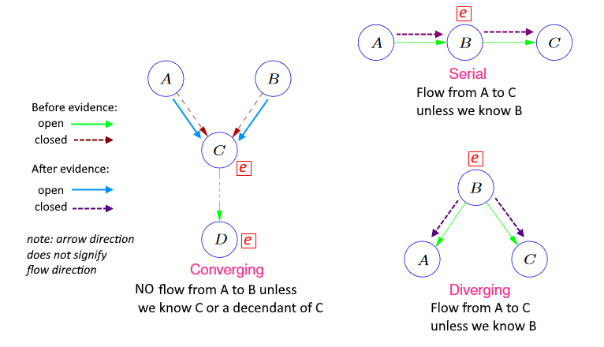
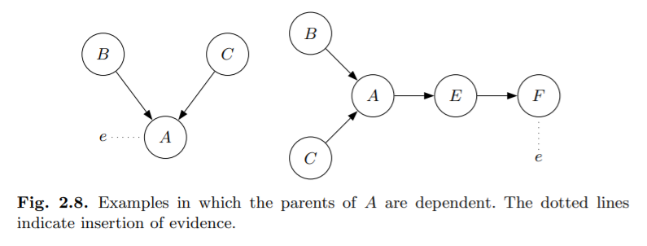

# Bayesian Networks

## Reasoning Under Uncertainty

Example: *Car-start-problem:*

*“In the morning, my car will not start. I can hear the starter turn, but
nothing happens. There may be several reasons for my problem. I can hear
the starter roll, so there must be power from the battery. Therefore, the most probable causes are that the fuel has been stolen overnight or that the spark
plugs are dirty. It may also be due to dirt in the carburetor, a loose connection
in the ignition system, or something more serious. To find out, I first look at
the fuel meter. It shows half full, so I decide to clean the spark plugs.”*

* How can you make a computer do these assumptions, and make a choice what to check?

For propositional logic we have Boolean logic as a framework.

When we deal with uncertain events, it would be nice to have something similar.
We can extend the truth values of propositional logic to **"certainties"** which are numbers between 1 and 0.

**Certainties: **

* A certainty of 0 means "certainly not true"
* A certainty of 1 means "certainly true"

Example:

*“if I take a cup of coffee while on break, I will with certainty 0.5 stay awake during the next lecture”*

or

*“if I take a short walk during the break, I will with certainty 0.8 stay awake during the next lecture.”*

### Casual Perspective on Car Start Problem

To simplify, we assume that we have

* $\{yes, no\} $ for $Fuel?$
* $\{yes, no\}$ for $Clean\ Spark\ Plugs?$
* $\{full, 1/2, empty\}$ for $Fuel\ Meter$
* $\{yes, no\}$ for $Start?$.

AKA *states*.

We know that the state of $Fuel?$ and $Clean\ Spark\ Plugs?$ have a casual impact on the state of $Start?$.

Also, the state of $Fuel?$ has an impact on the state of $Fuel\ Meter$.

This can be represented with a graph:

If we add a direction from $no$ to $yes$ in each variable, we can represent directions of the impact. (Fig. 2.2.)

## Casual Networks and d-Separation

A **Casual Network** consists of

* A set of *variables*
* A set of *directed links* (aka *arcs*)

Mathematically a directed graph.

If there is a link from *A* to *B* we say that *B* is a *child* of *A*, and *A* is a *parent* of *B*.

### Bayesian Network

A **Bayesian Network** for variables $A_1,\dots,A_k$ consists of

* a directed acyclic graph with nodes $A_1,...,A_k$
* for each node a **conditional probability table** specifying the conditional distribution
    $P(A_i\mid parents(A_i))$
    * $parents(A_i)$ denotes the **parents** of $A_i$ in the graph

and through the chain rule provides a compact representation of a joint probability distribution

#### Example

To turn this graph into a Bayesian network, the following conditional probability tables must be specified:

$$
\begin{align*}
&P(A)\\&P(B)\\&P(C\mid A,B)\\&P(D\mid A,C)\\&P(E\mid B,D,F)\\&P(F\mid A)
\end{align*}
$$

### Constructing a Bayesian Network

#### Via Chain Rule

1. Put the random variables in some order
2. Write the joint distribution using chain rule
3. Simplify conditional probability factors by conditional independence assumptions.
    That determines the *parents* of each node i.e. the graph structure
4. Specify the conditional probability tables

Note: The structure of the resulting network strongly depends on the chosen order of the variables.

#### Via Causality

* Draw an edge from variable $A$ to variable $B$ if $A$ has a direct casual influence on $A$

Note: This may not always be possible:

* *Inflation* $\to$ *salaries* or *salaries* $\to$ *inflation*?
* *Rain* doesn't cause *Sun*, and *Sun* doesn't cause *Rain*, but they are not independent either.

### Transmission of Evidence

#### Serial Connection

Consider fig 2.3:

Evidence about *A* will influence the certainty of *B*, which influences the certainty of *C*.
<u>Similarly, evidence about *C* will influence the certainty of *A* through *B*.</u>

If the state of *B* is known, the channel is "blocked" and we say that *A* and *C* are **d-separated** given *B*.

When a state of a variable is known, we say that the variable is *instantiated*.

> *We conclude that evidence may be transmitted through a serial connection unless the state of the variable in the connection is known*

#### Diverging Connection

Influence can pass between all the children of A unless the state of A is known.

* *B,C,...,E* are d-separated given *A*

#### Converging Connection

* If nothing is known about *A* except what may be inferred from knowledge of its parents, then the parents are independent.
* However, if anything is known about the consequences, then information on on possible cause may tell us something about the other causes.

### D-Separation

**Definition**

Two distinct variables $A$ and $B$ in a casual network are **d-separated** if for all paths between $A$ and $B$, there is an intermediate variable $V\neq A \and V\neq B$ such that either:

* the connection is serial or diverging and $V$ is instantiated, or
* the connection is converging, and neither $V$ nor any of $V$'s descendants have received evidence.

If $A$ and $B$ are not d-separated, we call them **d-connected**

**Theorem**

For all pairwise disjoint sets $A,B,C$ of nodes in a Bayesian network:

* If $C$ d-separates $A$ from $B$ then $P(A\mid B,C)=P(A\mid C)$

Note:

Når man tjekker efter d-seperation, så tjek hele ruten på en gang!

Tjek efter d-seperated, og <u>IKKE</u> efter d-connection

