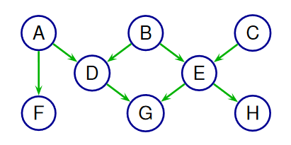
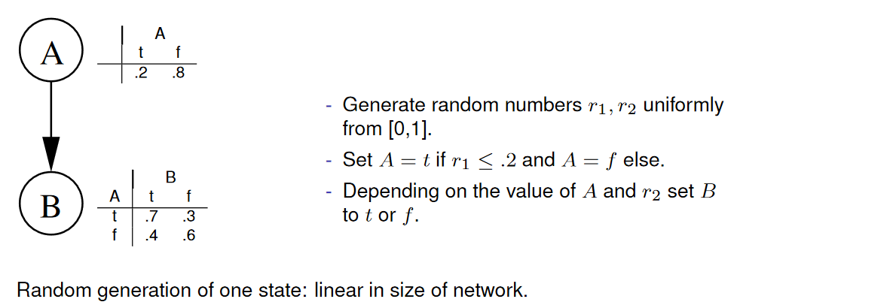
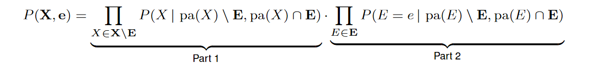
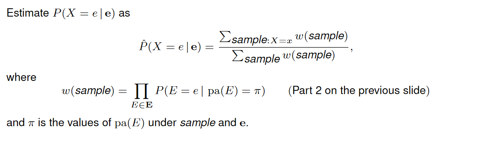

# Inference in Bayesian Networks

## Inference

Inference Problem:

* Given: a Bayesian network
* Given an assignment of values to some of the variables in the network: $E_i=e_i(i=1,\dots,l)$
    * "Instantiation of the nodes $\bold E$"
    * "Evidence $\bold E=e$ entered"
    * "Findings entered"
    * ...
* Want: for variables $A\notin \bold E$ the *posterior margnial* $P(A\mid \bold E=e)$

According to the definition of conditional probability, it is sufficient to compute for each $A\in D_A$ the value

$$
P(A=a,\bold E=e)
$$

Together with

$$
P(\bold E=e)=\sum_{a\in D_A}P(A=a,\bold E=e)
$$

This gives the posterior distribution

### Inference as Summation

Let $A$ be the variable of interest, $\bold E$ the evidence variables, and $\bold Y=Y_1,\dots,Y_l$ the remaining variables in the network not belonging to $A\cup \bold E$. Then

$$
P(A=a,\bold E=e)=\sum_{y_1\in D_{Y_1}}\cdots\sum_{y_l\in D_{Y_l}}P(A=a,\bold E=e,Y_1=y_1,\dots,Y_l=y_l)
$$
Note:

* For each $\bold y$ the probability $P(A=a,\bold E = \bold e, \bold Y = \bold y)$ can be computed from the network 
    In time linear in the number of random variables
* The number of configurations over $\bold Y$ is exponential in $l$

### Inference Problems

#### First Problem

Find $P(B\mid a,f,g,h)={P(B,a,f,g,h)\over P(a,f,g,h)}$

We can if we have access to $P(A,B,C,D,E,F,G,H)$

$$
P(A,B,C,D,E,F,G,H)=P(A)P(B)P(C)P(D\mid A,B)\cdots P(H\mid E)
$$

Inserting evidence we get:

and

#### Second Problem

See naive solution in [Lecture 14.10 Slides 8-11](./extra/mi-14-10.pdf)

##### Naive Solution Summary

### Variable Elimination

**Problem**

The joint probability distribution will contain exponentially many entries

**Idea**

We can use

* the form of the joint distribution $P$, and
* the law of distributivity

to make the computation of the sum more efficient

Thus, we can adapt our elimination procedure so that:

* we marginalize out variables sequentially
* when marginalizing out a particular variable $X$, we only need to consider the factors involving $X$

### Example

### Factors

**Calculus of factors**

* The procedure operates on **factors:** functions of subsets of variables

* Required operations on factors:

    * *multiplication*
    * *marginalization* (summing out selected variables)
    * *restriction* (setting selected variables to specific values)

    

**Complexity**

See example in [Lecture 14.10 Slides 16-17](./extra/mi-14-10.pdf)

#### Singly Connected Networks

A **singly connected network** is a network in which any two nodes are connected by at most one path of undirected edges.

For singly connected network: any elimination order that "peels" variables from outside will only create factors of one variable.

The complexity of inference is therefore linear in the total size of the network ( = combined size of all conditional probability tables)

## Approximate Inference

### **Sample Generator**

Observation: can use Bayesian network as random generator that produces states $\bold X = \bold x$
according to distribution $P$ defined by the network

#### Example

### Approximate Inference from Samples

To compute an approximation of $P(\bold E = \bold e)$ ($\bold E$ is a subset of the variables in the Bayesian network):

* generate a (large) number of random states
* count the frequency of states in which $\bold E = \bold e$

### Hoeffding Bound

### Required Sample Size

#### Example

### Rejection Sampling

The simplest approach: **Rejection Sampling**

**Problem**

Samples with $\bold E \neq \bold e$ are useless!

Ideally: would draw samples directly from the conditional distribution $P(\bold A \mid \bold E = \bold e)$

#### Likelihood Weighting

We would like to sample from

So instead weigh each generated sample with a weight corresponding to Part 2

