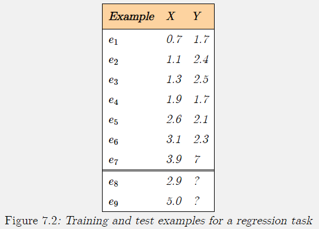
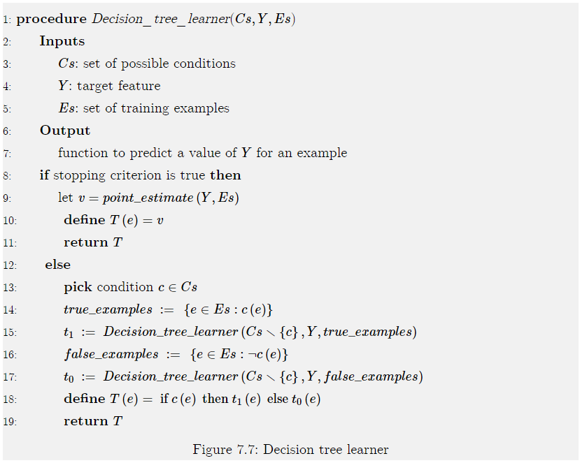

# Learning: Introduction and Decision Trees

Learning: The ability of an agent to improve its behavior based on experience, e.g.:

*  The range of behaviors is expanded; the agent can do more. 
*  The accuracy on tasks is improved; the agent can do things better. 
*  The speed is improved; the agent can do things faster. 

## Learning Issues

The following components are part of any learning problem:

* **Task**: The behavior or task that is being improved
* **Data:** The experiences that are used to improve performance in the task, usually in the form of a sequence of examples
* **Measure of improvement:** How the improvement is measured. Examples:
    * New skills that were not present initially
    * Increasing accuracy in prediction
    * Improved speed

Learning techniques face the following issues:

### Task

[7.1: Task](https://artint.info/2e/html/ArtInt2e.Ch7.S1.html#I2)

The most commonly studied learning task is **supervised learning:**

* Given some input features, some target features, and a set of **training examples** where the input features and target features are specified, predict the value of target features for new examples given their values on the input features.
    * This is called **classification** when the target features are discrete,
    * And **regression** when the target features are continuous.

Other learning tasks include:

* Unsupervised learning
    * Without defined targets
* Reinforced learning
    * Based on rewards and punishments
* Analytic learning
    * Learning to reason faster
* Inductive logic programming
    * Learning richer representation such as logic programs

### Feedback

[7.1: Feedback](https://artint.info/2e/html/ArtInt2e.Ch7.S1.html#I2.ix66)

Learning tasks can be characterized by the feedback given to the learner.

* **Supervised Learning**: What has to be learned is specified for each training example.
* **Unsupervised Learning:** No classifications are given, and the learner must discover categories and regularities in the data.

Feedback often falls between these extremes, such as:

* **Reinforcement Learning:** Feedback in terms of rewards and punishments occurs after a sequence of actions

    * This leads to the **credit assignment problem** of determining which actions were responsible for the rewards or punishments.

        

### Representation

[7.1: Representation](https://artint.info/2e/html/ArtInt2e.Ch7.S1.html#I2.ix67)

Experiences must affect the agents internal representation. This internal representation could be the raw experiences, but it is typically a compact representation that generalizes the data.

* The problem of inferring an internal representation based on examples is called **induction**.

* The problem of deriving consequences of a knowledge base is called **deduction**
* Hypothesizing what may be true about a particular case is called **abduction**

Two principles are at odds:

*  *The richer the representation, the more useful it is for subsequent problem solving*. 
*  *The richer the representation, the more difficult it is to learn*.

### Online and Offline

* **Online Learning:** Training examples arrive as the agent is acting.
* **Offline Learning:** All of the training examples are available to an agent before it needs to act.

An agent that learns online requires some representation of its previously seen examples before it has seen all of its examples. As new examples are observed, the agent must update its representation. 

**Active learning** is a form of online learning in which the agent acts to acquire useful examples from which to learn.

### Measuring Success

To know whether an agent has learned, we must define a measure of success. The measure is usually not how well the agent performs on the training data, but how well the agent performs for new data. 

Success in learning should not be judged on correctly classifying the training set, but  on being able to correctly classify unseen examples.

* Thus, the learner must **generalize:** go beyond the specific given examples to classify unseen examples.

To evaluate a learning procedure, we can divide the examples into **training examples** and **test examples**.

### Bias

The tendency to prefer one hypothesis over another is called a **bias**.

* Without a bias, an agent will not be able to make any predictions on unseen examples.
* What constitutes a good bias is an empirical question about which biases work best in practice.

### Learning as Search

Given a representation and a bias, the problem of learning can be reduced to one of search.

Unfortunately, the search spaces are typically prohibitively large for systematic search.

* The definition of the learning algorithm then becomes one of defining the search space, evaluation function and search method.

### Noise

In most real-world situations, the data are not perfect. 

There can be **noise** where the observed features are not adequate to predict the classification, **missing data** where the observations of some of the features for some or all of the examples are missing, and **errors** where some of the features have been assigned wrong values. 

One of the important properties of a learning algorithm is its ability to handle noisy data in all of its forms. 

### Interpolation and Extrapolation

**Interpolation:** Making a prediction between cases for which there are  data.

**Extrapolation:** Making a prediction that goes beyond the seen examples.

Extrapolation is usually much less accurate than interpolation.

## Supervised Learning

[7.2 Supervised Learning](https://artint.info/2e/html/ArtInt2e.Ch7.S2.html)

A set of examples and a set of features, partitioned into input features and target features.

The aim is to predict the values of the target features from the input features.

A **feature** is a function from examples into a value.

If $e$ is an example, and $F$ is a feature, then $F(e)$ is the value of feature $F$ for example $e$.

The **domain** of a feature is the set of values it can return.

In a supervised learning task, the learner is given:

* a set of **input features, **$X_1,\dots,X_n$
* a set of **target features, ** $Y_1,\dots,Y_n$
* a set of **training examples**, where the values for the input and target features are given for each example
* a set of **test examples**, where only the values for the input features are given.

The aim is to predict the values of the target features for the test examples and as-yet-unseen examples.

[Example 7.1](https://artint.info/2e/html/ArtInt2e.Ch7.S2.html#Ch7.Thmciexamplered1)

See the image above. 

Predicting the value of $Y$ is a **regression** task, because $Y$ is a real-valued feature.

Example $e_8$ is an **interpolation** problem, because the value of $X$ is between the values of the training examples.

Example $e_9$ is an **extrapolation** problem, because the value of $X$ is outside the range of the range of the training examples.

### Evaluating Predictions

$$
\newcommand{pval}{\widehat Y}
$$

A **point estimate** for target feature $Y$ on example $e$ is a prediction of the value of $Y(e)$.

Let $\widehat{Y}(e)$ be the predicted value for target feature $Y$ on example $e$.

The **error** for this example on this feature is a measure of how close $\widehat Y(e)$ is to $Y(e)$.

For regression, both $\widehat Y(e)$ and $Y(e)$ are real numbers that can be compared arithmetically.

For classification, when the target feature $Y$ is a discrete function, there are a number of alternatives:

* When the domain of $Y$ is binary, we can associate one value with 0 and the other with 1, and the prediction can be some real number.

* In a **cardinal feature** the values are mapped to real numbers. This is appropriate when the values in the domain are totally ordered,  and the differences between the numbers are meaningful.

    Often,  mapping values to the real line is not appropriate even if the values are totally ordered.

    * Example: Values = $short, medium, long$. The prediction that the value is either $short$ or $long$ is very different from the prediction that the value is $medium$

    When the domain of a feature is totally ordered, but the differences between the values are not comparable, the features is called an **ordinal feature**

* For a totally ordered feature, either cardinal or ordinal, and for a given value $v$, a Boolean feature can be constructed as a **cut**:

    * A new feature that has value $1$ when $Y\leq v$ and $0$ otherwise.

    Combining cuts allows for features that are true for intervals.

* When $Y$ is discrete with domain $\{v_1,\dots,v_k\}$, where $k>2$, a separate prediction can be made for each $v_i$.
    This can be modeled by having a binary **indicator variable,** $Y_i$, associated with each value $v_i$, 
    where $Y_i(e)=1$ if $Y(e)=v_i$, and $Y_i(e)=0$ otherwise.

[Example 7.3](https://artint.info/2e/html/ArtInt2e.Ch7.S2.SS1.html#Ch7.Thmciexamplered3)

#### Prediction Error

In the following measures of **prediction error,**

​	$E$ is a set of examples, and
​	$T$ is a set of target features.

For target feature $Y\in T$ and example $e\in E$, the actual value is $Y(e)$ and the predicted value is $\pval$.

The **0/1 error** on $E$ is the sum of the number of predictions that are wrong:

$$
\sum_{e\in E} \sum_{Y\in T}Y(e) \neq \pval(e)\ ,
$$
​	where $Y(e)\neq \pval(e)$ is 0 when false and 1 when true.

This is the number of incorrect predictions, not taking into account how wrong the predictions are.

The **absolute error** on $E$ is the sum of the absolute differences between the actual and predicted values:

$$
\sum_{e\in E}\sum_{Y \in T} \left| Y(e)-\pval(e) \right|
$$
This is always non-negative, and is only zero when all predictions exactly fit the observed values. 
Here close predictions are better than far-away predictions.

The **sum-of-squares error** on $E$ is:

$$
\sum_{e\in E}\sum_{Y \in T}(Y(e)-\pval(e))^2
$$

This treats large errors as much worse than small errors.

The **worst-case error** on $E$ is the maximum absolute difference:
$$
\max_{e\in E}\max_{Y\in T} \left| Y(e) - \pval(e) \right|
$$
In this case, the learner is evaluated by how bad it can be.

These are often described in terms of the **norms** of the differences between the predicted and actual values.

The 0/1 error is the $L_0$ **error**, the absolute error is the $L_1$ **error**, the sum-of-squares error is the square of the $L_2$ **error**, and the worst-case error is the $L_\infty$ **error**.

The sum-of-squares error is often written as $L_2^2$ as the $L_2$ norm takes the square root of the sum of squares.

[Example 7.4](https://artint.info/2e/html/ArtInt2e.Ch7.S2.SS1.html#Ch7.Thmciexamplered4)

For the special case where the domain of $Y$ is $\{0,1\}$, and the prediction is in the range $[0,1]$ (and so for Boolean domains where $true$ is treated as 1, and $false$ as 0), the following can also be used to evaluate predictions: 

* **likelihood of the data**
* **log-likelihood** 

See [https://artint.info/2e/html/ArtInt2e.Ch7.S2.SS1.html#p5 ](https://artint.info/2e/html/ArtInt2e.Ch7.S2.SS1.html#p5)

### Types of Errors

* A **false-positive error** (**type I error**)
* A **false-negative error (type II error)**

For a given predictor for a given set of examples, suppose

*  $tp$ is the number of true positives,
* $fp$ is the number of false positives,
* $fn$ is the number of false negatives, and
* $tn$ is the number of true negatives

The following measures are often used:

* The **precision** is $\frac{tp}{tp+fp}$ the proportion of positive predictions that are actual positives.

* The **recall** or **true-positive rate** is $\frac{tp}{tp+fn}$ the proportion of actual positives that are predicted to be positive.

* The **false-positive rate** is $\frac{fp}{fp+tn}$ the proportion of actual negatives predicted to be positive.

An agent should try to maximize precision and recall, and to minimize the false-positive rate.

These goals are incompatible however.

To compare predictors for a given set of examples, an **ROC space** or receiver operating characteristic space** plots the false-positive rate against the true-positive rate.

* Each predictor these examples becomes a point in the space.

A **precision-recall space** plots the precision against the recall.

[Example 7.6](https://artint.info/2e/html/ArtInt2e.Ch7.S2.SS2.html#Ch7.Thmciexamplered6)

### Point Estimates with No Input Features

The simplest case for learning is when there are no input features, and where there is a single target feature.

* Best-case for many learning algorithms.

**Proposition 7.1**

Suppose $V$ is the multiset of values of $Y(e)$ for $e\in E$

1. A prediction that minimizes the 0/1 error is a **mode**;
    * one of the values that appears most often.
    * When there are multiple modes, any can be chosen.
2. The prediction that minimizes the sum-of-squares error on $E$ is the **mean** of $V$ (average value)
3. The absolute error is minimized by any median of $V$
4. The value that minimizes the worst-case error is $(max+min)/2$ where $max$ is the maximum value and $min$ is the minimum value.

[Full Proposition + proof](https://artint.info/2e/html/ArtInt2e.Ch7.S2.SS3.html#Ch7.Thmtheorem1)

When the target has domain $\{0,1\}$ the training examples can be summarized in

*  $n_0$: the number of examples with the value 0
* $n_1$: the number of examples with the value 1.

The prediction for each new case is the same number, $p$

The optimal prediction for $p$:

### Learning Decision Trees

Decision tree learning is one of the simplest useful techniques for supervised classification learning.

For this section we assume there is a single discrete target feature called the **classification**.

* Each element of the domain of the classification is called a **class**

A **decision tree** or a **classification tree** is a tree in which

* each internal (non-leaf) node is labeled with a condition, a Boolean function of examples
* each internal node has two children, one labeled with $true$ and the other with $false$
* each leaf of the tree is labeled with a point estimate on the class

[Example 7.7](https://artint.info/2e/html/ArtInt2e.Ch7.S3.SS1.html#Ch7.Thmciexamplered7)

**Searching for a Good Decision Tree**

The function $point_estimate(Y,Es)$ returns a value for $Y$ that can be predicted for all examples $E$, ignoring input features.

[Explanation]( https://artint.info/2e/html/ArtInt2e.Ch7.S3.SS1.html#SSSx1 )

[Example 7.8](https://artint.info/2e/html/ArtInt2e.Ch7.S3.SS1.html#Ch7.Thmciexamplered8)

