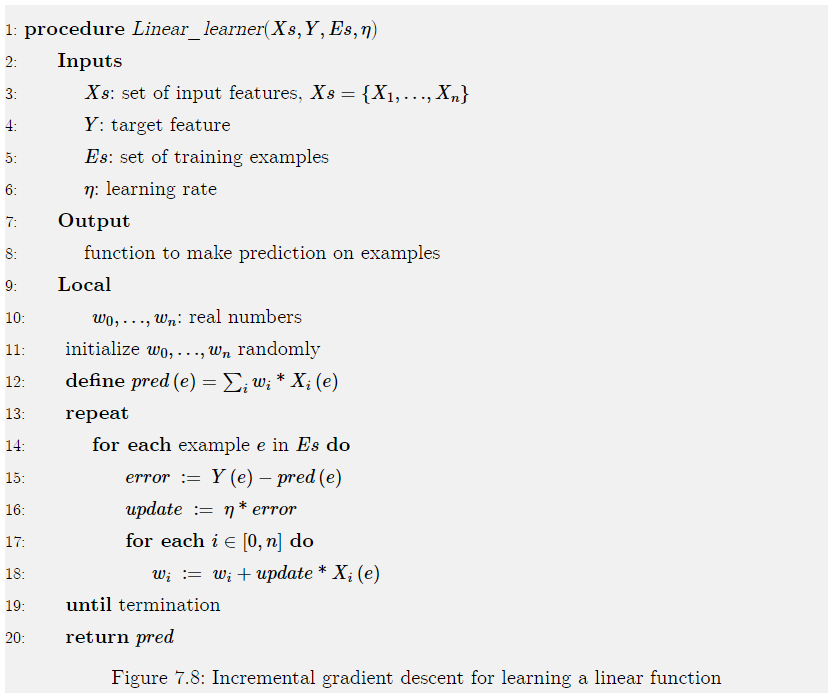
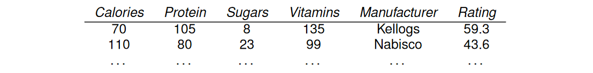
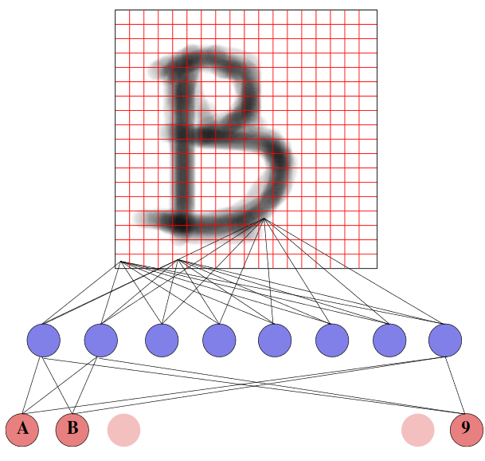
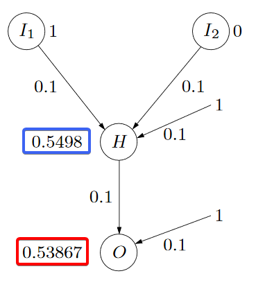
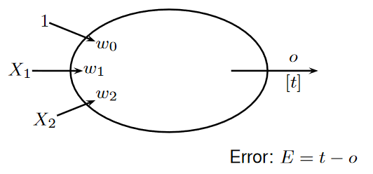
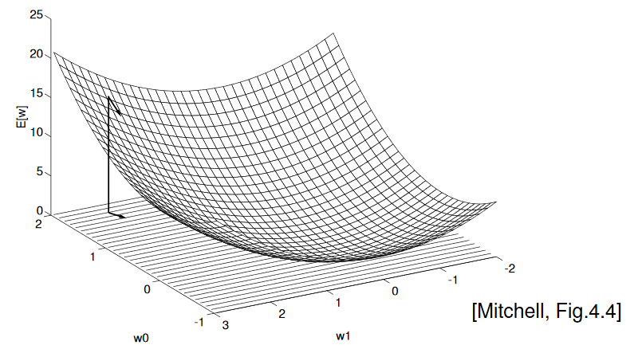

# Learning: Neural Networks

[Tensorflow Playground]([https://playground.tensorflow.org](https://playground.tensorflow.org/))

$$
\newcommand{\derr}[1]{\frac{\part}{\part {#1}}}
$$

## Linear Regression and Classification

**Linear Regression:** The problem of fitting a linear function to a set of training examples, in which the input and target features are numeric.

$$
\begin{align*}
\hat Y^{\overline w}(e) &= w_0+w_1 * X_1(e)+\dots +w_n * X_n(e)\\
&= \sum^n_{i=0}w_i*X_i(e)
\end{align*}
$$

where $\overline w=\langle w_0,w_1,\dots,w_n\rangle$ is a tuple of weights.

To make $w_0$ not be a special case, new feature $X_0$ is always 1.

Suppose $E$ is a set of examples. The sum-of-squares error on $E$ for $Y$ is:

$$
\begin{align*}
error(E,\overline w) &= \sum_{e\in E}\left( Y(e)-\hat Y^{\overline w}(e) \right)^2 \\
&= \sum_{e\in E}\left( Y(e)- \sum^n_{i=0}w_i*X_i(e) \right)^2
\end{align*}
$$

The weights that minimize the error can be computed analytically. A more general approach, is to compute the weights iteratively.

### Gradient Descent

An iterative method for finding the minimum of a function.

* Starts with an initial set of weights
* In each step, it decreases each weight in proportion to its partial derivative.

$$
w_i:=w_i-\eta *\frac{\partial}{\partial w_i}error(E, \overline w)
$$

where $\eta$, the gradient descent step size, is called the **learning rate**.

* Given as the input to the learning algorithm

#### Linear Learner

* Termination is usually after some number of steps, when the error is small or when the changes get small. 

Not strictly implementing gradient descent.

Weights change while it iterates through the examples (**Incremental gradient descent**)

If examples are selected at random, its called **stochastic gradient descent**

**Batched gradient descent** updates the weights after a batch of examples.

* If batch is equal to all examples, its equivalent to gradient descent.

### Squashed Linear Functions

Consider binary classification. (domain of target is $\{0,1\}$)

The use of a linear function does not work well for such classification tasks; a learner should never make a prediction of greater than 1 or less than 0. 

A **squashed linear function** is of the form:

where $f$, an **activation function**, is a function from the real line $[-\infty,\infty]$ into some subset of the real line, such as $[0,1]$

* A prediction based on a squashed linear function is a **linear classifier**.
* A simple activation function is the **step function, ** $step_0(x)$, defined by:

$$
step_0(x)= 
\left \{ \begin{array}\
	1 & \text{if } x \geq0 \\
	0 & \text{if } x < 0
\end{array} \right .
$$

One differentiable activation function is the **sigmoid** or **logistic function**:

  

$$
sigmoid(x)=\frac{1}{1+e^{-x}}
$$
This function squashes the real line into the interval $(0,1)$

* Appropriate for classification
* Differentiable
    * $\frac{d}{dx}sigmoid(x)=sigmoid(x)*(1-sigmoid(x))$

The problem of determining weights for the sigmoid of a linear function that minimize an error on a set of examples is called **logistic regression**

To optimize the **log loss** error for logistic regression, minimize the negative log-likelihood:

where $\delta(e)=Y(e)-\hat Y^{\overline w}(e)$

The $Linear\_learner$ algorithm can be modified to carry out logistic regression to minimize log loss.

[Example 7.11](https://artint.info/2e/html/ArtInt2e.Ch7.S3.SS2.html#Ch7.Thmciexamplered11 )

### Linearly Separable

Consider each input feature as a dimension.

If there are $n$ features, there will be $n$ dimensions.

A **hyperplane** in an $n$-dimensional space is a set of points that all satisfies a constraint that some linear function of the variable is zero.

The hyperplane forms a $(n-1)$-dimensional space.

* In 2D that's a line
* In 3D that's a plane

A classification is **linearly separable** if there exists a hyperplane where the classification is true on one side of the hyperplane and false on the other side.

Figure 7.11: Linear separators for Boolean functions:

  

[Example 7.12 + 7.13](https://artint.info/2e/html/ArtInt2e.Ch7.S3.SS2.html#Ch7.Thmciexamplered12)

## Neural Networks

There are many different types of neural networks. The book considers **feed-forward neural networks**.

* Hierarchy consisting of linear functions interleaved with **activation functions**

Neural network can have multiple input and target features (real-valued)

* Discrete features can be transformed into [indicator variables](https://artint.info/2e/html/ArtInt2e.Ch7.S2.SS1.html#Ch7.S2.I2.i4) or [ordinal features](https://artint.info/2e/html/ArtInt2e.Ch7.S2.SS1.html#Ch7.S2.I2.i2).

* Inputs feed into layers of **hidden units**

    * Features never directly observed
    * A simple function of the units in a lower layer.

    

  

Figure 7.16: A deep neural network.

### Single Neuron

Two step computation

* Combine inputs as *weighted sum*
* Compute output by **activation function** of combined inputs

#### Activation Functions

The most common activation functions are:

If activation function is sigmoid, i.e. $out=\sigma(\sum_j i_j\cdot w_j)$ we also talk of *squashed linear function*

For the output neuron also the **identity function** is used: $af(x)=id(x)=x$

### Layers

Each layer of units is a function of the previous layer. Each example has a value for each unit. We consider 3 kinds of layers:

* An **input layer** consists of a unit for each input feature.

    * Gets its value for an example from the value for the corresponding input feature for that example.

* A **complete linear layer**, where each output $o_j$ is a linear function of the input values $v_i$ to the layer (and, as in [linear regression](https://artint.info/2e/html/ArtInt2e.Ch7.S3.SS2.html), an extra constant input that has value “1” is added) defined by:

    ​	$o_j=\sum_i w_{ji}v_i$

    for weights $w_{ji}$ that are learned. There is a weight for every input-output pair of the layer. in the diagram of Figure 7.16 there is a weight for every arc for the linear functions.

* An **activation layer**, where each output $o_i$ is a function of the corresponding input value;

    * thus $o_i=f(v_i)$ for activation function $f$.

    Typical activation functions are the 

    * $sigmoid: \quad f(x)=1/(1+e^{-x})$,  and the 
    * **rectified linear unit**       $ReLU:\quad f(x)=\max(0,x)$

For regression, where the prediction can be any real number, its typical for the last layer to be complete linear layer.

For binary classification, where the output values can be mapped to $\{0,1\}$ it is typical for the output to be a sigmoid function of its input

* We never want to predict a value greater or less than zero.

### Discrete Inputs

If the regression should also use discrete predictor attributes, e.g.:

replace discrete attributes with 0-1-valued **indicator variables** for their possible values:

#### Indicator Variables

* For each value $x_i$ of $X$ with domain $\{x_1,\dots,x_k\}$ introduce a binary feature $X\_is\_x_i$ with values $0,1$
* Encode input $X=x_i$ by inputs
    * $X\_is\_x_0=0,\dots,X\_is\_x_{i-1}=0,X\_is\_x_i=1,X\_is\_x_{i+1},\dots,X\_is\_x_k=0$ 

#### Numerical Encoding

Translate values into numbers:

* $true, false \mapsto 0,1$
* $low,medium,high\mapsto 0,1,2$

Probably <u>not</u> sensible:

* $red,green,blue \mapsto 0,1,2$
    * $blue$ is not "two times $green$"

### Neural Networks for Classification

Use one output node for each class label.

Classify instance by class label associated with output node with highest output value.

### Propagation in Neural Networks

The output of neuron $H$ is:

$$
o_H=\sigma(1\cdot0.1+0\cdot0.1+1\cdot0.1)=\color{blue} 0.5498
$$
The output of neuron $O$ is:

$$
o_O=\sigma(\color{blue}{0.5498} \color{black} \cdot 0.1+1\cdot0.1)=\color{red}{0.53867}
$$

### The Perceptron

* No hidden layer
* One output neuron $o$
* $sign$ activation function

Computed:

$$
O(x_1,\dots,x_n)= \left\{\begin{array}{}\begin{align*}
	1	\quad &\text{if } w_0x_0+w_1x_1+\dots w_n x_n\\
	-1	\quad &\text{otherwise}
\end{align*}\end{array}\right.
$$

<u>Convention</u> from now on assume that $x_0$ is an input neuron with constant input value 1.
Then write $\bold w \cdot \bold x$ for $w_0 x_0+w_1x_1+\dots w_n x_n$

#### Expressive Power

The decision surface of a two-input perceptron is given by a straight line, separating positive and negative examples

Can represent $x_1 \and x_2$

Can represent $x_1 \or x_2$

<u>Cannot!</u> represent $x_1 \text{ xor } x_2$

* The examples are not **linear separable**

#### Multiple Neurons

## Learning

**We have**

* $\mathcal{D}=(x_1,x_2,x_3,x_4)$ input vectors (cases)
* $\bold t=(-1,1,-1,-1)$ vector of target outputs
* $\bold w=(w_0,w_1,w_2)$ vector of current parameters
* $\bold o=(o_1,o_2,o_3,o_4)$ vector of current outputs

**We request**

* $\bold w^*$ parameters yielding $\bold o = \bold t$

**Weight Updating Procedure**

* $E>0 \Rightarrow o$ shall be increased  $\Rightarrow \bold x \cdot \bold w$ up $\Rightarrow \bold w:= \bold w+ \alpha E x$
* $E<0 \Rightarrow o$ shall be decreased $\Rightarrow \bold x \cdot \bold w$ down $\Rightarrow \bold w:= \bold w+ \alpha E x$

$\alpha$ is called the **learning rate**

With $\mathcal D$ linearly separable and $\alpha$ not too large, this procedure will converge to a correct set of parameters

See example in the [appendix](./10-28appendix.md#learning-weights-and-threshold-example) of this page

### Sum of Squared Errors

Given

* data (training examples): $(x_i,y_i)\quad (i=1,\dots,N)$ with
    * $x_i$: value of input features $\bold X$
    * $y_i$: value of output feature $Y$
* a neural network that computes outputs $o_i=out(x_i)$

define **sum of squared error**

$$
SSE=\sum^N_{i=1}(y_i-o_i)^2
$$

For a given dataset the SSE is a smooth, convex function of the weights

Example for $n=2$ and a linear activation function:

Weights $\bold w$ that minimize $E(\bold w)$ can be found by **gradient descent**

### Gradient Descent Learning

The gradient is the vector of partial derivatives:

$$
\nabla E[\bold w]=\left(\frac{\partial E}{\partial w_o},\frac{\partial E}{\partial w_1},\dots,\frac{\partial E}{\partial w_n}  \right)
$$

The partial derivatives are (with linear activation function):

$$
\frac{\partial E}{\partial w_k}=\sum_{i=1}^N(t_i-\bold w\cdot x_i)(-x_{i,k})\label{gradiant_descent}
$$
Gradient descent rule:

1. Initialize $\bold w$ with random values
2. **repeat**
    1. $\bold w := \bold w - \eta \nabla E(\bold w)$
3. **until** $\nabla E(\bold w) \approx 0$

$\eta$ is a small constant, the **learning rate**

**Properties**

* The procedure converges to the weights $\bold w$ that minimize the SSE (if $\eta$ is small enough)

#### Stochastic Gradient Descent

Variation of gradient descent: Instead of following the gradient computed from the whole dataset ($\ref{gradiant_descent}$)

iterate through the data instances one by one, and in one iteration follow the gradient defined by a single data instance $(x_k,t_k)$

$$
\frac{\partial E}{\partial w_i}=(t_k-\bold w\cdot x_k)(-x_k,i)
$$

### The Task of Learning

**Given**: structure and activation functions. To be learned: weights.

**Goal:** given the training examples

Find the weights that minimize the *sum of squared errors (SSE)*

$$
\sum_{i=1}^N\sum_{j=1}^m(t_{j,i}-o_{j,i})^2,
$$
where $o_{j,i}$ is the value of the $j$th output neuron for the $i$th data instance.

### Back-Propagation

**Back-propagation** implements stochastic gradient descent for all weights.

There are two properties of differentiation used in back-propagation:

* **Linear rule:** the derivative of a linear function is given by;

$$
\derr{w}(aw+b)=a
$$

* **Chain rule:** if $g$ is a function  of $w$ and function $f$, which does not depend on $w$, is applied to $g(w)$, then

$$
\derr w f(g(w))=f'(g(w))*\derr w g(w)
$$

Learning consists of two passes through the network for each example:

* Prediction: given the values on the inputs for each layer, compute a value for the outputs of the layer
* Back-propagation: go backwards through the layers to update all of the weights of the network.

Calculate an error term $\delta_h$ for a hidden unit by taking the weighted sum of the error terms, $\delta_k$ for each output units it influences.

#### Updating Rules

When using a sigmoid activation function we can derive the following update rule:

where
$$
\delta_j=\begin{array}{}\left\{ \begin{align*}
	&o_j(1-o_j)(t-o_j) &&\quad \text{for output nodes}\\
	&o_j(1-o_j) \sum_{k=1}^m w_{jk}\delta_k &&\quad \text{for hidden nodes}
\end{align*}\right. \end{array}
$$

See example in the [appendix](./10-28appendix.md#back-propagation-example) of this page 