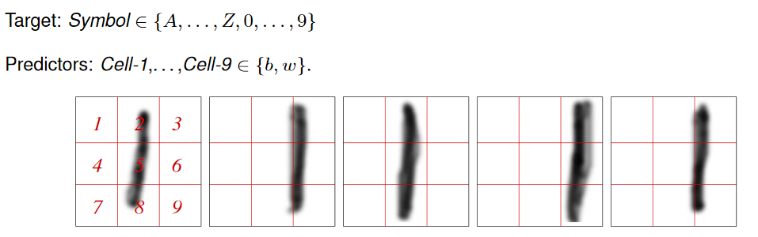
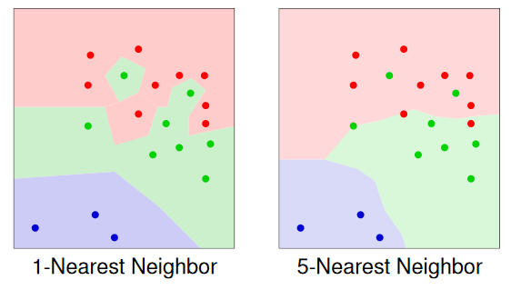
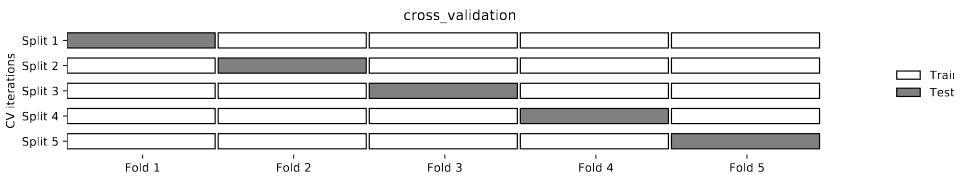

# Learning: Methods and Issues

## Probabilistic Models

Word occurrence in emails (thousands of input features!):

### Naive Bayes Classifier

**Assumption**

* The input features are conditionally independent of each other given the classification

Classify email as *spam* if 

$$
P(Spam=yes \mid \bold X = \bold x) > threshold
$$
where $\bold X=(abacus, \dots ,zytogenic)$ and $\bold x$ is a corresponding set of y/n values

**Structural Assumption**

**Learning**

* Need to learn entries in conditional probability tables
* Simplest approach: use **empirical frequencies**, e.g.:

Given an example with inputs $X_1=x_1,\dots, X_k=x_k$, Bayes Rule is used to compute the posterior probability distribution of the example's classification, $Y$
$$
P(Y \mid X_1=x_1,\dots, X_k=x_k)= {P(Y)\cdot P(x_1 \mid Y)\cdots P(x_k \mid Y) \over \sum_Y P(Y)\cdot P(x_1 \mid Y)\cdots P(x_k \mid Y)}
$$

#### Example

#### Pseudo Counts

When leaning the naive Bayes model, we estimated $P(long \mid reads)$ as
$$
P(long \mid reads) = {0\over 9}
$$
based on 9 cases only, $\leadsto$ unreliable parameter estimates and risk of zero probabilities.

The solution is **pseudo counts**

where

* $p_{ac}$ is our prior estimate of the probability (often chosen as a uniform distribution), and
* $m$ is a virtual sample size (determining the weight of $p_ac$ relative to the observed data)

##### Example

$$
P(known \mid reads) = {2+0.5\cdot m \over 3+m}
$$

#### Assumptions

Attributes not independent given Symbol=1!

Attributes not independent given Spam=yes!

$\leadsto$ Naive Bayes assumption often not realistic. Nevertheless, Naive Bayes often successful.

#### When Naive Bayes Must Fail

No Naive Bayes Classifier can produce the following classification

because assume it did, then:

Multiplying the four left sides and the four right sides of these inequalities:

$$
\prod^4_{i=1}(left\ side\ of\ i) > \prod^4_{i=1}(right\ side\ of\ i)
$$

But this is false, because both products are actually equal.

## Case-based Reasoning

**Idea:**

To predict the output feature of a new example $e$

* find among the training examples the one (several) most similar to $e$
* predict the output for $e$ from the known output values of the similar cases

Several names for this approach

* Instance Based Learning
* Lazy Learning
* Case-based Reasoning

Required:

* **Distance measure** on values of input features

### Distance Measures for Numeric Features

If all features $\bold X$ are numeric:

* **Euclidian distance**

$$
d(x,x')=\sqrt{\Sigma_i(x_i-x'_i)^2}
$$

* **Manhattan distance**

$$
d(x,x')=\Sigma_i|x_i-x_i'|
$$

### Distance Measure for Discrete Features

For a single feature $X$ with domain $\{x_i,\dots x_k\}:$

* **Zero-One distance**

$$
d(x_i,x_j) = \begin{array}{}\left\{\begin{align*} 
    &0 &&\quad\text{if } j=i\\
    &1 &&\quad\text{if } j\neq i
\end{align*}\right.\end{array}
$$

* **Distance Matrix**
    * For each pair $x_i,x_j$ specify the distance $d(x_i,x_j)$ in a $k\times k$-matrix. Example

For a set of discrete features $\bold X$:

* Define distance $d_i$ and weight $w_i$ for each $X_i\in \bold X$
* Define $d(x,x')=\Sigma_i w_i d_i (x_i,x_i')$

### K-Nearest-Neighbor Classifier

Given

* training examples $(x_i,y_i)\quad(i=1,\dots N)$,
* a new case $\bold x$ to be classified, and
* a distance measure $d(x,x')$

classify $\bold x$ as follows:

* Find the $K$ training examples $x_{i_1},\dots x_{i_K}$ with minimal distance to $\bold x$
* Predict for $\bold x$ the most frequent value in $y_{i_1},\dots y_{i_K}$

#### Example 

* Output feature: $red, blue, green$
* Two numeric input features
* Euclidian distance
* Colored dots: training examples
* Colored regions: regions of input values that will be classified as that color

## Overfitting

Occurs when the learner makes predictions based on regularities that appears in the training examples, but not in the test examples or the real world.

[Example 7.14](https://artint.info/2e/html/ArtInt2e.Ch7.S4.html#Ch7.Thmciexamplered14)

[Example 7.15 Overfitting caused by model complexity](https://artint.info/2e/html/ArtInt2e.Ch7.S4.html#Ch7.Thmciexamplered15)

A model **overfits** the training data if a smaller error on future data would be obtained by a less complex model.

### Avoid Overfitting

Do not allow overly complex models:

* Naive Bayes model
* K-NN for "large" K

Do not allow to learn models that are too complex (relative to the available data):

* Decision Trees: use an early stopping criterion, e.g. stop construction when (sub-)set of trainnig examples contains fewer than $k$ elements (for not too small $k$)
* Add to evaluation: measure a **penalty term** for complexity. This penalty term can have an interpretation as a **prior model probability**, or **model description length**

These techniques will usually lead to more complex models only when the data strongly supports it (especially: large number of examples)

### Validation Data

**Idea**

Reserve part of the training examples as a **validation set**

* Not used during model search
* Used as proxy for future data in model evaluation

**Train/Validation Split**

Simplest approach: split the available data randomly into a **training** and a **validation** set.

Typically:

* 50/50, or
* 66/33

 

#### Example: Decision Trees

**Post Pruning**

Use of validation set in decision tree learning:

* Build decision tree using *training set*
* For each internal node:
    * Test whether accuracy on *validation* set is improved by replacing sub-tree rooted at this node by single leaf (labeled with most frequent target feature value of *training* examples in this sub-tree)
    * If yes: replace sub-tree with leaf (*prune* sub-tree)

####  Example K-NN and Neural Networks 

**Selection of ** $K$

For $K=1,2,3,\dots$

* Measure accuracy of $K$-NN based on training examples for validation examples
* Use $K$ with best performance on validation examples
* Validation examples can now be merged with training examples for prediction future cases

**Selection of Neural Network Structure**

For $\#hl=1,2,\dots ,max$ and $\#nd=1,2,\dots,max$:

* Learn neural network with #hl hidden layers and #nd nodes per hidden layer using training examples
* Evaluate SSE of learned network on validation examples
* Select a network structure with minimal SSE
* Re-learn weights using merged training and validation examples

### Cross Validation

The idea of using part of the training data as a surrogate for test data.

Simplest:

* We split the data into two:
    * A set of examples
    * A **validation set**

The idea is to choose a parameter setting or a representation in which the error of the validation set is a minimum (see figure 7.14)

The method of **k-fold cross validation** allows us to reuse examples for both training and validation. It has the following steps:

* Partition training set into $k$ sets, of approximately equal size called **folds**

* To evaluate a parameter setting, train $k$ times for that parameter setting, each time using one of the folds as the validation set, and the remaining for training.

    The accuracy is evaluated using the validation set. For example, if $k=10$ then $90\%$ of the training examples are used for training and $10\%$ for validation.

    It does this 10 times, so each example is used once in a validation set.

* Optimize parameter settings based on the error on each example when it is used in the validation set.

* Return the model with the selected parameter settings, trained on all of the data.

[Example 7.19](https://artint.info/2e/html/ArtInt2e.Ch7.S4.SS3.html#Ch7.Thmciexamplered19)

At one extreme when **k** is the number of training examples, it becomes **leave-one-out cross validation**.

