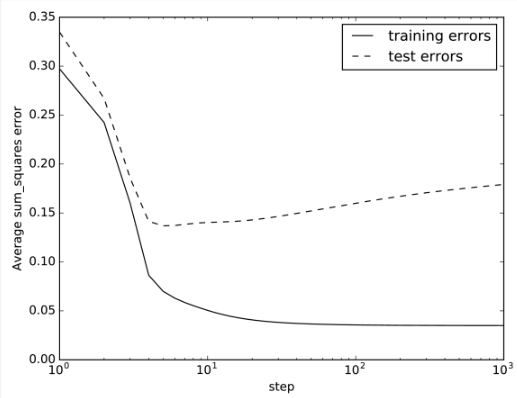

# Learning: Methods and Issues

## Overfitting

Occurs when the learner makes predictions based on regularities that appears in the training examples, but not in the test examples or the real world.

[Example 7.14](https://artint.info/2e/html/ArtInt2e.Ch7.S4.html#Ch7.Thmciexamplered14)

[Example 7.15 Overfitting caused by model complexity](https://artint.info/2e/html/ArtInt2e.Ch7.S4.html#Ch7.Thmciexamplered15)

Figure 7.14

### Cross Validation

The idea of using part of the training data as a surrogate for test data.

Simplest:

* We split the data into two:
    * A set of examples
    * A **validation set**

The idea is to choose a parameter setting or a representation in which the error of the validation set is a minimum (see figure 7.14)

The method of **k-fold cross validation** allows us to reuse examples for both training and validation. It has the following steps:

* Partition training set into $k$ sets, of approximately equal size called **folds**

* To evaluate a parameter setting, train $k$ times for that parameter setting, each time using one of the folds as the validation set, and the remaining for training.

    The accuracy is evaluated using the validation set. For example, if $k=10$ then $90\%$ of the training examples are used for training and $10\%$ for validation.

    It does this 10 times, so each example is used once in a validation set.

* Optimize parameter settings based on the error on each example when it is used in the validation set.

* Return the model with the selected parameter settings, trained on all of the data.

[Example 7.19](https://artint.info/2e/html/ArtInt2e.Ch7.S4.SS3.html#Ch7.Thmciexamplered19)

At one extreme when **k** is the number of training examples, it becomes **leave-one-out cross validation**.

