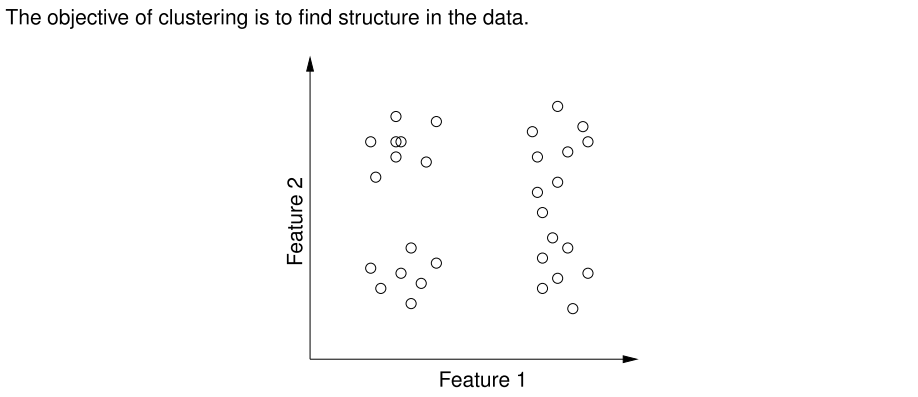
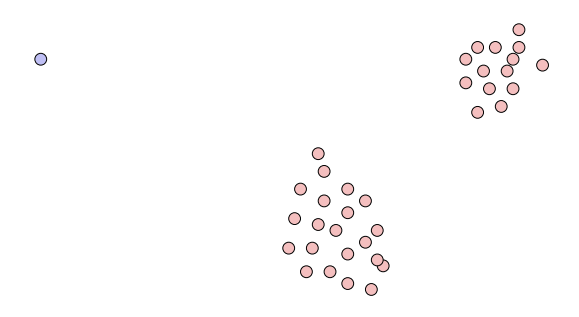
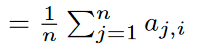
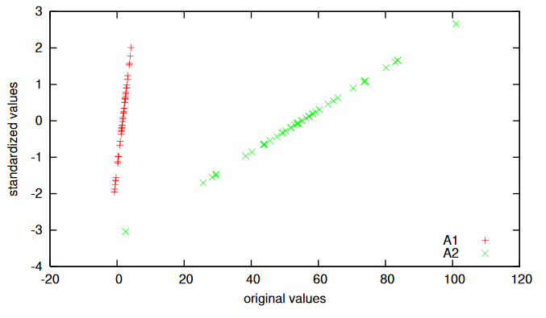
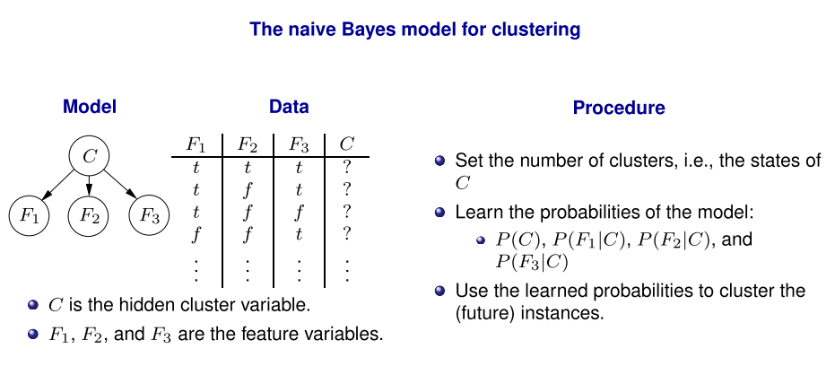
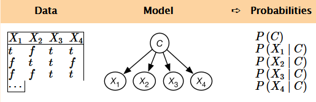

# Learning: Clustering

**Examples:**

* Based on customer data, find group of customers with similar profiles
* Based on image data, find groups of images with similar motif.
* Based on article data, find groups of articles with the same topics
* ...

## K-Means Algorithm

General goal: find clustering with:

* Large between-cluster variation
* small within-cluster variation 

We consider the scenario, where

* the number $k$ of clusters is known
* we have a distance measure $d(x_i,x_j)$ between pairs of data points (feature vectors)
* we can calculate a centroid for a collection of data points $S=\{x_1,\dots,x_n\}$

[Example: Session 11.11 Slide 9](./extra/mi-11-11.pdf)

Result can depend on choice of initial cluster centers!

### K-means as an Optimization Problem

Assume we use Euclidian distance *d* as proximity measure and that the quality of the clustering is measured by the sum of squared errors:

where 

* $c_i$ is the i'th centroid
* $C_i\in S$ is the points closets to $c_i$ according to $d$

**In principle**

We can minimize the SSE by looking at all possible partitionings $\leadsto$ <u>not feasible though!</u> 

**Instead, k-means**:

The centroid that minimizes the SSE is the mean of the data-points in that cluster:

$$
c_i = \frac{1}{|C_i|}*\sum_{x\in C_i}{x}
$$

Local optimum found by alternating between cluster assignments and centroid estimation.

#### Convergence

The *k*-means algorithm is guaranteed to converge

* Each step reduces the sum of squared errors
* There is only a finite number of cluster assignments

There is no guarantee of reaching the global optimum:

* Improve by running with multiple random restarts

#### Outliers

The result of partitional clustering can be skewed by outliers

### Different Measuring Scales

Instances defined by attributes

* All distance functions for continuous attributes dominated by *income* values
    * $\leadsto$ may need to *rescale* or *normalize* continuous attributes

#### Min-Max Normalization

Replace $A_i$ with

$$
A_i-\min(A_i)\over \max(A_i)-\min(A_i)
$$
where $\min(A_i),\max(A_i)$ are min/max values of $A_i$ appearing in the data

* Will always be between 0 and 1
* Be careful for extreme values (See the lowest green value)

#### Z-Score Standardization

Replace $A_i$ with

$$
A_i-mean(A_i) \over standard\ deviation(A_i)
$$

where

* $mean(A_i)$ 
* $standard\ deviation$ 

* Is not between 0 and 1, we have no min and max value
* Slightly less sensitive to outliers

## Soft Clustering

The k-means algorithm generates a *hard* clustering: each example is assigned to a single cluster.

**Alternatively:**

In *soft* clustering, each example is assigned to a cluster with a certain probability.

### EM-Algorithm

When learning the probability distributions of the model, the variable $C$ is hidden

* $\leadsto$ we *cannot* directly estimate the probabilities using frequency counts

Instead we employ the **EM Algorithm**

The *Expectation-maximization algorithm*

* Combined with a naive Bayes classifier, it does soft clustering.

The main idea:

* Use hypothetical completions of the data using the current probability estimates

* Infer the maximum likelihood probabilities for the model based on completed data set.

  

Each original example gets mapped into $k$ augmented examples, one for each class. 
The count for these are aassigned to sum to 1.

Example for 4 features and 3 classes:

The EM algorithm repeats the two steps:

* **E step**: Update the augmented counts based on the probability distribution.
    For each example $\langle X_1 = x_1, \dots,X_n=x_n \rangle$ in the original data, the count associated with
    $\langle X_1 = x_1, \dots,X_n=x_n, C=c \rangle$ in the augmented data is updated to

    * $P(C=c\mid X_1=x_1,\dots,X_n=x_n)$

    Note that this step involves probabilistic inference. This is an **expectation** step because it computes the expected values.

* **M step:** Infer the probabilities for the model from the augmented data. Because the augmented data has values associated with all the variables, this is the same problem as learning probabilities from data in a naive Bayes classifier.

    This is a **maximization** step because it computes the maximum likelihood estimate or the [maximum a posteriori probability (MAP)](https://artint.info/2e/html/ArtInt2e.Ch10.S1.html) estimate of the probability.

[Example: Session 11.11 Slide 20](./extra/mi-11-11.pdf)