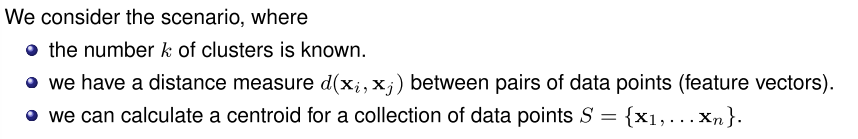
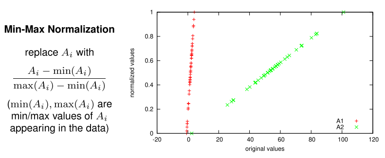
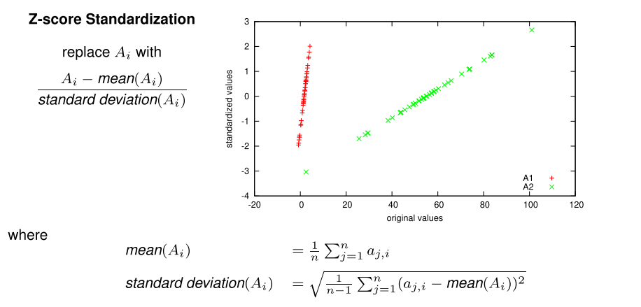

# Learning: Clustering

**Examples:**

* Based on customer data, find group of customers with similar profiles
* Based on image data, find groups of images with similar motif.
* Based on article data, find groups of articles with the same topics
* ...

## K-Means Algorithm

General goal: find clustering with:

* Large between-cluster variation
* small within-cluster variation 

[Example: Session 11.11 Slide 9](https://www.moodle.aau.dk/mod/resource/view.php?id=983171)

Result can depend on choice of initial cluster centers!

### K-means as an Optimization Problem

Assume we use Euclidian distance *d* as proximity measure and that the quality of the clustering is measured by the sum of squared errors:

where 

* $c_i$ is the i'th centroid
* $C_i\in S$ is the points closets to $c_i$ according to $d$

**In principle**

We can minimize the SSE by looking at all possible partitionings, <u>not feasible though!</u> 

**Instead, k-means**:

The centroid that minimizes the SSE is the mean of the data-points in that cluster:

$$
c_i = \frac{1}{|C_i|}*\sum_{x\in C_i}{x}
$$

Local optimum found by alternating between cluster assignments and centroid estimation.

#### Convergence

The *k*-means algorithm is guaranteed to converge

* Each step reduces the sum of squared erros
* There is only a finite number of cluster assignments

There is no guarantee of reaching the global optimum:

* Improve by running with multiple random restarts

#### Outliers

The result of partitional clustering can be skewed by outliers

### Different Measuring Scales

Instances defined by attributes

* All distance functions for continuous attributes dominated by *income* values
    * may need to *rescale* or *normalize* continuous attributes

#### Min-Max Normalization

* Will always be between 0 and 1
* Be careful for extreme values (See the lowest green value)

#### Z-Score Standardization

* Is not between 0 and 1, we have no min and max value
* Slightly less sensitive to outliers

## Soft Clustering

The k-means algorithm generates a *hard* clustering: each example is assigned to a single cluster.

**Alternatively:**

In *soft* clustering, each example is assigned to a cluster with a certain probability.

### EM-Algorithm

When learning the probability distributions of the model, the variable $C$ is hidden

* We cannot directly estimate the probabilites using frequency counts
* Instead we employ the EM Algorithm

The *Expectation-maximization algorithm*

The main idea:

* Use hypothetical completions of the data using the current probability estimates

* Infer the maximum likelihood probabilities for the model based on completed data set.

    

[Example: Session 11.11 Slide 20](https://www.moodle.aau.dk/mod/resource/view.php?id=983171)

