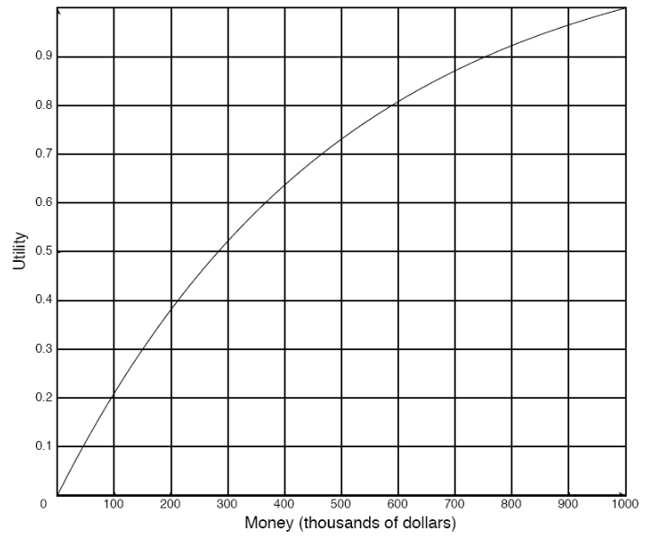
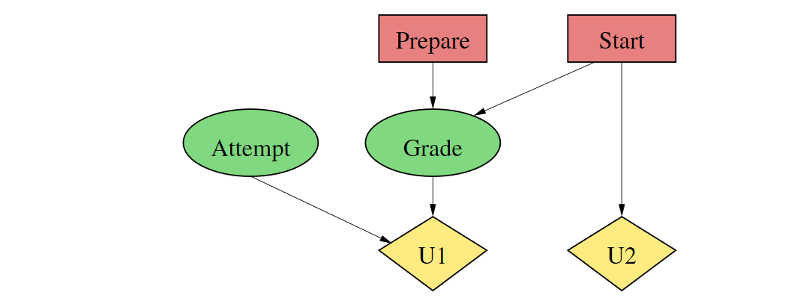

# Planning Under Uncertainty

## Preferences and Utility

Agent chooses actions based on **outcome**.

* Whatever the agent has preferences over.
* If it does not prefer any outcome, it doesn't matter what it does.

Assume finite number of outcomes.

**Weakly Preferred**

Suppose $o_1$ and $o_2$ are outcomes. We say that $o_1$ is **weakly preferred** to $o_2$, written $o_1 \succeq o_2 $, if $o_1$ is at least as desirable as $o_2$

**Equally Preferred**

Define $o_1 \sim o_2$ if $o_1 \succeq o_2$ and $o_2 \succeq o_1$.

* They are equally preferred
* The agent is **indifferent** between $o_1$ and $o_2$

**Strictly Preferred**

Define $o_1 \succ o_2$ to mean $o_1 \succeq o_2$ and $o_2 \nsucceq o_1$ 

* We say $o_1$ is **strictly preferred** to outcome $o_2$

A **lottery** is defined to be a finite distribution over outcomes, written:

$$
[p_1:o_1,p_2:o_2,\dots , p_k:o_k]
$$

where each $o_i$ is an outcome and $p_i$ is a non-negative real number such that $\sum_ip_i=1$

The lottery specifies that outcome $o_i$ occurs with probability $p_i$.

**Axiom 9.1 - Completeness**

*An agent has preference between all pairs of outcomes:*

$$
o_1 \succeq o_2\ or\ o_2 \succeq o_1
$$

**Axiom 9.2 - Transitivity**

*Preferences must be transitive:*

$$
if\ o_1 \succeq o_2\ and\ o_2 \succeq o_3\ then\ o_1 \succeq o_3
$$

**Axiom 9.3 - Monotonicity**

*An agent prefers a larger chance of getting a better outcome than a smaller chance of getting the better outcome. That is, if* $o_1\succ o_2$ *and* $p>q$ *then*

$$
[p:o_1, (1-p): o_2] \succ [q:o_1, (1-q):o_2]
$$

### Lotteries

A **lottery** is a probability distribution over **outcomes**, e.g.:

* $[0.4:\$100,0.6:-\$20]$ means you win \$100 with probability 0.4, and loose \$20 with probability 0.6
* $[0.3:00,0.5:7,0.2:10]$

Preference between lotteries with "money outcomes" are not always determined by **expected monetary value**.

### Preference from Utilities

A classical result:

*If preferences between lotteries obey a certain set of plausible rules, then there exists an assignment of real numbers (**utilities**) to all outcomes, such that one lottery is preferredover another if and only if it has a higher **expected utility***

**Example**

Utility function of a **risk-averse** agent:

#### Ensurance Example

Assume $Utility(\$999k)=0.9997$ 

Then agent is indifferent between lotteries

and prefers

Interpretation

* right lottery: 0.03 risk of loosing a \$ 1000k property
* left lottery: buying insurance against that risk for \$ 600

The insurance company prefers

$\leadsto$ the insurance company has a different utility function (near linear).

### Factored Utility

Two compont utility function:

Utility of full outcome (state) is sum of utility factors:

Assumption: The utility contribution from one factor is independent of the values of other factors.
E.g.: (rhc,swc) should perhaps be worth less than 5 when at the same time (mr, mw), because mail needs to be delivered first (the two utility factors are **substitutes**)

## Single Stage Decision Networks

Simple decisions can be seen as choices over lotteries.

Decisions, outcomes, and utilities can all be composed of features or factors:

Two components of decision: prepare *some / all*, start preparations *sooner / later*

Two utility factors: utility of grade, and utility (cost) of preparation time

Outcome composed of *Grade, Attempt*

Graph represents:

* One utility factor depends on *Attempt* and *Grade*, another only on *Start*
* Both the *Prepare* and *Start* decision influence the probabilities for *Grade*

### In General

A **Single-Stage Decision Network (SSDN)** is a directed acyclic graph with three types of nodes:

* Decision nodes $\bold D$
* Chance Nodes $\bold C$
* Utility Nodes $\bold U$

The graph must have the following structure:

* All decision nodes are connected in one linear sequence (representing the order in which the different sub-decisions are taken)
* The only parent of a decision node is its predecessor in the order
* Chance Nodes can have Decision Node and Chance Node parent
* Utility nodes can have decision node and chance node parents

**Tables**

* No table is associated with decision nodes (only the  list of available decisions)
* A chance node is labeled with a conditional probability table that specifies for each value assignment to its parents (decision and chance nodes) a probability distribution over thedomain of the chance node.
* A utility node is labeled with a utility table that specifies for each value assignment to its parents (decision and chance nodes) a utility value

#### Semantics

A **possible world** $\omega$ is an assignment of values to all decision and chance variables.

An SSDN defines:

* For each assignment $\bold D = \bold d$ of values to the decision nodes a probability distribution

    * $P(\omega \mid \bold D = \bold d)$

    over possible worlds

* For each possible world $\omega$ a utility value

    * $U(\omega)$

#### Solving an SSDN

To **solve** an SSDN means to find the decisions $\bold d$ that maximize the expected utility
$$
\varepsilon(U\mid \bold D = \bold d)=\sum_\omega U(\omega)P(\omega \mid \bold D = \bold d)
$$

##### Robot Example

#### Solving By (Chance) Variable Elimination

## Sequential Decisions

SSDNs are generalized to sequential decision problems by.

* Several decisions are taken (in fixed order)
* Some chance variables may be *observed* before the next decision is taken 

**Examples**

* Doctor first decides which test to perform, then observes test outcome, then decides which treatment to prescribe
* Before we decide to take the umbrella with us, we observe the weather forecast
* A company first decides whether to develop a certain product, then observes the customer reaction in a test market, then decides whether to go into full production.

### Example: Fire Scenario

### Decision Function

A **Decision Function** for a decision node $D$ is an assignment of a decision $d$ to each possible configuration of $D's$ parents.

A **Policy** $\pi$ consists of one decision function for each decision node.

* General strategy for actions (decisions), taking into account the possible (uncertain) effects of previous actions

### Semantics

As before: possible worlds $\omega$ are assignments for all decision and chance variables.

* A policy $\pi$ defines a probability distribution

    $$
    P(\omega \mid \pi)
    $$
    over possible worlds:

    * If $\omega$ contains assignments to a decision node $D$ and its parents which is not consistent with the decision function for $D$
        * $\to$ $P(\omega \mid \pi) = 0$
    * otherwise $P(\omega\mid\pi)$ is the product of all conditional probability values for the assignments to chance nodes $C$, givenb the assignment to the parents of $C$
    
* Each possible world has a utility
  
    $$
    U(\omega)
    $$
    
* Obtain expected utility of a policy

$$
\varepsilon(U\mid \pi)=\sum_\omega U(\omega)P(\omega\mid\pi)
$$

An **optimal policy** is a policy with maximal expected utility (among all possible policies)

### Solving Sequential Decision Problems

We now have a new decision problem with one decision less. This decision problem can be solved using the same procedure until no decisions are left.

#### Intuition

* Given values assigned to its parents, the last decision node can be seen as a single-stage decision
* When all decisions following a given decision $D$ are taken according to fixed decision rules, then $D$ also behaves like a single-stage decision
* Backwards stragegy
    * find the decision rule for the last decision $D$ that is not yet eliminated
    * eliminate $D$ by replacing it with the resulting utlity factor
* Form way of "What would I do if ..." reasoning

### Variable Elimination

### Value of Information

Question: what is it worth to know the exact state of *Forecast F* when making decision *Umbrella*?

Answer: Compare maximal expected utilities of 

Question: what is it worth to know the exact state of a random variable $C$ when making decision $D$?

Answer: Compute

* the expected value $val_0$ of optimal policy in given decision network
* the expected value $val_1$ of optimal policy in midified decision network
    * add an edge from $C$ to $D$ and all subsequent decisions
* $val_1-val_0$ is the value of knowing $C$

**Properties**

* Value of information is always non-negative
* Value of knowing $C$ for decision $D$ is zero, if no observed value of $C$ can change the decision rule, 
    i.e. for all values $\bold p$ of existing parents of $D$, and all values $c$ of $C$, the optimal decision given $(\bold p,c)$ is the same as the optimal decision given $(\bold p)$ 