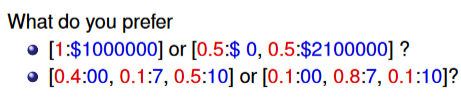
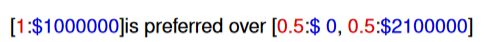
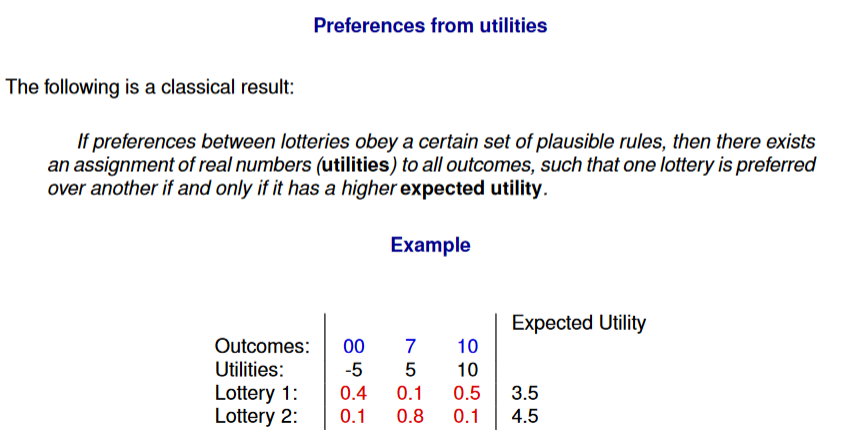
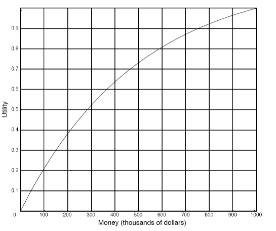
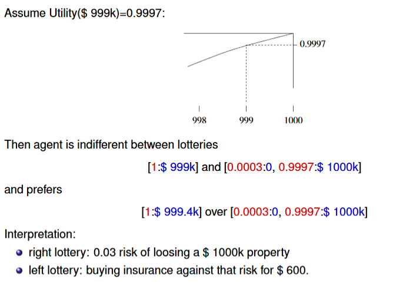

---

title: Planning Under Uncertainty
course: MI
session: 18.11
date: 18-11-2019
---

# Planning under Uncertainty

## Utility

**Expected monetary value**

Typically 

Thus, preferences between lotteries with "money outcomes" are not always determined by **expected monetary value**

Typical utility function of a **risk-averse** agent (concave):

