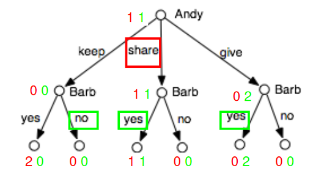

# Multi-Agent Systems

## Game Trees

Sharing game. Andy and Barb share two pieces of pie:

Representation by **game tree:**

* tree whose nodes are labeled with agents
* outgoing arcs labeled by actions of agent
* leaves labeled with one utility value for each agent
* (can also have *nature* nodes that represent uncertainty from random effects, e.g. dealing of cards, rolling of dice)

## Imperfect Information Games

Representation of game with simultaneous moves:

Collect in an **information set** the nodes that the agent (Bob) can not distinguish (at all nodes in an information set the same actions must be possible)

Other sources for imperfect information:

* Unobserved, random moves by nature (dealing of cards)
* Hidden moves by other agent

## Strategies

A **(pure) strategy** for one agent is a mapping from information sets to (possible) actions.

* (Essentially a policy)

A **strategy profile** consists of a strategy for each agent.

## Utility

Utility for each agent given a strategy profile:

* each node has the utilities that will be reached at a leaf by following the strategy profile
* the utilities at the node represent the outcome of the game (given the strategy profile)
* (utilities at a *nature* node are computed by taking the *expectation* over the utilities of its successors)

## Solving Perfect Information Gain

If 

* game is perfect information (no information sets with more than 1 node)
* both agents play rationally (optimize their own utility)

then the optimal strategies for both players are determined by

* bottom-up propagation of utilities under optimal strategies, where
* each player selects the action that leads to the child with the highest utility (for that player)

Often these game trees can be extremely large.

* Example: Chess

## Pruning

**Zero Sum Game**

For two players: $utility_1=-utility_2$

In this case:

* need only one utility value at leaves
* one player (Max) wants to reach leaf with max value, other (Min) wants to reach leaf with min value.

In bottom-up utility computation, some sub trees can be **pruned** 

($\alpha\text{-}\beta \text{ pruning}$)

## Imperfect Information

Game Trees can be represented as tables

**Share Game**

**Rock Paper Scissors**

Difference between perfect and imperfect information not directly visible in normal form representation.

### Nash Equilibrium

Consider optimal strategy profile for share game:

The two strategies are in **Nash equilibrium** 

* no agent can improve utility by switching strategy while other agent keeps its strategy 
* this also means: agent will stick to strategy when it knows the strategy of the other player 

#### Example Prisoner's Dilemma

Alice and Bob are arrested for burglary. They are separately questioned by police. Alice and Bob are both given the offer to testify, in which case:

* The only Nash Equilibrium is Alice: *testify*, Bob: *testify*
* Nash equilibria <u>do not</u> represent cooperative behavior!

#### Mixed Strategies

No pure strategy Nash Equilibrium in Rock Paper Scissors

A **mixed strategy** is a probability distribution over actions:

Expected utility for Alice = expected utility for Bob =

$$
1/9*(0+1-1-1+0+1+1-1+0)=0
$$

Suppose Alice plays some other strategy: $r:p_r\ p:p_p\ s:p_s$
Expected utility for Alice then:

* If Bob plays $r:1/3\ p: 1/3\ s: 1/3$, Alice cannot do better than playing $r:1/3\ p: 1/3\ s: 1/3$ also.
* Same for Bob
* Both playing $r:1/3\ p: 1/3\ s: 1/3$ is a (the only) Nash equilibrium.

#### Key Results

* Every (finite) game has a Nash equilibrium (using mixed strategies)
    * There can be multiple
* Playing a Nash equilibrium strategy profile does not necessarily lead to optimal utilities for the agents (prisoners dilemma )