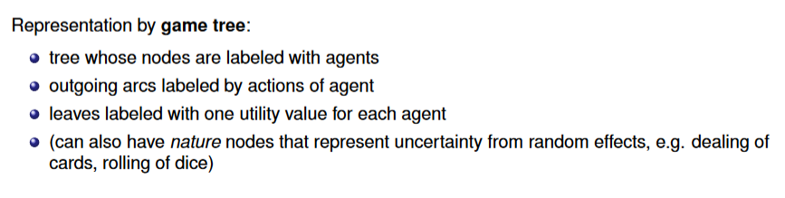
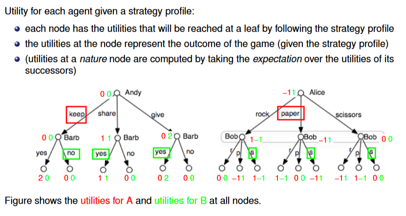
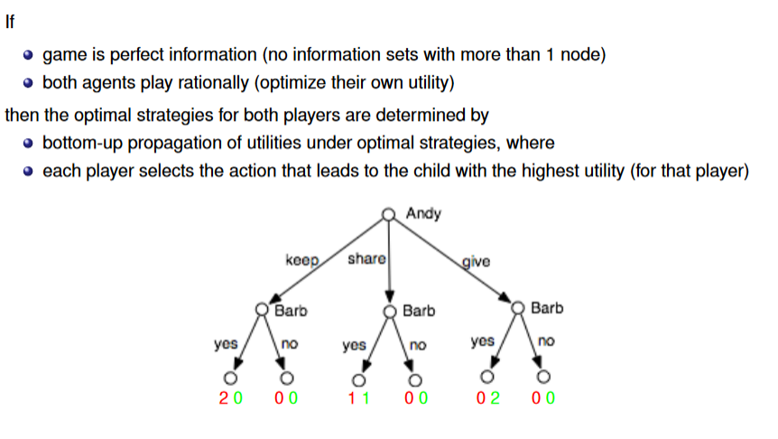
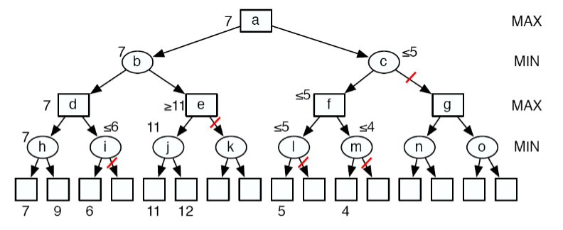
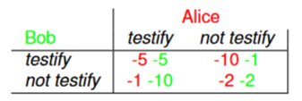
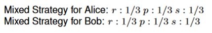
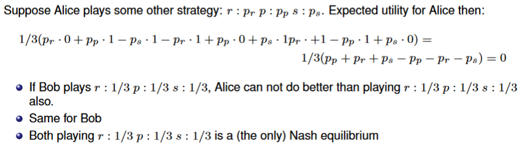

# Multi-Agent Systems

## Game Trees

Sharing game. Andy and Barb share two pieces of pie:

**Imperfect Information Games**

## Strategies

A **(pure) strategy** for one agent is a mapping from information sets to (possible) actions.

* (Essentially a policy)

A **strategy profile** consists of a strategy for each agent.

## Utility

### Solving Perfect Information Gain

Often these game trees can be extremely large.

* Example: Chess

## Pruning

**Zero Sum Game**

For two players: $utility_1=-utility_2$

In this case:

* need only one utility value at leaves
* one player (Max) wants to reach leaf with max value, other (Min) wants to reach leaf with min value.

In bottom-up utility computation, some sub trees can be **pruned** 

($\alpha\text{-}\beta \text{ pruning}$)

## Imperfect Information

Game Trees can be represented as tables

**Share Game**

**Rock Paper Scissors**

Difference between perfect and imperfect information not directly visible in normal form representation.

### Nash Equilibrium

Consider optimal strategy profile for share game:

The two strategies are in **Nash equilibrium** 

* no agent can improve utility by switching strategy while other agent keeps its strategy 
* this also means: agent will stick to strategy when it knows the strategy of the other player 

#### Example Prisoner's Dilemma

Alice and Bob are arrested for burglary. They are separately questioned by police. Alice and Bob are both given the offer to testify, in which case:

* The only Nash Equilibrium is Alice:*testify*, Bob:*testify*
* Nash equilibria do not represent cooperative behavior!

#### Mixed Strategies

No pure strategy nash eq. in Rock Paper Scissors

A **mixed strategy** is a probability distribution over actions:

Expected utility for Alice = expected u for Bob =

$$
1/9*(0+1-1-1+0+1+1-1+0)=0
$$

#### Key Results

* Every finite game has a Nash equilibrium (using mixed strategies)
    * There can be multiple
* Playing a Nash equilibrium strategy profile does not necessarily lead to optimal utilities for the agents (prisoners dilemma )