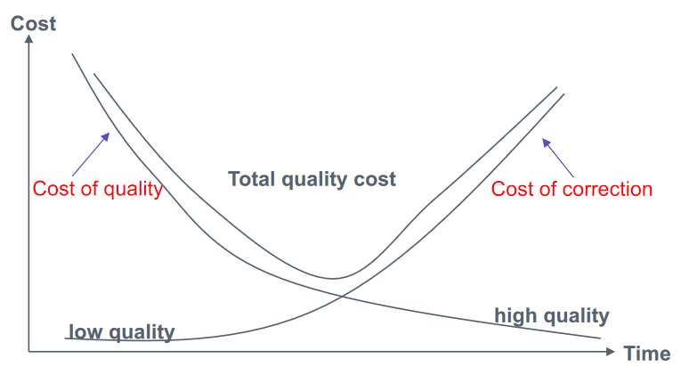
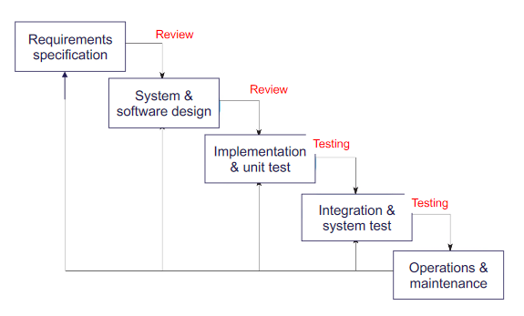

# Quality

**Definition**

**Quality** is a reflection of one or more peoples' assesment of correspondance between their expectations and experience of a productor a service

Can be divided into three categories

* **Product Quality**
* **Process Quality**
* **Quality of expectations**

**Cost of bad quaility**

Direct cost:

* Loss
* Wasted work
* Maintanance usually more expensive than development

Indirect cost

* Follows from poor quaility
* Has potentially severe consequences

## Quality Management

Quality Management consists of

* Quality Assurance
    * Plan or design processes to <u>prevent</u> bad quality
* Quality Control
    * <u>Monitor</u> that work products meet quality standards

### Theory of Cost and Quality

* Low quality(low quality management) is initially cheap, but becomes gradually very expensive
* High quality management, has an initial cost when quality processes are defined, but is cheaper later because users are reporting much less errors, and code is more stable
* The amount of quality management should be balanced to the cost – a process that is 100% defect free is often too expensive, so an appropriate compromise is normally made. 
    As a result the initial cost is a little less than for very high quality management, at the cost that slightly more defects are reported over time.
* We plan and design, how and when to do *verification* and *validation* in our process

### Quality Assurance

**Validation** (fit for use)

* Are we building the right systems?
* Conforms to customers' expectations and experience

**Verification** (are all requirements implemented)

* Are we building the system right?
* Conforms to specification
* Relatively objective process

Techniques

* <u>Testing</u> of programs and prototypes
* <u>Reviewing</u> of specifications, documentation and programs

### In the Different Models

#### Waterfall

#### Incremental

#### Integration and Configuration

### Quality Management and Agile Development

Quality management in agile is <u>informal</u> rather than document-based

It relies on establishing a <u>quality culture</u>, where all team members feel responsible for software quality and take actions to ensure that quality is maintained.
This quality culture is established through agile quality practices

#### Agile Quality Practices

* **Definition of Done**

    * Team agree on what criteria must be met before a task is complete

* **Sprint Review**

    *  Product Owner and other stakeholders <u>validate</u> the sprint delivery meets expectations

* **Check before check-in**

    * Developers are responsible for organizing their own code reviews with other team members before the code is checked in to the build system

* **Never break the build**

    * Team members should not check in code that causes the system to fail

        Developers have to test their code changes against the whole system and be confident that these work as expected

* **Fix problems when you see them**

    * If a programmer discovers problems or obscurities in code developed by someone else, they can fix these directly rather than referring them back to the original developer

### Fundamental Process Theory (Process Quality)

* A software product can only be as good as the process through which it is produced
* You can only improve the quality of the product if you improve the process
    * Repeating the same process, will create same level of quality
    * Sources of bad quality can be used as input to improve the process

